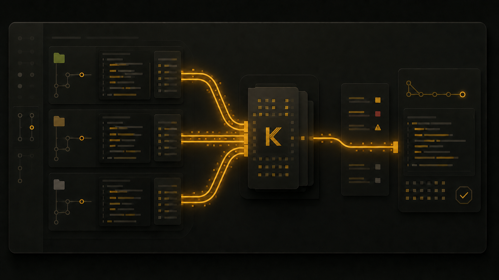

# kanzei

**中文** | [English](#english)

[](https://github.com/kanze1/kanzei-code/releases/latest)


[](LICENSE.md)



> 一个以外部记忆为核心、能在真实 Git worktree 中并行推进任务的个人 AI coding agent。

kanzei 会把决策、证据和开发经验沉淀为可检查、可编辑、可召回的外部记忆，让 agent 在不微调模型参数的情况下持续改进工作方式。它也用自己维护的 backlog 开发自己：建线、写代码、测试、提交、合并、发版。

## 为什么是 kanzei

- **Memory-first**：记忆不是聊天记录的尾巴，而是独立的控制面。压缩后的上下文仍可召回，项目经验可以被检索、修订和复用。
- **真正的任务级并行**：每条开发线拥有独立 worktree、分支和运行目录；多条线可以同时写各自的代码树，而不是在一个回合里临时扇出几个只读子代理。
- **受控合并**：界面提前显示跨线文件交集，合并前再执行 Git 文本冲突预检；干净变更以 `--no-ff` 合入，冲突时保留双方现场。
- **规则写在代码里**：权限、状态机、托管文档格式和写入边界由注册表与拦截器执行。模型格式写错时，引擎会拒绝并给出修复提示。
- **工单就是文件**：需求、缺陷、想法、决策、来源与发现都是普通 Markdown。你和 agent 编辑的是同一份事实源，排序就是执行优先级。
- **通道可以混用**：同一桌面端可使用 Codex 登录态、Claude Code 令牌、OpenAI 兼容 API 与本地 Ollama，并为不同角色选择不同模型。
- **过程可见**：上下文占用、压缩与召回、工具活动、权限请求、开发线状态和冲突预警都留在界面与事件轨迹中。

设计原则只有一句：**为好用和优雅不妥协。** kanzei 是个人日常开发工具，不做多租户和企业管理层。

## 设计目标

kanzei 为**永久工作**而设计：一次投入的决策、证据与经验要被长期保存、持续召回和复用，而不是随上下文压缩消失。具体目标：

- **永久工作优先**：外部记忆是独立控制面，跨会话保留；会话可恢复、轨迹可回放；agent 用自己维护的 backlog 开发自己，不依赖微调模型参数。
- **好用压倒一切**：上下文透明、少打断、信息清晰；个人日常开发工具，不做多租户和企业管理层。
- **真正的任务级并行**：每条开发线独立 worktree、分支与运行目录，多条线同时写各自的代码树。
- **受控合并**：跨线文件交集提前预警 + Git 文本预检 + `--no-ff` 合并；文本层已检查、语义层未检查的边界始终明示。
- **规则写在代码里**：权限、状态机、托管文档格式与写入边界由注册表与拦截器执行，能用代码强制的绝不只写进提示词。
- **复刻优先，创新只投护城河**：Claude Code 已解决的问题先复刻其行为契约，压缩与选择性丢弃后落地；记忆控制面、上下文可见性等护城河区持续领先。
- **工单就是文件**：需求、缺陷、目标、来源均为普通 Markdown，人与 agent 编辑同一份事实源，排序即执行优先级。
- **中英文并重**：界面文案可翻译，对话内容与用户数据展示层永不触碰；翻译发生在渲染点，漏译可机械检出。

方向基线详见 [`docs/design/direction_taste.md`](docs/design/direction_taste.md)。

## 一条任务如何完成

```text
对话 / backlog
      │
      ├─ 建线 A → worktree A → agent A ─┐
      ├─ 建线 B → worktree B → agent B ─┼─ 文件交集预警 → Git 预检 → no-ff 合并
      └─ 建线 C → worktree C → agent C ─┘
                         │
                 共享主根中的 tracker / state / memory
```

源码在线内隔离，`.kanzei/**` 项目资产始终以主根为唯一事实源。同一棵代码树上的 writer 仍会排队，避免两个进程直接覆盖同一份文件。

## 当前能力

- Rust + Tauri 桌面端：项目、对话、活动、权限、需求/缺陷、想法、附件、设置与更新
- Anthropic Messages、OpenAI Chat、OpenAI Responses 三类协议及流式事件统一
- Codex、Claude、Kimi/DeepSeek 等 OpenAI 兼容端点、本地 Ollama
- SQLite 事件溯源、会话恢复、自动压缩、外部记忆与回放评估
- 研究工作台：topic 工件、来源/发现、计划审批、检索反思、报告与引用校验
- LaTeX 编译、科研绘图与浏览器自检工具，均通过专用工具通道接入
- 移动端 PWA + LAN 配对/消息/审批/通知桥，服务于电脑端遥控
- 结伴开发与自主推进两种 agent；`fast` / `primary` 子代理档位
- 真实 worktree 建线、跨线并列状态、按线模型设置、文件冲突预警、diff、合并与放弃
- Markdown 原生的需求、缺陷、想法、决策、来源/发现与研究记录
- `ui_dom` / `ui_console` / `ui_style` / `ui_screenshot` 前端实查工具，以及代码级权限门禁、后台进程围栏与发布验证

当前并行模式检查的是**文件集合与 Git 文本合并**，还不能判断跨文件行为变化等语义冲突；线路状态、收活流程和按线设置已接入实时工作流。

## 安装

### Windows 安装包（推荐）

从 [最新 Release](https://github.com/kanze1/kanzei-code/releases/latest) 下载 `kanzei-setup-*.exe` 并运行。安装为当前用户应用，包含开始菜单入口和卸载器；应用启动时检查更新，也可在设置页手动更新。

- 桌面程序：`%LOCALAPPDATA%\kanzei\kzapp.exe`
- CLI：`%USERPROFILE%\.cargo\bin\kz.exe`
- 终端输入 `kzapp` 时，启动器会转发到上面的唯一桌面程序

### 从源码构建

需要 Rust、Cargo、Node.js 与 Tauri/NSIS 构建依赖。

```powershell
.\scripts\release.ps1
# 测试并构建 release；安装 kz 到 ~/.cargo/bin，kzapp 到 %LOCALAPPDATA%/kanzei

.\scripts\package.ps1 -Ack <自上个 build 标签以来的提交数> -Publish
# 通过提交范围与验证证据门禁后，构建并发布 NSIS 安装包
```

桌面端是主要入口；CLI 可用 `kz run "任务"`，以及 `kz req|defect|source|finding list|add|...` 管理项目事实源。

## 项目结构

| Crate | 职责 |
|---|---|
| `kanzei-base` | 零依赖底层原语：原子写与文件锁(atomic_file/FileLock,R-208) |
| `kanzei-memory` | 记忆控制平面：分层记忆系统、docstore 结构化文档存储、embed 通道、回放评估(R-203) |
| `kanzei-harness` | agents、tools、commands、skills、context sources、permissions 六类注册表与拦截器硬门禁 |
| `kanzei-llm` | 多协议 LLM、流式事件、代理与认证适配 |
| `kanzei-core` | session runner、调度、事件存储、压缩、记忆与执行协调 |
| `kanzei-tools` | read/write/edit/bash/git/tracker/memory 等内置工具 |
| `kanzei-app` | Tauri 桌面端、项目与开发线管理、更新与安装包 |
| `kanzei` | `kz` CLI 入口 |

需求、缺陷、想法与决策记录在 `.kanzei/project/`，topic 级来源/发现/报告与论文工件在 `.kanzei/research/<topic>/`；dev 侧勘察也使用该根目录，按 `<entry-id>-<slug>/report.md` 绑定条目并保留最终报告，详细约定见 [`research_mode.md`](docs/design/research_mode.md)。设计文档在 `docs/design/`，参考资料在 `docs/reference/`。

## 开发指南

kanzei 是一个 Rust workspace + Tauri 桌面端 + 静态前端的自举项目——它用自己维护的 backlog 开发自己。

- **分支与发布**：日常开发提交到 `dev` 分支；`main` 只接收来自 dev 的 `--ff-only` 合并，保持随时可发布。发布从独立发布树执行 `scripts/package.ps1`，桌面端唯一安装位是 `%LOCALAPPDATA%\kanzei\kzapp.exe`。
- **测试**：改动哪个 crate 跑哪个 crate 的定向测试（`cargo test -p <crate>`）；纯前端改动跑 `node --check` + `scripts/ui-*-smoke.mjs` 冒烟；全量 `cargo test --workspace` 在发版前与关闭中/大复杂度条目时执行。
- **提交门禁**：提交 Rust 代码前，编译、`cargo fmt --all -- --check`、`cargo clippy --workspace --all-targets -- -D warnings` 由结构化 git 工具强制检查，任一不过即拦下提交并点名违规文件。
- **规范**：开发规则单源在引擎内置通用规范 + 本项目 `.kanzei/project/conventions.md`；需求/缺陷/目标记录在 `.kanzei/project/`，随代码一起提交。
- **外部 agent 协作**：动仓库前先 `kz lock status` 查看活跃线与未提交改动；提交只暂存自己明确修改的文件，禁止 `git add .`。

---

## English

> A memory-first personal AI coding agent that can advance real tasks concurrently in isolated Git worktrees.

kanzei stores decisions, evidence, and development experience in inspectable, editable external memory. It uses that memory to improve without fine-tuning model parameters, and it develops itself from its own Markdown backlog.

### What makes it different

- **Memory-first control plane** with recallable compaction, editable project memory, and replay evaluation
- **Real task-level parallelism**: each development line owns a worktree, branch, and runtime directory
- **Controlled integration**: early file-overlap warnings, Git merge preflight, and `--no-ff` merges
- **Hard gates in code** for permissions, state transitions, managed documents, and write boundaries
- **Markdown-native tickets** shared by the user and the agent as one source of truth
- **Mixed model channels**: Codex, Claude, OpenAI-compatible APIs, and local Ollama in one desktop app
- **Observable execution**: context, compaction, tools, permissions, line status, and conflict warnings remain visible

The current parallel mode checks file overlap and Git text merges. It does not yet detect semantic conflicts across files or behavior.

### Design goals

kanzei is built for **permanent work**: decisions, evidence, and experience are kept, recalled, and reused across sessions instead of vanishing with context compaction.

- **Permanent work first**: external memory is an independent control plane that survives across sessions; sessions can be recovered and traces replayed; the agent develops itself from its own backlog without fine-tuning model parameters.
- **Usability over everything**: transparent context, fewer interruptions, clear information; a personal daily tool, not multi-tenant enterprise software.
- **Real task-level parallelism**: each line owns a worktree, branch, and runtime directory, writing its own code tree concurrently.
- **Controlled integration**: early cross-line file-overlap warnings, Git merge preflight, and `--no-ff` merges; the "text checked, semantics unchecked" boundary is always explicit.
- **Rules in code**: permissions, state machines, managed-document formats, and write boundaries are enforced by registries and interceptors; anything enforceable in code is not left to prompts.
- **Replicate first, innovate only in the moat**: behaviors Claude Code already solved are replicated (compressed and selectively trimmed) before improving; the memory control plane and context observability keep leading.
- **Tickets are files**: requirements, defects, ideas, decisions, sources, and findings are plain Markdown shared by user and agent as one source of truth; file order is execution order.
- **Chinese and English both matter**: UI copy is translatable; conversation content and user data are never touched at the display layer; translation happens at render points and missing keys are caught mechanically.

The direction baseline lives in [`docs/design/direction_taste.md`](docs/design/direction_taste.md).

### Development guide

kanzei is a self-hosting Rust workspace + Tauri desktop app + static frontend: it develops itself from its own backlog.

- **Branches and releases**: day-to-day work lands on `dev`; `main` only receives `--ff-only` merges from `dev` and stays releasable. Releases run from a dedicated release worktree via `scripts/package.ps1`; the desktop app's single install location is `%LOCALAPPDATA%\kanzei\kzapp.exe`.
- **Testing**: run targeted tests for the crate you change (`cargo test -p <crate>`); pure-frontend changes run `node --check` plus `scripts/ui-*-smoke.mjs`; the full `cargo test --workspace` runs before releases and when closing medium/large requirements.
- **Commit gates**: before committing Rust code, compile, `cargo fmt --all -- --check`, and `cargo clippy --workspace --all-targets -- -D warnings` are enforced by the structured git tool; any failure blocks the commit and names the offending files.
- **Conventions**: dev rules come from the engine-embedded generic conventions plus this project's `.kanzei/project/conventions.md`; requirements/defects/ideas/decisions live in `.kanzei/project/`, and sources/findings live in topic-scoped research artifacts.
- **External agent collaboration**: run `kz lock status` before touching the repo to see active lines and uncommitted changes; stage only the files you explicitly changed, never `git add .`.

### Install

Download `kanzei-setup-*.exe` from the [latest Release](https://github.com/kanze1/kanzei-code/releases/latest). It is a per-user Windows installer with Start Menu and uninstall entries, plus in-app updates.

```powershell
.\scripts\release.ps1
.\scripts\package.ps1 -Ack <commits-since-last-build-tag> -Publish
```

## License / 许可

[PolyForm Noncommercial 1.0.0](LICENSE.md) — 可自由使用、修改和分发，**禁止商业用途**。

Free to use, modify, and redistribute for **noncommercial purposes only**.
