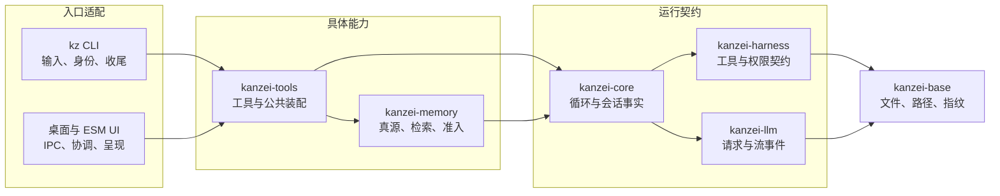

# 系统职责与依赖边界

这是职责与调用方向图；完整 crate 依赖从实时 Cargo 图查看。CLI 与桌面共用工具装配，core 消费抽象能力，具体记忆策略在 memory/tools。箭头表示使用或调用，不能把 UI、目录归属或历史文档当成持久状态真源。

```mermaid
flowchart LR
  subgraph entry_group["入口适配"]
    cli_entry["kz CLI<br/>输入、身份、收尾"]:::entry
    app_entry["桌面与 ESM UI<br/>IPC、协调、呈现"]:::entry
  end
  subgraph capability_group["具体能力"]
    shared_tools["kanzei-tools<br/>工具与公共装配"]:::focus
    project_memory["kanzei-memory<br/>真源、检索、准入"]
  end
  subgraph runtime_group["运行契约"]
    execution_core["kanzei-core<br/>循环与会话事实"]
    capability_harness["kanzei-harness<br/>工具与权限契约"]
    wire_llm["kanzei-llm<br/>请求与流事件"]
  end
  foundation["kanzei-base<br/>文件、路径、指纹"]
  cli_entry --> shared_tools
  app_entry --> shared_tools
  shared_tools --> execution_core
  shared_tools --> project_memory
  project_memory --> execution_core
  execution_core --> capability_harness
  execution_core --> wire_llm
  capability_harness --> foundation
  wire_llm --> foundation
  click cli_entry "crates/kanzei/src/cli/run.rs" "CLI 适配共享运行能力"
  click app_entry "crates/kanzei-app/src/run/assembly.rs" "桌面适配共享运行能力"
  click shared_tools "crates/kanzei-tools/src/run.rs" "build_harness 与 build_runner_config"
  click project_memory "crates/kanzei-memory/src/memory/mod.rs" "Markdown 真源、准入与检索"
  click execution_core "crates/kanzei-core/src/runner/drive.rs" "run_once_with_parts"
  click capability_harness "crates/kanzei-harness/src/harness.rs" "HarnessDraft 与 HarnessSnapshot"
  click wire_llm "crates/kanzei-llm/src/lib.rs" "多协议归一为 LlmEvent"
  click foundation "crates/kanzei-base/src/lib.rs" "共享基础原语"
```
