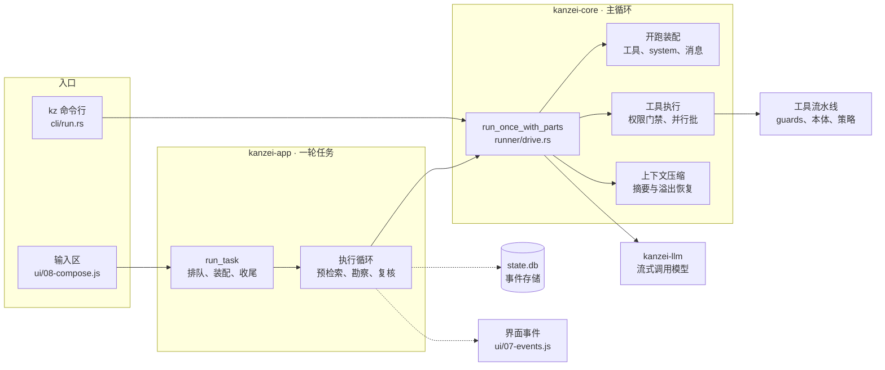

# 运行时主循环

一轮任务从输入区(或 kz 命令行)进来:kanzei-app 的 run_task 排队并装配本轮,执行循环依次做记忆预检索、勘察、主循环与复核;kanzei-core 的 run_once_with_parts 是主循环本体——装配工具与上下文、流式调模型、过权限门禁执行工具、超限时压缩。事件一路落库并推回界面。点节点打开对应实现。

```mermaid
flowchart LR
  subgraph entry_grp["入口"]
    compose["输入区<br/>ui/08-compose.js"]:::entry
    cli["kz 命令行<br/>cli/run.rs"]:::entry
  end
  subgraph app_grp["kanzei-app · 一轮任务"]
    run_task["run_task<br/>排队、装配、收尾"]
    exec_loop["执行循环<br/>预检索、勘察、复核"]
  end
  subgraph core_grp["kanzei-core · 主循环"]
    drive["run_once_with_parts<br/>runner/drive.rs"]:::focus
    assembly["开跑装配<br/>工具、system、消息"]
    tool_exec["工具执行<br/>权限门禁、并行批"]
    compaction["上下文压缩<br/>摘要与溢出恢复"]
  end
  llm["kanzei-llm<br/>流式调用模型"]:::ext
  pipeline["工具流水线<br/>guards、本体、策略"]
  store[("state.db<br/>事件存储")]:::store
  ui_events["界面事件<br/>ui/07-events.js"]

  compose --> run_task
  cli --> drive
  run_task --> exec_loop
  exec_loop --> drive
  exec_loop -.-> ui_events
  exec_loop -.-> store
  drive --> assembly
  drive --> llm
  drive --> tool_exec
  drive --> compaction
  tool_exec --> pipeline

  click compose "crates/kanzei-app/ui/08-compose.js" "输入区:经 run_prompt 发送一轮任务"
  click cli "crates/kanzei/src/cli/run.rs" "kz run:命令行直接调 run_once"
  click run_task "crates/kanzei-app/src/run/coordinator.rs" "run_task:装配、事件循环、轮末收尾"
  click exec_loop "crates/kanzei-app/src/run/execution.rs" "run_execution_loop:记忆预检索 → 勘察 → 主循环 → 复核修正"
  click drive "crates/kanzei-core/src/runner/drive.rs" "run_once_with_parts:单次运行主循环"
  click assembly "crates/kanzei-core/src/runner/drive/assembly.rs" "开跑时的工具物化、system 分块与消息初始化"
  click tool_exec "crates/kanzei-core/src/runner/drive/permissions.rs" "按规则集裁决允许 / 询问 / 拒绝;并行批见 drive/parallel_tools.rs"
  click compaction "crates/kanzei-core/src/runner/compaction.rs" "主动压缩与上下文溢出恢复"
  click llm "crates/kanzei-llm/src/lib.rs" "多协议 LLM、流式事件与认证,连到模型服务商"
  click pipeline "crates/kanzei-harness/src/tool_pipeline.rs" "run_tool_pipeline:guards → 工具本体 → result policies → observers"
  click store "crates/kanzei-core/src/store/events.rs" "事件存储(state.db)"
  click ui_events "crates/kanzei-app/ui/07-events.js" "前端事件处理"
```
