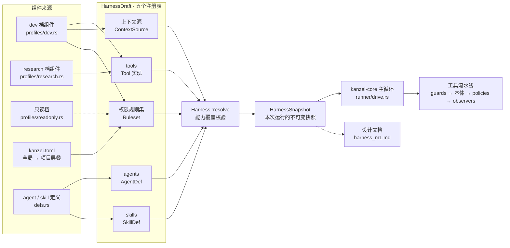

# Harness 注册表

每次运行前,各档位组件往 HarnessDraft 的五个注册表里贡献条目(agents、tools、skills、上下文源、权限规则集),`Harness::resolve` 做能力覆盖校验后冻结成不可变快照;主循环每次调工具都走同一条流水线:guards → 工具本体 → 结果策略 → 观察者。详细设计见 docs/design/harness_m1.md。

