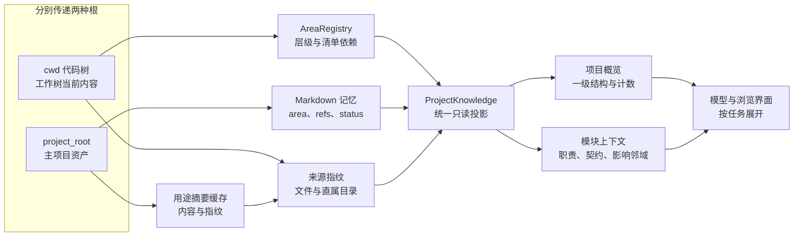

# 项目知识与局部上下文

结构和用途指纹读取当前代码树，项目记忆与缓存读取主项目资产根。Markdown 是记忆真源；层级、图和检索索引是派生物。局部请求只展开祖先、目标子树与一跳影响邻域，候选、缺失区域和失效正文不能升级为已确认约束。

```mermaid
flowchart LR
  subgraph source_group["分别传递两种根"]
    work_code["cwd 代码树<br/>工作树当前内容"]:::entry
    project_assets["project_root<br/>主项目资产"]:::entry
  end
  code_areas["AreaRegistry<br/>层级与清单依赖"]
  current_hashes["来源指纹<br/>文件与直属目录"]
  memory_source["Markdown 记忆<br/>area、refs、status"]:::store
  annotation_cache["用途摘要缓存<br/>内容与指纹"]:::store
  projection["ProjectKnowledge<br/>统一只读投影"]:::focus
  overview["项目概览<br/>一级结构与计数"]
  local_context["模块上下文<br/>职责、契约、影响邻域"]
  consumers["模型与浏览界面<br/>按任务展开"]
  work_code --> code_areas
  work_code --> current_hashes
  project_assets --> memory_source
  project_assets --> annotation_cache
  code_areas --> projection
  memory_source --> projection
  annotation_cache --> current_hashes
  current_hashes --> projection
  projection --> overview
  projection --> local_context
  overview --> consumers
  local_context --> consumers
  click work_code "crates/kanzei-harness/src/tool.rs" "ToolCtx 分开传递 cwd 与 project_root"
  click project_assets "docs/design/project_knowledge.md" "主项目资产与当前工作树边界"
  click code_areas "crates/kanzei-harness/src/areas.rs" "目录层级不是完整 import/调用图"
  click current_hashes "crates/kanzei-tools/src/files.rs" "content_hash 与 directory_fingerprint"
  click memory_source "crates/kanzei-memory/src/memory/store.rs" "MemoryStore 的 Markdown 真源"
  click annotation_cache "crates/kanzei-app/src/files_view.rs" "标注生成与来源前后核验"
  click projection "crates/kanzei-tools/src/project_knowledge.rs" "snapshot 与 project"
  click overview "crates/kanzei-tools/src/project_knowledge.rs" "overview 不常驻全部正文"
  click local_context "crates/kanzei-tools/src/architecture.rs" "architecture action=context"
  click consumers "crates/kanzei-app/ui/24-project-knowledge.js" "三处界面的共享层级视图"
```
