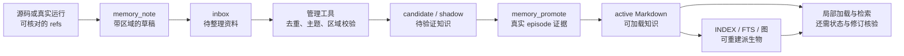

# 记忆真源、准入与证据

主运行投递草稿，管理工具维护真源。源码职责事实与失败修复经验使用不同的验证条件；后者还需要跨轮复发和对应 episode 的真实恢复证据。任何候选或图推断都不能仅凭生成成功进入 active。

```mermaid
flowchart LR
  source_evidence["源码或真实运行<br/>可核对的 refs"]:::entry
  note_entry["memory_note<br/>带区域的草稿"]
  inbox_store["inbox<br/>待整理资料"]:::store
  manager_tools["管理工具<br/>去重、主题、区域校验"]
  candidate_state["candidate / shadow<br/>待验证知识"]
  source_gate["memory_promote<br/>真实 episode 证据"]:::focus
  active_memory["active Markdown<br/>可加载知识"]:::store
  derived_index["INDEX / FTS / 图<br/>可重建派生物"]
  scoped_retrieval["局部加载与检索<br/>还需状态与修订核验"]
  source_evidence --> note_entry
  note_entry --> inbox_store
  inbox_store --> manager_tools
  manager_tools --> candidate_state
  candidate_state --> source_gate
  source_gate --> active_memory
  active_memory --> derived_index
  active_memory --> scoped_retrieval
  derived_index --> scoped_retrieval
  click source_evidence "crates/kanzei-memory/src/memory/mod.rs" "validate_source_refs 与 validate_manager_fact_refs"
  click note_entry "crates/kanzei-memory/src/memory/tools.rs" "memory_note 投递与同步纠错"
  click inbox_store "crates/kanzei-memory/src/memory/inbox.rs" "草稿、批次与 checkpoint"
  click manager_tools "crates/kanzei-memory/src/memory/manager.rs" "管理工具的写入门禁"
  click candidate_state "crates/kanzei-memory/src/memory/store.rs" "source 决定候选写入"
  click source_gate "crates/kanzei-memory/src/memory/lifecycle.rs" "证据先落库；失败经验另验真实恢复"
  click active_memory "crates/kanzei-memory/src/memory/store.rs" "一条记忆一个 Markdown 文件"
  click derived_index "crates/kanzei-memory/src/memory/index.rs" "检索索引不是真源"
  click scoped_retrieval "crates/kanzei-tools/src/project_knowledge.rs" "active、missing_areas 与 revision 检查"
```
