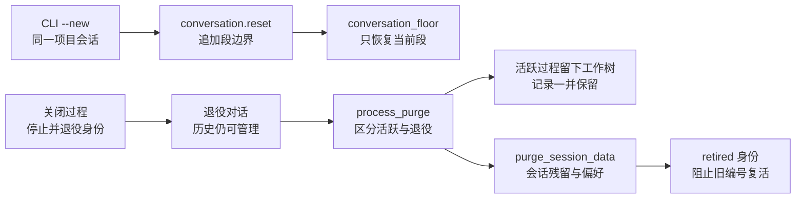

# 对话新段、关闭与永久清理

新段保留历史，关闭保留可管理的退役对话。永久删除仍有活跃 process 时先关闭；若它的工作树被保留，记录也保留并给出说明。删除只有退役历史的分支则不碰留下的工作树，可清理其会话数据。界面数组不代表持久清理已完成。

```mermaid
flowchart LR
  cli_new["CLI --new<br/>同一项目会话"]:::entry
  reset_event["conversation.reset<br/>追加段边界"]
  restore_prior["conversation_floor<br/>只恢复当前段"]
  close_identity["关闭过程<br/>停止并退役身份"]:::entry
  retired_history["退役对话<br/>历史仍可管理"]:::store
  permanent_purge["process_purge<br/>区分活跃与退役"]:::entry
  retained_tree["活跃过程留下工作树<br/>记录一并保留"]:::store
  persistent_purge["purge_session_data<br/>会话残留与偏好"]:::focus
  retired_identity["retired 身份<br/>阻止旧编号复活"]:::store
  cli_new --> reset_event
  reset_event --> restore_prior
  close_identity --> retired_history
  retired_history --> permanent_purge
  permanent_purge --> retained_tree
  permanent_purge --> persistent_purge
  persistent_purge --> retired_identity
  click cli_new "crates/kanzei/src/cli/run.rs" "begin_new_segment 不删除共享历史"
  click reset_event "crates/kanzei-core/src/store/session.rs" "段边界与历史恢复"
  click restore_prior "crates/kanzei/src/cli/run.rs" "recover_cli_prior"
  click close_identity "crates/kanzei-app/src/processes/lifecycle.rs" "close_process 与注销"
  click retired_history "crates/kanzei-app/src/processes/lifecycle.rs" "列出退役对话"
  click permanent_purge "crates/kanzei-app/src/processes/lifecycle.rs" "purge_process 的分支与保留例外"
  click retained_tree "crates/kanzei-app/src/processes/lifecycle.rs" "留下工作树时不进入数据清理分支"
  click persistent_purge "crates/kanzei-core/src/store/session.rs" "purge_session 与 delete_session_with"
  click retired_identity "crates/kanzei-core/src/store/processes.rs" "持久退役身份"
```
