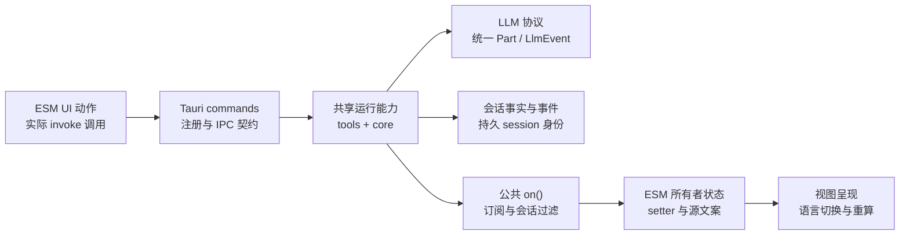

# 前后端与协议消费边界

调用链和事件链分开核对：command 注册与实际 invoke 结构一致，运行事件带会话身份，经公共订阅更新拥有状态的 ESM 模块，再触发呈现。LlmEvent/Part 是协议与 core 的契约，前端文案不能替代后端错误分类、权限或持久事实。

```mermaid
flowchart LR
  ui_action["ESM UI 动作<br/>实际 invoke 调用"]:::entry
  commands["Tauri commands<br/>注册与 IPC 契约"]
  shared_runtime["共享运行能力<br/>tools + core"]
  wire_protocol["LLM 协议<br/>统一 Part / LlmEvent"]:::ext
  stored_facts["会话事实与事件<br/>持久 session 身份"]:::store
  bridge_subscription["公共 on()<br/>订阅与会话过滤"]:::focus
  owned_state["ESM 所有者状态<br/>setter 与源文案"]
  ui_render["视图呈现<br/>语言切换与重算"]
  ui_action --> commands
  commands --> shared_runtime
  shared_runtime --> wire_protocol
  shared_runtime --> stored_facts
  shared_runtime --> bridge_subscription
  bridge_subscription --> owned_state
  owned_state --> ui_render
  click ui_action "crates/kanzei-app/ui/08-compose.js" "输入动作与后端调用"
  click commands "crates/kanzei-app/src/main.rs" "invoke_handler 注册入口"
  click shared_runtime "crates/kanzei-tools/src/run.rs" "公共运行装配"
  click wire_protocol "crates/kanzei-llm/src/protocol/mod.rs" "所有协议同步公共请求和流事件"
  click stored_facts "crates/kanzei-core/src/store/typed.rs" "typed session facts"
  click bridge_subscription "crates/kanzei-app/ui/01-core.js" "on 的身份过滤与 listen 失败显示"
  click owned_state "crates/kanzei-app/ui/01-core.js" "会话状态的模块所有权"
  click ui_render "crates/kanzei-app/ui/02-i18n.js" "源文案翻译与语言切换"
```
