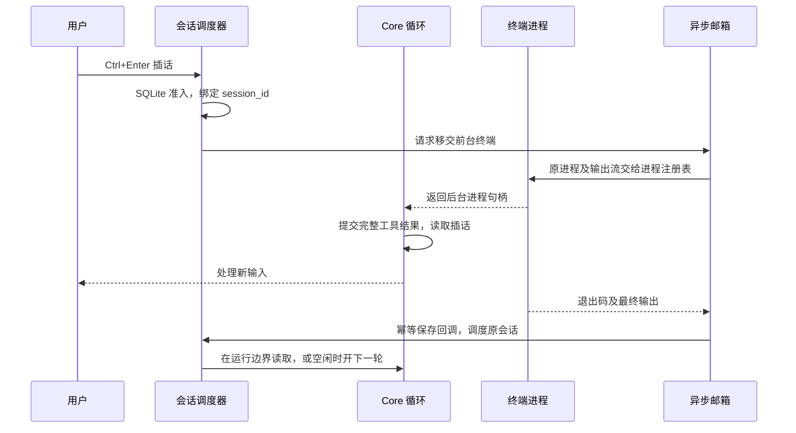

# 异步对话与终端回调

2026-10-07。面向 Kanzei 桌面会话；研究依据是 Claude Code 的官方行为文档和公开 Agent SDK 类型。Claude Code 内部执行循环没有在这些来源中公开，因此下文把公开契约和 Kanzei 的实现分开描述。

## Claude Code 的公开契约

- [交互模式](https://code.claude.com/docs/en/interactive-mode#background-bash-commands)：后台 shell 立即返回任务 ID，输出可回读，当前对话可以接收新提示。Ctrl+B 可以将运行中的 shell 移到后台。
- [消息队列](https://code.claude.com/docs/en/interactive-mode#queue-messages-while-claude-works)：普通消息在完整工具组结束后进入模型；Ctrl+Enter 的即时发送可以把可移交的工作放到后台。不能移交的工作有不同的中断行为。
- [后台子代理](https://code.claude.com/docs/en/sub-agents#run-subagents-in-foreground-or-background)：主会话可以继续运行，完成结果通过后续通知交付。子代理自己的后台终端结束时，通知应送给该子代理。
- [公开 SDK 类型](https://github.com/anthropics/claude-agent-sdk-python/blob/main/src/claude_agent_sdk/types.py)：`TaskNotificationMessage` 带有任务、会话、状态、输出文件、摘要及可选工具调用身份。部分终态仅通过 `TaskUpdatedMessage` 发布；终态显示不能只依赖一类完成通知。
- [TypeScript SDK](https://code.claude.com/docs/en/agent-sdk/typescript#sdktasknotificationmessage)：`origin.kind=task-notification` 区分自动通知和人类输入；通知正文会说明没有新的人类授权。
- [异步 hooks](https://code.claude.com/docs/en/hooks#run-hooks-in-the-background)：普通 async hook 在下次对话交付结果；空闲时主动唤醒另有 `asyncRewake` 语义。它和后台 shell 的结果交付不能混为同一个开关。

可以据此推导出需要会话级任务注册、输入排队和结果交付，但不能据此断言 Claude 内部采用哪种 Rust/JavaScript 事件循环、队列或数据库。

## Kanzei 的所有权与流转

1. `session_id` 是对话所有权；项目根只定位资料与状态库，`process_id` 标识工作区会话或终端。当前 UI 显示哪条对话不参与回调收件人的计算。
2. 复用 `AsyncMailbox`、`session_inputs` 和原有 `schedule_run`，不创建另一个模型运行循环。运行中的输入在完整工具/结果批次之间消费；空闲会话由相同调度器继续。
3. `AsyncMailbox` 提供递增的移交请求序列。命令启动前订阅，新命令不会重放早先已经交付的插话；并行等待者都能观察到本次请求。
4. 前台 shell 移交包含原 Child、stdout/stderr、已捕获输出、原执行截止时间和 owner。没有重跑命令或重新执行副作用。
5. 完成通知先等待输出收集，再发布稳定的 `terminal:<id>` 回调。桌面入口以 owner 和回调 ID 保存输入，避免重复启动。回调是工具结果，不构成新的人类指令或授权。
6. 明确停止/关闭会话会关闭邮箱并推进生命周期代数；旧回调不能重新启动该会话。普通轮次结束不关闭邮箱，因此后台命令可以跨轮完成。
7. 可写子代理沿用项目的独立工作树。是否需要初始化应用自有的无项目资料仓库，由实际存储根身份决定；结对模式的 `project_workflow=false` 只关闭项目交付流程，不把普通项目变成无项目存储。

## 行为边界

| 操作 | 行为 |
|---|---|
| Enter，交付方式为排队 | 保留原行为，本轮结束后执行 |
| Enter，交付方式为插入 | 保存插话；可移交的前台终端转入后台 |
| Ctrl+Enter / Cmd+Enter | 此次发送使用插话，不改用户的排队选择 |
| `bash background=true` | 立即返回句柄；支持邮箱的会话会自动接收完成结果 |
| 前台命令移交后到达原超时 | 终止原进程树，完成回调带 `timed_out: true` |
| 自动记录测试的命令 | 保持等待真实退出的契约，不因插话提前完成测试记录 |
| 托管项目中工作目录不符合后台边界 | 保持前台执行，不放宽后台围栏 |
| 正在生成模型响应、执行其它工具 | 在原有执行边界交付消息；本次没有加入强制打断模型的行为 |
| 切换显示的会话 | 不改变后台任务及完成通知的 owner |

Kanzei 的一次性 `kz run` 没有在本次改成常驻交互终端；现有 CLI 无邮箱场景继续通过 `process` 读取结果。也没有引入 Claude 的云端会话管理、完整 PTY 或 hook 配置系统。后台移交使用已有管道和进程注册表。

## 验证入口

- `cargo test -p kanzei-harness background_requests`：新请求唤醒当前等待者，旧请求不会重放给后续命令。
- `cargo test -p kanzei-tools foreground_handoff`：真实 PowerShell 进程；不重跑、保留前后输出、单次完成回调、原截止时间有效。
- `cargo test -p kanzei-tools background::`：进程树停止、围栏归因、输出收集及后台生命周期回归。
- `cargo test -p kanzei-app async_mailbox`：停止与正在发布的回调竞态、幂等准入。
- `cargo test -p kanzei-tools writer_background_isolated_result_then_explicit_adoption`：项目流程与结对模式都能完成真实子代理写入、独立工作树和显式采纳。
- `node scripts/ui-async-agents-native-smoke.mjs <fresh kzapp.exe>`：真实 WebView2、Rust 调度器、SQLite、Git、终端和本地确定性模型。覆盖后台子代理、插话、异步问答、Ctrl+Enter 前台移交、OS PID 连续性、切换会话后的结果交付和停止。

原生验收使用隔离项目与应用目录，保存执行文件 SHA-256、模型请求和检查结果。它验证执行机制，不衡量外部模型自主选择后台任务的成功率。

## 本次验证结果

2026-10-07，新构建通过 25 项原生检查，产生 29 次本地模型请求，无浏览器或运行时错误。不可变验收记录为 `output/playwright/async-agents/1791379068068/acceptance.json`；执行文件 SHA-256 为 `9bc536295d4f9d050e1924a308d640b80650a011122c8f435f000215b213e0f1`。

- 旧发布文件在相同前台终端场景中，Ctrl+Enter 仍排队，直到原命令 30 秒超时并被终止；原始记录为 `output/playwright/async-agents/1791377692871/failure.json`。新构建在释放测试终端之前已处理插话；移交前后的 OS PID 相同，完成回调恰好一次，含前后两段输出。
- 主会话和子代理的后台终端结果都回到原接收者；切换显示的会话不改变收件人。异步问题的回答使用原历史恢复同一个子代理，明确停止及关闭主会话的检查也通过。
- 结对项目的可写子代理回归测试先复现 `Not a general conversation store`，修复存储身份判断后，结对与项目流程两种模式的真实写入、独立工作树和显式采纳均通过。
- 定向 Rust 测试、三个相关 crate 的 all-targets Clippy、UI lint、完整 `ui-runtime-smoke.mjs` 和 release 构建通过。后台测试中的既有忽略项仍为忽略，没有作为通过证据。

以上为 2026-10-07 的本地实现与验收结果。发布另行执行 `scripts/verify.ps1 -Full`，验证证据必须绑定最终发布提交；完成后以 GitHub Release、安装器哈希和发布验收记录为准。
