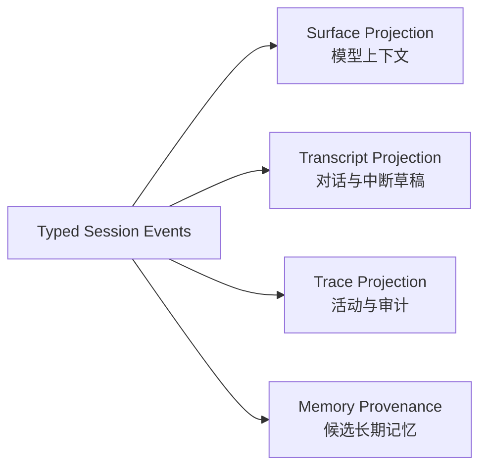

# DeepSeek Harness 约束驱动的运行时升级

- 状态：设计基线；R-241 已实现并进入 shadow 观察，R-242 尚未切换真源
- 日期：2026-08-14
- 关联需求：R-241、R-242、R-243、R-244、R-245、R-246
- 关联缺陷：D-209、D-349
- 关联决策：A-012（draft）
- 外部参考：[`deepseek_harness_reference_20260814.md`](../reference/deepseek_harness_reference_20260814.md)

## 背景与问题

Kanzei 已经有 SQLite `session_events`、会话快照、运行轨迹、上下文压缩、权限规则、后台进程和多种 RAII 收尾点，但这些能力还没有形成一套统一的事实与生命周期契约：

- `conversation.updated` 是轮末完整消息快照。正常停止已有 D-342 的合作式收尾，但崩溃、强杀或异常中断仍无法稳定恢复轮内已发生事实和生成到一半的 assistant 内容。
- `run.trace` 与 conversation 使用不同落库粒度，模型 prior、历史 UI 和审计回放可能看到不同事实。
- Compaction 修改当前消息数组；原始历史和模型可见上下文没有结构性分离。
- bash、git、web 与后台进程分别截断输出，结果进入事件层前就可能已经丢失完整原文。
- 权限、不可逆拒绝、执行包装、结果处理和观察逻辑散落在 runner 与各工具内部。
- cancellation、子代理、通知、后台进程、租约和临时资源分别拥有生命周期，缺少一个能证明“整条线路已静止”的 owner。

本设计吸收 DeepSeek Harness 已经验证过的四项约束：事实只追加一次、模型上下文由事实投影、拒绝型约束不可逆、异步资源归属明确 owner。不引入 Cordis、Everything-is-Plugin、热插拔或按小能力拆 crate。

## 用户已确认的产品边界

1. “清空对话”保留原始历史，只追加 segment/reset 边界；“删除会话”执行确定性删除，并在弹窗中明确风险和删除范围。
2. 生成到一半的 assistant 可见内容必须能够恢复，用于复盘为何中断。
3. Spill artifact 不按天自动过期；系统必须提供显式“存储与整理”入口。

## 目标与非目标

### 目标

- 用一份可回放的 typed event log 承载运行时会话事实。
- 从相同事件序列生成模型 surface、对话 transcript、活动 trace 和长期记忆 provenance。
- 在崩溃后恢复已发生事实，并把未完成动作明确闭合为 `interrupted`。
- 让 Compaction 只替换模型 surface，不改写原始事实。
- 为 Tool Pipeline 和 LineRuntime 建立固定的阶段与 owner 契约。
- 完整保存需要外置的大工具结果，并提供可见、可控的空间治理。

### 非目标

- 不将所有 streaming token 逐 token 永久写入 SQLite。
- 不把 Markdown 变成第二套运行时会话真源。
- 不重写现有 Ruleset、R-236 纪要算法、R-180 长驻服务注册表。
- 不自动重放异常中断前的有副作用工具。
- 不增加定时自动清理任务。

## SQLite 与 Markdown 的权威边界

| 数据域 | 权威真源 | 原因 |
| --- | --- | --- |
| 运行时会话、typed events、流式草稿、工具调用/结果引用 | `.kanzei/state.db` | 需要原子 sequence、事务、并发追加、崩溃恢复和索引查询 |
| 线路、运行状态、租约、运行遥测 | `.kanzei/state.db` | 与现有运行状态同库，必须跨进程一致 |
| 需求、缺陷、设计、决策 | `.kanzei/project/*.md` | 人可读、可编辑、可 Git 审计 |
| 长期 Memory | `.kanzei/memory/*.md` | 延续 A-001/A-005 的文件优先与可编辑性 |
| 会话 Markdown 导出 | SQLite 的派生工件 | 带 `session_id`、`event_sequence`、`format_version`，可删除重建 |

若用 Markdown 承担每秒流式追加，仍需自行实现 sequence 分配、WAL、事务、索引、并发写入和崩溃后的半写修复，等于在文件上重建一个可靠性更差的数据库。Markdown 可以有原生的会话压缩或导出算法，但其输入仍应来自 raw events；压缩结果是 surface projection，不是新的事实真源。

## 事件模型

### 最小事件词表

第一阶段冻结下列概念；最终 Rust 枚举名与存储 `event_type` 在 R-241 B1 中机械锁定：

- `turn_started`
- `user_message_committed`
- `assistant_draft_appended`
- `assistant_message_committed`
- `assistant_message_interrupted`
- `tool_called`
- `tool_result_committed`
- `tool_result_interrupted`
- `turn_stopped`
- `turn_completed`
- `turn_failed`
- `conversation_reset`
- `compaction_started`
- `compaction_summary`
- `surface_replaced`
- `compaction_ended`
- `runtime_adopted`
- `runtime_disposed`

所有事件至少携带：

```text
event_id
session_id
sequence
event_type
format_version
turn_id
step_id?
created_at
payload
```

同一 Session 的 `sequence` 在 SQLite 事务内分配并受唯一约束。投影只依赖事件内容和明确版本，不能依赖进程内到达时序。

### 流式 assistant 草稿

流式内容按“已经向用户可见”的增量持久化，但不逐 token 写库。默认实现采用有界批次，具体时间/字节阈值由 R-241 的写放大 telemetry 决定：

```text
assistant_draft_appended(message_id, chunk_index, text)
...
assistant_message_committed(message_id, final_hash)
```

如果进程在 commit 前终止，恢复器将该 `message_id` 投影为 `assistant_message_interrupted`：

- transcript 与审计 UI 显示已经落盘的草稿，并标注“生成中断”；
- 模型 prior 默认不把它伪装成一条已完成回答；
- 下一轮可通过明确的诊断上下文知道上一轮说到哪里、为何停止；
- 不把服务端尚未送达客户端、也未落事件的 token 宣称为可恢复。

恢复粒度因此是“最近一次成功持久化的可见批次”，不是“绝不损失一个 token”。

### Tool call/result 配对

`tool_called` 必须先于工具副作用执行落库。每个调用最终只有一个结果终态：committed 或 interrupted。恢复发现孤立调用时追加 interrupted 终态，不自动重新执行工具。

`SessionInvariant` 在提交前拒绝：

- result 没有对应 call；
- 同一 call 重复 result；
- result 跨 turn/step 配对；
- turn 已终结后再追加普通消息或工具事实；
- committed assistant message 的 hash 与草稿重放不一致。

## 投影模型

同一事件日志生成四类投影：



- Surface 只包含当前模型所需的任务定义、已提交消息、必要的 interrupted 诊断摘要、压缩纪要和近期工具事实。
- Transcript 保留用户实际能看到的已提交消息与中断草稿。
- Trace 保存工具、权限、重试、停止和生命周期事件的顺序投影。
- Memory 从事件或 episode projection 提取，并记录 provenance；Memory 不反向承担会话恢复。

R-241 只实现 shadow projector：继续使用旧 `conversation.updated` 路径，同时计算新投影并报告差异。R-242 达到切换门槛后才替换读路径。

### R-241 已实现边界

- Core 契约位于 `crates/kanzei-core/src/store/typed.rs`。存储事件统一使用 `session.*` 前缀，第一版包含 `legacy_seeded`、turn 开始/停止/完成/失败、user commit、assistant draft/commit/interrupted、tool called/result committed/result interrupted。
- `RunEvent::AssistantMessageCommitted` 在任何工具副作用开始前发出；`RunEvent::ToolResultsCommitted` 在整组工具结果真正进入 history 时发出。权限拒绝、工具错误、停止占位和多工具部分完成因此与旧 messages 使用同一份结构化结果。
- CLI 与桌面端共用 `TypedSessionWriter`。可见草稿达到 2,048 个字符立即写批次，较短草稿由 250 ms 定时检查保证在 750 ms 年龄阈值后写入；恢复承诺仍以最近一次成功提交的批次为界。
- `prepare_typed_session` 在新 turn 前先幂等 seed 最新 `conversation.updated`，再把上次遗留的 open draft/tool 闭合为 interrupted + failed；恢复只追加终态，绝不执行工具。
- `conversation_shadow_get` 是只读 Tauri 命令，返回 `projection.surface_messages`、`projection.transcript_messages`、`interrupted_assistants`、diagnostics 和 legacy comparison。现有 `conversation_get` 与模型 prior 未切换。
- 每轮结束另写 `session.shadow_compared`，包含两侧 SHA-256、消息数、首个差异位置、中断数、诊断和 typed 写入错误。

### Schema、兼容与回滚

R-241 没有新增表、列、索引或 SQLite schema version，直接复用既有 `session_events` 的事务 sequence、唯一约束与复合索引，因此不需要数据库 migration、数据回填或迁移备份。事件 payload 固定 `format_version = 1`；未知版本在进入 invariant/投影前被拒绝，不能静默按 v1 解释。

旧数据由带 `source_event_id`、`source_sequence`、`source_hash` 的 `session.legacy_seeded` 保存 provenance；同一 legacy source 重复准备为 no-op。Shadow 期间回滚只需撤回 CLI/桌面 writer 接线并忽略新增 `session.*` 事实，`conversation.updated` 从未停止写入，现有 UI 和模型 prior 不受影响。已经追加的 typed facts 无需删除，也不得借回滚改写。

## 清空、删除与安全整理

### 清空

“清空对话”追加 `conversation_reset`，新建 segment。新 segment 的模型 prior 为空，旧 segment 仍能在审计和历史界面查看。它不是数据删除。

### 删除

“删除会话”弹窗必须列出将删除的：

- 消息、流式草稿与运行轨迹；
- 工具调用与结果引用；
- Spill artifact；
- 与该会话直接绑定、能够恢复正文的派生缓存。

取消弹窗不得产生任何写入。确认后，SQLite 行与 artifact 删除作为一个可恢复失败的删除计划执行；产品层完成标准是所有查询入口不可再检索，重启不复生。

### “确定性删除”的两层含义

当前本地 `state.db` 实测为 WAL 模式、`secure_delete=OFF`、`auto_vacuum=NONE`。因此 SQL `DELETE` 后，旧字节仍可能留在 freelist、WAL 或迁移备份。产品 UI 必须区分：

1. **仅删除**：产品层确定性不可检索，速度快；磁盘空闲页和旧备份可能尚未整理。
2. **删除并安全整理**：等待运行静止，处理 WAL checkpoint、数据库 VACUUM/secure-delete 策略，并列出包含旧正文的迁移备份供用户确认删除。

安全整理失败时必须明确显示“产品层已删除、磁盘整理未完成”，不能宣称已经安全擦除。这里的安全擦除只覆盖 Kanzei 管理的数据库、WAL、备份和 artifact；不对文件系统快照、云备份或存储介质磨损均衡作无法验证的承诺。

## Surface Compaction

复用 R-236 的纪要模型、固定模板、滚动合并、质量闸与机械事实清单，只改变存储语义：

```text
compaction_started
→ compaction_summary
→ surface_replaced
→ compaction_ended
```

压缩前检查边界上的 tool call/result 配对。原始事件 hash 在压缩前后保持不变；不完整事务不影响有效 surface，并在恢复时留下诊断。

## Tool Pipeline

固定阶段为：

```text
parse/materialize
→ policy allow/deny/ask
→ monotonic guards
→ execution wrappers
→ tool body
→ result policies
→ immutable observers
```

现有能力按以下方式迁入而非重写：

- Ruleset 普通规则进入 Policy；
- `hard_denies`、托管文件、writer ownership 进入 Monotonic Guard；
- timeout、progress、managed fence、cancellation 进入 Wrapper；
- recall、去冗余、preview、redaction、Spill 进入 Result Policy；
- UI、trace、metrics、memory telemetry 进入 Observer。

Observer 不得修改已经形成的工具事实；任何 allow 也不能覆盖 Guard deny。

## Tool Result Spill 与整理入口

统一结果形状：

```text
Inline(text)
Spilled {
    preview,
    artifact_id,
    bytes,
    sha256,
    retrieval_hint
}
```

建议目录为 `.kanzei/artifacts/tool_results/`，与 `state.db` 共享项目身份和备份/删除策略，并加入 Git ignore。最终路径在 R-245 实施前结合现有后台日志迁移边界确认，不能直接复用系统临时目录。

- `read` 已有原文件与 offset/limit，优先返回回读指引，不重复复制大文件。
- bash、git、test_record、web 与无稳定原文件的结果进入 durable artifact。
- artifact 先原子写入，再提交引用事件；反向失败产生可被整理器识别的无引用 artifact。
- 第一轮仅记录 32 KiB `would_spill` telemetry，不改变模型输入。

“存储与整理”入口至少展示：总占用、state.db、WAL、freelist、Spill artifact、无引用 artifact、迁移备份。它支持 dry-run、按会话删除、清理无引用 artifact、数据库安全整理与迁移备份管理。任何仍被事件引用的 artifact 都不得被静默清理。

## LineRuntime 生命周期

```text
LineRuntime
├── cancellation token
├── active run
├── child agent registry
├── transcript projection
├── background result registry
├── notification subscriptions
├── background process handles
├── writer/read leases
├── worktree binding
└── temporary artifacts
```

`dispose()` 必须幂等；并发调用共享同一个完成 future。返回前必须等待工具 wrapper 静止、子代理退出、普通后台进程收回、订阅与租约释放、生命周期终态写入。

R-180 已经交付的 persistent 服务不能重做。它必须通过 adoption 事件从 LineRuntime 显式移交给 ProjectRuntime；未 adopt 的资源不能通过布尔值或遗失 handle 隐式长驻。

## 实施顺序与 Gate

| 顺序 | 条目 | 进入下一阶段的门槛 |
| --- | --- | --- |
| 1 | R-241 Typed Events + Shadow Projection | 所有终态路径闭合；legacy 迁移幂等；shadow 差异可解释 |
| 2 | R-242 会话真源切换 | 故障注入无已发生事实丢失；五条读路径一致 |
| 3 | R-243 Surface Compaction | raw hash 不变；连续压缩 replay 一致 |
| 4 | R-244 Tool Pipeline | 现有权限语义无回归；阶段顺序与唯一结果成立 |
| 5 | R-245 Spill + 整理 | 无悬空引用；重启可回读；整理 dry-run 与结果可核对 |
| 6 | R-246 LineRuntime | dispose 真正静止；persistent adoption 显式可回放 |

推荐主任务先做 R-241。它是唯一 P0，也是所有后续的事件契约地基；第一阶段保留旧读路径，回滚边界最清晰。R-242 与 R-243 仍建议由同一主线串行完成。R-244～R-246 可在契约稳定后，根据任务量交给独立自举 worktree，但数据库 schema、事件枚举和 ToolOutput 公共类型只能由主线串行合入。

## 验证策略

每个里程碑都必须同时交付运行时 invariant、定向单测和至少一条故障注入：

- 强杀点：user 落盘后、assistant draft 后、tool call 后、部分 tool result 后、compaction 中、dispose 中。
- 并发点：多连接追加 sequence、并发 delete/append、dispose 重入、artifact 与事件双写失败。
- 投影点：相同日志重复 replay、跨版本 replay、legacy seed 与新事件混合。
- UI 点：中断草稿、清空、删除风险弹窗、仅删除/安全整理差异、Spill 回读与整理 dry-run。
- 回归面：D-342 合作式停止、R-236 上下文压缩、Ruleset/hard deny、R-174 子代理、R-180 长驻服务。

## 变更记录

- 2026-08-14：建立设计草案；纳入用户确认的确定性删除、部分 assistant 恢复和无自动过期/显式整理边界；拆分 R-241～R-246，收敛 D-209，新增 D-349 与 A-012 草案。
- 2026-08-14：完成 R-241 shadow 实现：冻结 format v1 与提交前 invariant，接入 CLI/桌面双写、750 ms/2,048 字符草稿批次、legacy seed、崩溃闭合、确定性 projector、只读 shadow 命令和逐轮差异事件；复用既有 `session_events`，无 schema migration。

## TODO 与后续风险

- TODO(R-242)：在切换真源前收集 `session.shadow_compared` 的真实轮次样本，分类解释非相等路径，并为 format version 升级增加正式迁移器。
- TODO(R-242/R-245)：实现前确认“安全整理”对正在运行的多连接如何进入静止窗口。
- TODO(R-245)：确认 `.kanzei/artifacts/tool_results/` 与 R-180 系统临时日志的最终迁移/共用边界。
- 风险：迁移备份包含删除前正文。任何“安全整理完成”判定都必须覆盖备份清单。
- 风险：shadow 双写增加 SQLite 写放大，需量化事件频率、WAL 增长和 UI 延迟后再切真源。
