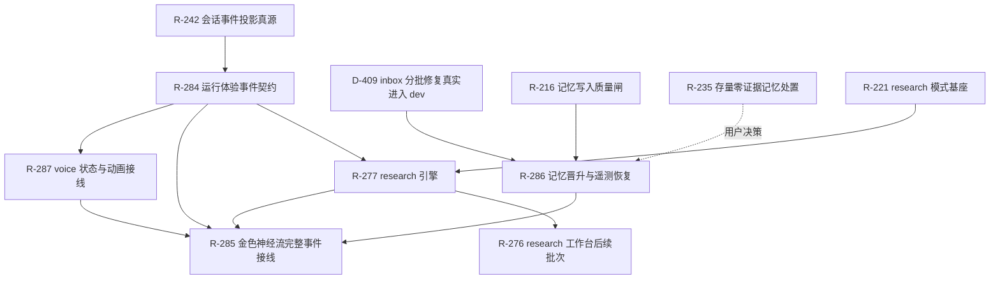

# 自举二期系统升级总纲

- 状态：设计基线（2026-08-17，用户确认一期可结项并启动全面升级）
- 范围：research、memory、运行体验事件、金色神经流、voice
- 实施载体：R-221、R-276、R-277、R-283～R-287
- 一期基线：loop/dev 主链进入稳定维护；二期集中补齐研究质量、记忆控制面、系统表现力和语音交互

## 1. 二期目标

二期把 Kanzei 从“能稳定完成开发闭环的自举系统”升级为“能研究、能积累、能解释自身运行、能自然交互的个人 Agent 系统”。四个结果同时成立才算完成：

1. research 可以围绕一个真实课题完成计划、检索、阅读、反思、写作、引用核验和断点恢复；
2. memory 可以持续消化 inbox、形成候选、依据真实来源晋升，并用结果遥测判断记忆价值；
3. 主对话和记忆页以真实运行事件驱动金色神经流，形成 Kanzei 自身的视觉语言；
4. voice 支持流式语音输入、语音回复和经授权的定制声音，同时保留文本、工具、权限和记忆链路。

二期不推翻一期已经稳定的 loop/dev 运行语义。新能力通过独立状态机、适配器和事件投影接入，避免把研究、动画或语音逻辑塞进核心 runner。

## 2. 当前基线与主要缺口

| 领域 | 已有能力 | 主要缺口 | 对应条目 |
| --- | --- | --- | --- |
| loop/dev | 会话事件、工具链、自主推进、并行线路、交付门禁 | 进入稳定维护，继续处理存量缺陷 | 既有清单 |
| research | ResearchProfile、source/finding 工具、双面板 UI、LaTeX/绘图工具 | 缺少可恢复研究引擎、topic 工件、来源适配、计划审批和引用门禁 | R-221、R-276、R-277 |
| memory | Markdown 真源、FTS/hybrid 检索、candidate 生命周期、recall/eval 表 | inbox 整理链失效；来源账本与结果聚合不足；UI 未展示完整漏斗 | R-216、R-235、R-286、D-409 |
| 运行体验事件 | 已有 `kz:*` 会话和工具事件 | memory/research/voice 缺少统一事件词表；展示层容易各自推断状态 | R-242、R-284 |
| 动画 | 现有金色主题和轻量 CSS 动效 | 缺少真实事件驱动的系统级视觉表现 | R-285 |
| voice | 完成提示音 | 无采集、VAD、ASR、TTS、声音档案和中断控制 | R-287 |

## 3. 权威边界

二期继续使用三类权威面：

- **事实面**：SQLite、Markdown 工件和不可变运行事件，负责回答“发生了什么”；
- **控制面**：research/memory/voice 状态机，负责回答“下一步允许做什么”；
- **表现面**：主对话、工作台、动画和音频播放，负责把事实与状态投影给用户。

动画只消费表现事件，不成为业务真源；动画丢帧、窗口隐藏或用户开启减少动态效果，不能改变运行状态。语音输入最终进入现有文本输入与权限链，TTS 只朗读已经形成的回复文本。research 和 memory 的成功状态必须由持久化事实决定。

## 4. 依赖图



依赖分为两种：

- **硬依赖**：没有上游事实或状态契约就不能交付下游验收，例如记忆晋升事件必须建立在真实晋升链上；
- **软依赖**：可以先完成独立批次，例如金色神经流的 Canvas 引擎和现有 `kz:*` 事件接线可以先于 R-284。

## 5. Work Breakdown Structure

### 5.1 R-283：二期升级编排与终态门禁

职责：维护本总纲、依赖、取活顺序、跨条目验收和二期结项报告。

批次：

1. 固化设计、需求映射和现状快照；
2. 解决 P0 事实偏差：D-409 交付状态、inbox backlog、事件真源依赖；
3. 研究与记忆引擎通过各自 E2；
4. 动画和 voice 通过 E3；
5. 完成一次真实的“研究产生结论 → dev 实施 → memory 晋升 → 动画可见 → 语音复述”联合验收。

### 5.2 R-286：记忆晋升与遥测恢复

#### A. 整理执行链

- inbox 按条目数与字节/token 双上限分批；
- 每批记录 `batch_id`、输入条目、状态、成功条目、失败原因和下一游标；
- memory-manager 返回结构化结果，调用方不得忽略错误；
- 桌面端和 CLI 共用同一整理服务；
- 重启后从最后一个完成 checkpoint 继续；
- partial success 保留已成功结果，不整批回滚或整批重做。

#### B. 生命周期事实

- `note_queued`：原始经验进入 inbox；
- `candidate_created`：manager 形成候选；
- `candidate_shadowed`：候选进入观察期；
- `candidate_promoted`：来源、recurrence、评估门槛满足；
- `memory_deprecated`：记忆失效或降级；
- 每个状态转换携带 memory id、episode/source id、reason code 和时间。

#### C. 遥测漏斗

统一统计：

`AVAILABLE → RETRIEVED → INJECTED → ACTION_CHANGED → OUTCOME_IMPROVED`

需要补齐：

- inbox backlog、最老等待时间、单批成功率；
- candidate 到晋升的时间和失败原因；
- source provenance 覆盖率；
- retrieval、injection、fetch/adopt 的分层统计；
- counterfactual eval 聚合；
- 每条记忆的正收益、无收益和负收益画像。

#### D. 记忆 UI

- 顶部显示真实漏斗与 backlog，不以静态卡片代替运行状态；
- candidate 展示来源、recurrence、shadow 时间和晋升缺口；
- active 条目展示最近召回、采用和 outcome 结果；
- 整理操作显示 queued/processing/partial/failed/completed；
- 失败可重试，错误不会只留在日志。

### 5.3 R-221/R-277/R-276：research 工程化

#### A. topic 工件

```text
.kanzei/research/<topic_id>/
  research_plan.md
  state.json
  query_log.jsonl
  sources/
  evidence.jsonl
  findings.md
  outline.md
  claim_source_matrix.json
  report.md | paper.tex
  validation.json
```

#### B. 引擎状态机

`scoping → plan_pending → approved → retrieving → synthesizing → verifying → completed/paused/failed`

要求：

- 计划未经批准不能开始大规模检索；
- 每阶段完成后写 checkpoint；
- 强杀后恢复时不重复已经确认的来源和章节；
- token、轮次、来源数量和时间均有预算；
- 预算耗尽时收敛写作并报告缺口，而不是丢失已有研究。

#### C. 来源与证据

- 网页、arXiv、GitHub、本地文件和直接 URL 使用统一 adapter；
- 单一 provider 故障不结束整个研究；
- 保存作者、日期、URL/file@commit、读取片段、哈希和证据深度；
- finding 创建时绑定 source；
- 报告完成前生成 claim-source matrix；
- 机械检查来源是否真的包含支撑文本。

#### D. 质量评测

固定覆盖文献综述、代码+论文联合研究、竞争调研、开放方向、负结果和断点恢复六类任务。评价来源覆盖、引用正确、恢复一致、预算遵守和最终可读性，不以报告长度作为质量指标。

### 5.4 R-284：运行体验事件契约

#### A. 事件包络

```json
{
  "event_type": "memory_recall_injected",
  "event_id": "uuid",
  "project_id": "project_id",
  "session_id": "session_id",
  "run_id": "run_id",
  "entity_ids": ["M-071"],
  "timestamp_ms": 0,
  "phase": "completed",
  "intensity": 0.8,
  "metadata": {}
}
```

业务字段统一 `snake_case`。事件分为：

- 持久化事实事件：用于恢复、审计和 UI 重新投影；
- 瞬时表现事件：由事实投影派生，允许丢帧，不写入长期数据库；
- 高频 delta：按帧或时间窗口合并，避免 text delta 形成事件风暴。

#### B. 词表

会话：`run_started`、`reasoning_active`、`assistant_streaming`、`run_completed`、`run_failed`、`run_stopped`。

工具：`tool_started`、`tool_progressed`、`tool_completed`、`tool_failed`。

记忆：`memory_note_queued`、`memory_candidate_created`、`memory_candidate_promoted`、`memory_recall_retrieved`、`memory_recall_injected`、`memory_outcome_evaluated`、`memory_deprecated`。

research：`research_plan_pending`、`research_plan_approved`、`research_source_retrieved`、`research_finding_bound`、`research_section_verified`、`research_completed`。

voice：`voice_listening`、`voice_transcribing`、`voice_thinking`、`voice_speaking`、`voice_interrupted`、`voice_failed`。

#### C. 消费纪律

- 事件必须带归属标识，前端不能按当前页签猜 session；
- 控制状态先归并到 session/topic store，再触发表现；
- 动画只接收经过归属过滤的事件；
- 同一事实重放不会重复形成晋升、通知或音频副作用；
- 未知事件安全忽略并留下开发日志。

### 5.5 R-285：金色神经流

执行归属：主会话（SOL）。自举循环可运行机械检查、补明确回归测试或修已登记缺陷，不得自行重做构图、颜色、运动节奏和视觉层级。

#### 视觉主张

深暖近黑工作台中的低亮金色生命体。常态像缓慢呼吸的神经场，运行时能看到信息流向，记忆形成时出现短暂结晶。内容、代码和操作状态始终高于动画。

#### 三种核心运动

1. **呼吸**：空闲时节点和边以低振幅缓慢变化；
2. **流动**：用户输入、推理、工具和召回形成定向金色脉冲；
3. **结晶**：candidate/promote 或完整研究结论形成时，多条流汇聚成高亮节点后稳定下来。

#### 分层实现

- B1：Canvas 2D 神经场、主题 token、ResizeObserver、减少动态效果和后台暂停；
- B2：现有 `kz:turn/text/tool/done/error` 与记忆页真实操作接线；
- B3：接 R-284 的 memory/research/voice 结构化事件；
- B4：性能档位、设置开关、真实 WebView2 E3 和视觉回归工件。

#### 视觉映射

| 事件 | 表现 |
| --- | --- |
| run_started | 脉冲从输入侧进入神经场，网络能量抬升 |
| assistant_streaming | 细小连续脉冲沿主干流动 |
| tool_started | 主干分叉，按工具类型选择路径 |
| memory_recall_retrieved | 记忆簇被扫描点亮 |
| memory_recall_injected | 高亮粒子从记忆簇流向回复区域 |
| memory_candidate_promoted | 多条边汇聚、节点结晶并形成光晕 |
| run_completed | 能量向外围收敛后恢复静息 |
| run_failed | 流动中断并产生短促琥珀/错误色阻塞，不播放成功结晶 |
| voice_listening/speaking | 输入侧扩散波 / 输出侧呼吸波 |

#### 性能与无障碍

- 主对话常态低频刷新，活动态才提升帧率；
- 窗口隐藏时停止绘制；
- `prefers-reduced-motion` 下保持静态网络，只更新状态文本；
- Canvas `pointer-events:none`，不遮挡选择、滚动和点击；
- 高 DPI 设置像素比上限；
- 不创建虚假的记忆语义边，静态网络只作为运行场，真实脉冲来自真实事件。

### 5.6 R-287：voice

#### A. 技术栈

- 音频采集/播放：Rust `cpal`，Windows 走 WASAPI；
- VAD/流式 ASR 首选：`sherpa-onnx` Rust API；
- ASR 对照：`whisper.cpp`；
- 本地定制 TTS：CosyVoice sidecar；
- 托管定制 TTS：OpenAI Custom Voice、ElevenLabs adapter；
- 状态接入：R-284 voice 事件。

#### B. 产品批次

1. **设备与基准**：设备枚举、录音、播放，建立中文/英文/代码术语测试集；
2. **Push-to-talk**：实时 partial、final 回填输入框、用户确认后发送；
3. **语音回复**：TTS 播放、暂停、停止，文本与音频状态一致；
4. **定制声音**：voice profile、授权录音、样本版本、删除与 provider 切换；
5. **自然打断**：VAD 自动收尾、barge-in、中断 TTS、状态恢复。

#### C. 安全与隐私

- 默认不保存原始录音；
- 参考音频与 consent 记录放应用数据目录，不进入 Git、memory 或普通运行日志；
- transcript 是否进入长期历史沿用现有会话设置；
- provider key 只在 Rust/后端读取；
- 删除 voice 时同时提供本地样本和云端 voice 的明确处置结果；
- 任何声音克隆都必须有明确授权记录。

#### D. 基准与验收

- 目标设备上至少 50 条真实麦克风语料；
- 分开记录首个 partial、停顿到 final、TTS 首包和中断延迟；
- 报告中文 CER、代码术语修正率、实时率和峰值资源；
- ASR/TTS/provider 失败进入可恢复状态，不让语音层卡死文本对话；
- 定制声音用真实 provider 或本地模型响应验收，配置输出不作为激活证据。

## 6. 实施波次与取活顺序

### Wave 0：事实恢复

1. R-286 先修 D-409 未进入 dev 和错误吞没；
2. R-283 更新台账与当前事实；
3. R-284 固化事件词表和持久/瞬时边界。

Go：inbox 可分批下降、失败可见、台账与 dev 一致；事件不依赖当前页签猜归属。

#### Wave 0 事实记录（本批复核：Go）

- **状态：Go。** 当前 `dev` 已满足 inbox 分批、失败可见和台账一致三项门槛；D-409/D-428 的历史矛盾已由 R-286 在当前 dev 重新对账，不再把归档状态单独当作实现证据。
- **实现证据：** `crates/kanzei-memory/src/memory/inbox.rs:18-122` 提供按批读取与 checkpoint；`crates/kanzei-tools/src/memory_consolidation.rs:1-301` 保留失败原因并支持重试；桌面与 CLI 分别在 `crates/kanzei-app/src/memory.rs:298-306`、`crates/kanzei/src/cli/memory.rs:15-33` 调用同一整理服务。
- **当前证据：** R-286 的真实 manager 运行记录为 `T-1786922726169`，关闭前 workspace 回归为 `T-1786922726213`；D-428 已 fixed 并归档。

### Wave 1：研究与记忆引擎

1. R-221 topic 工件和记忆一元化；
2. R-277 计划、检索反思、写作、引用校验；
3. R-286 provenance、晋升漏斗和 counterfactual 聚合；
4. R-276 接计划树、证据深度和全文阅读。

Go：一条真实课题和一条真实记忆都能从来源走到可复查终态。

#### Wave 1 当前门禁记录（本轮复核：Go）

- **状态：Go。** research 与 memory 已达到当前 E2 门槛：R-221、R-276、R-277、R-286 均已完成真实链路验收；R-283 的 Wave 1 不再引用旧的 `todo/0/N` 状态。
- **research 证据：** R-221 的 topic 工件、来源/发现、报告与回流记录位于 `.kanzei/research/r221-chain/`，真实链路证据为 `T-1786922726120`、`T-1786922726121`；R-277 的计划、检索反思、报告/LaTeX 与引用校验由 `T-1786922726169`、`T-1786922726170` 覆盖；R-276 的研究工作台和引用回源由 `T-1786922726173` 覆盖。
- **memory 证据：** R-286 已在当前 dev 接通分批 inbox、provenance、生命周期和 outcome 聚合；控制面消费位于 `crates/kanzei-app/src/memory.rs:42-87`，真实运行证据为 `T-1786922726169`、`T-1786922726202`、`T-1786922726207`、`T-1786922726209`、`T-1786922726213`。D-428 已 fixed。
- **交接：** Wave 1 已 Go；后续 Wave 2 仍等待 R-284 事件契约、R-285 剩余批次，Wave 3 等待 R-287。

### Wave 2：系统表现力

1. R-285 B1/B2 可先行；
2. R-284 稳定后完成 R-285 B3；
3. 完成设置、性能和 E3 验收。

Go：动画只响应真实事件，减少动态效果成立，长对话与记忆页无明显性能退化。

#### Wave 2 当前门禁记录（本轮复核：No-Go）

- **状态：No-Go。** R-285 的 Canvas 与现有 `kz:*`/memory 操作接线已有 E2 级证据，但结构化 memory/research/voice 事件、真实 WebView2 性能和设置档位尚未完成。
- **已有能力（非本轮交付）：** R-285 进展已记录 `T-1786922726035` 前端回归和 `T-1786922726036` Chromium 视觉验收，覆盖 B1/B2；这些是既有主会话交付，不冒充 R-283 本批实现。
- **缺口证据：** R-284 当前为 `todo`、批次 `0/4`，R-285 的批3依赖 R-284；R-285 仍为 `doing`、批次 `2/4`，剩余为结构化事件、设置/质量档和真实 WebView2 E3。故当前没有真实 `memory_recall_injected`/`candidate_promoted`/research/voice 事件的完整消费证据。
- **交接：** R-284 完成事件契约并由 R-285 接通后，再补 WebView2 长会话、窗口档位和 reduced-motion 的真实证据，Wave 2 才能评估 Go。

### Wave 3：语音

1. R-287 设备/ASR 基准；
2. Push-to-talk；
3. TTS adapter；
4. 定制声音；
5. barge-in 和动画联动。

Go：文本主链始终可用；语音失败可恢复；定制声音经过授权和真实输出验收。

#### Wave 3 当前门禁记录（本轮复核：No-Go）

- **状态：No-Go。** R-287 当前为 `todo`、批次 `0/5`，尚未形成真麦克风、ASR、TTS、授权定制声音或 barge-in 的实现和测试证据。
- **范围证据：** R-287 明确要求 cpal/WASAPI、sherpa-onnx/whisper.cpp 对照、partial/final 字幕、TTS adapter、授权 voice profile 和打断恢复；当前没有可绑定的真实设备基准、provider 输出或删除边界测试。
- **依赖证据：** R-287 依赖 R-284 的 voice 状态投影；R-284 仍为 `todo`，因此语音不能绕过统一事件契约直接接入动画或会话状态。
- **交接：** R-287 完成真实设备与 provider 验收，并提供授权、存储、删除和失败恢复证据后，Wave 3 才允许评估 Go；在此之前不得以配置文件或 mock 输出核销。

### Wave 4：联合验收

完成一个真实闭环：

1. 用户通过语音提出研究问题；
2. research 生成并执行经批准的计划；
3. 来源和 finding 形成报告；
4. dev 根据结论完成一项实现；
5. memory 提取候选并依据真实来源晋升；
6. 主对话与记忆页动画准确反映检索、工具、完成和晋升；
7. 系统用定制声音复述结果；
8. 所有步骤可从 session/topic/memory id 回溯。

#### Wave 4 当前门禁记录（本轮复核：No-Go）

- **状态：No-Go。** 当前没有一次真实的“语音研究请求→批准计划→来源/finding 报告→dev 实施→memory 晋升→动画可见→定制声音复述”闭环记录。
- **可回溯性缺口：** 尚未产生可同时关联的 `session_id`、`topic_id`、`memory_id` 和实现提交；现有 R-285 Chromium 视觉记录属于既有 E2 视觉验收，不包含 research、voice 或 memory 晋升联合链路。
- **门禁：** Wave 4 禁止用单测、viewport 模拟、替身 provider 或静态配置代替真实链路；必须由真实入口产生真实效果，并逐步记录 session/topic/memory id、提交、测试和失败状态。
- **交接：** Wave 0～3 全部转 Go 后，R-283 再组织一次真实联合验收；在此之前二期不得结项，requirements/defects/tests/实现必须继续保持未完成事实一致。

## 7. 测试矩阵

| 层级 | research | memory | 动画 | voice |
| --- | --- | --- | --- | --- |
| E0 静态 | schema、路径、引用格式 | 生命周期枚举、SQL/文档契约 | JS 语法、lint、i18n、a11y | feature、权限和配置契约 |
| E1 单元 | 状态转换、预算 | 分批、去重、晋升门槛 | 事件映射、节流、降级 | 音频格式、状态转换 |
| E2 集成 | 来源 adapter、强杀恢复、引用核验 | inbox→candidate→active、counterfactual | 模拟 `kz:*` 与 memory 事件 | 采集→ASR→文本、文本→TTS |
| E3 运行时 | 计划编辑和报告回源 | 真实记忆页和失败恢复 | WebView2 帧率、窗口档位、减少动态效果 | 真麦克风、播放、打断 |
| E4 外部 | 真实网页/provider | 跨真实轮次收益 | 不适用 | OpenAI/ElevenLabs/本地模型真实输出 |

## 8. 风险登记

| 风险 | 后果 | 控制 |
| --- | --- | --- |
| D-409 修复曾先于实现进入归档 | 自举可能把历史状态当作当前事实 | R-286 已在当前 dev 重接分批整理、checkpoint、错误回传与真实 drain；D-428 fixed |
| 高频 text delta 直接驱动画 | CPU/GPU 占用、长会话卡顿 | R-284 合并 delta；R-285 活动态节流 |
| 表现事件被误用为业务成功 | UI 动画与真实状态矛盾 | 动画只消费事实投影；失败事件有独立表现 |
| research 依赖单一 web search | provider 故障使研究停摆 | 多 adapter、失败证据和预算内替代路径 |
| 记忆晋升只看 recurrence | 重复错误被强化 | provenance + shadow + counterfactual outcome |
| 本地 TTS 模型过重 | 安装体积和启动时间失控 | 先基准；sidecar 可选安装；托管 adapter 可替换 |
| 声音样本进入 Git/日志/memory | 隐私泄露 | 应用数据目录、明确 consent、默认不存原始录音 |
| 自举模型重做动画 taste | 视觉漂移 | R-285 归属主会话（SOL），自举只做机械验证/明确缺陷 |

## 9. 二期终态

二期完成需要同时满足：

- R-221、R-276、R-277 的 research 主链通过真实课题验收；
- R-286 的 inbox、晋升、来源和 outcome 漏斗持续运行；
- R-284 成为 research/memory/voice 共同的体验事件契约；
- R-285 完成真实 WebView2 和减少动态效果验收；
- R-287 完成真实麦克风、ASR、TTS 与授权定制声音验收；
- 联合闭环可以按关联 ID 重放和审计；
- requirements、defects、tests 和实现状态一致，没有把静态配置、mock 或低等级证据写成真实完成。
