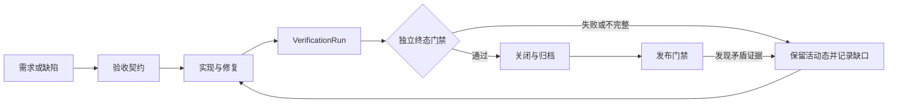

# Kanzei 可靠性、可用性与自举质量打磨设计

- 状态：设计基线已完成，工程实施待推进
- 日期：2026-08-07
- 适用范围：桌面端、核心运行器、工具与协议层、项目追踪器、测试归档和发布流程
- 关联需求：R-080、R-083、R-084、R-085、R-086、R-087、R-088、R-089、R-090、R-091、R-092、R-093
- 关联缺陷：D-050、D-051、D-053、D-054、D-055、D-056、D-060、D-061、D-064、D-066、D-068、D-104～D-110

## 1. 结论

Kanzei 已经具备形成日常开发工具的能力骨架：项目管理、多会话运行、工具调用、权限询问、文档追踪、SQLite 持久化和桌面界面均已存在。当前制约项目的核心因素已经从“缺功能”转为“状态、反馈和证据无法稳定闭环”。继续横向增加功能会放大恢复成本，也会让用户越来越难判断系统究竟完成了什么。

下一阶段的产品目标统一为：

> Agent 在明确边界内自由执行；每个关键状态都可恢复；每个完成结论都能被独立证据复核。

该目标拆成三个互相约束的质量面：

1. **可靠性**：不静默丢数据、不产生无法收尾的状态、不让权限判断与真实执行对象发生偏差。
2. **可用性**：用户始终知道当前对象、当前状态、失败原因和恢复入口，核心路径在受支持的窗口与输入方式下可完成。
3. **自举质量**：Kanzei 可以管理和验证自身项目，但生成、验证、终态变更与发布判断之间必须有结构化证据和职责隔离。

在阶段 1～4 完成前，新增功能应限于质量收口所需能力；确需插入的业务需求必须说明它依赖和影响的质量不变量。

## 2. 当前质量模型的问题

### 2.1 能力存在不等于闭环成立

当前多项能力有命令、有界面或有数据结构，但缺少真实调用方、消费方或恢复路径。典型表现包括测试记录写入端不可达、移动消息进入后无人消费、工作树命令与运行会话没有绑定。这样的能力会增加维护面，却不能支撑用户任务完成。

### 2.2 状态权威分散

运行状态同时存在于后端句柄、会话事件和前端全局变量中。界面切换项目或进程后，当前视图状态可能覆盖真实会话状态；后台控制事件又可能因视图过滤而丢失。状态权威不明确，是 D-055、D-056 一类挂死和串流问题的共同根因。

### 2.3 部分成功被压成单一结果

一次工具批次中可能同时包含已执行、被拒绝、未执行和写盘失败的操作。若返回路径直接退出，历史配对、外部副作用与界面反馈会产生分歧。D-054、D-061、D-064、D-066 都属于“业务动作已部分发生，状态收尾未完成”。

### 2.4 边界判断与真实对象不等价

路径权限、命令授权和 provider 错误分类目前包含字符串近似、首词泛化或模糊匹配。安全判断使用的对象必须和实际执行对象等价；否则规则看似存在，实质边界可以被路径大小写、解释器、重定向或错误文本变化绕过。

### 2.5 界面反馈服务于瞬时视图，而非任务恢复

短时 toast、全局运行标志、相互争抢空间的侧栏和只支持部分 Markdown 的输出区，使用户在失败后缺少稳定证据。可用性问题在这里与可靠性直接耦合：反馈消失会让用户重复操作，状态误读会让用户错误停止或继续任务。

### 2.6 自举容易形成乐观闭环

同一个 Agent 可以实现功能、运行局部检查、撰写“已完成”描述、关闭需求并进入发布。只要其中任一步把静态检查、既有能力或单元测试扩大解释为端到端通过，错误结论就会被追踪文档固化。R-050、R-059、R-070、R-080 的重新核查已经证明，终态判断需要独立的证据约束。

## 3. 质量定义与目标

### 3.1 可靠性

一个流程满足以下条件，才可视为可靠：

- 输入被接纳后有且仅有一个可解释的终态；
- 已发生的副作用与保存的历史一致；
- 进程崩溃或界面重建后能恢复或明确终止；
- 并发写入不会产生重复序号、覆盖或半提交；
- 权限决策绑定规范化后的真实执行目标；
- 错误分类不改变原始错误事实，重试行为可追踪。

### 3.2 可用性

核心任务路径为“选择项目与进程 → 发出请求 → 观察运行 → 处理权限或停止 → 查看结果与证据”。这条路径必须满足：

- 当前项目、进程、会话和运行状态可辨认；
- 高频动作直接可达，低频动作两步内可达；
- 异步动作有 pending、success、failure、cancelled 等明确反馈；
- 错误和长结果持久可见、可复制并提供恢复入口；
- 800×500、1024×720、1280×840 三档桌面窗口可用；
- 仅使用键盘可以完成核心流程。

### 3.3 自举质量

自举质量指 Kanzei 使用自身的需求、缺陷、执行和测试机制推进 Kanzei 项目时，仍能产生可复核的工程结论。它要求：

- 需求和缺陷终态由验收项与验证记录驱动；
- 验证记录绑定代码修订和工作树状态；
- 生成者的说明不能替代验证器的结果；
- 发布结论同时覆盖代码、运行时、安装物和外部依赖边界；
- 后续发现矛盾证据时可以自动或半自动重新开放条目。

## 4. 全局质量不变量

| 领域 | 必须保持的不变量 | 违反后的典型结果 | 当前关联 | 最低证据 |
| --- | --- | --- | --- | --- |
| 权限 | 决策对象与实际执行对象经过同一套规范化；授权范围精确可解释 | 越权、规则绕过 | D-050、D-051 | E2 |
| 消息历史 | 每个 ToolCall 都有且仅有一个对应 ToolResult，拒绝和取消也必须配对 | 会话永久 400、重复副作用 | D-053、D-054 | E2 |
| 输入队列 | 一个 input_id 只被接纳一次，并最终进入 completed、cancelled 或 failed | promoted 输入丢失、重复执行 | D-066 | E2 |
| 会话控制 | ask、done、error、stopped 等控制事件按 session_id 收敛到终态 | 后台挂死、前台假运行 | D-055、D-056 | E2 + E3 |
| 持久化 | 序号分配、业务写入和幂等记录在同一事务语义内 | 竞争冲突、假失败 | D-064 | E2 |
| 配置与文档 | 写入保留未知字段和用户自由内容；多文件变更原子提交 | 配置半更新、手改内容消失 | D-060、D-061 | E2 |
| Provider | 保留原始错误，按结构化状态分类；重试和回退有次数与原因 | 错误误报、不可诊断 | D-068、R-088 | E2 + E4 |
| 界面状态 | 前端展示是后端会话状态的投影，视图切换不改变运行事实 | 串流、卡死、误操作 | D-055、D-056 | E3 |
| 操作反馈 | 失败反馈在用户确认或问题解除前持续存在 | 重复提交、无法恢复 | D-106 | E3 |
| 发布 | commit、push、合并、构建、安装和外部服务验证分别记录 | 把代码存在误报为上线 | R-085 | E4 |

质量实现首先保护这些不变量，再优化局部体验。单个缺陷修复若绕开不变量，只会把故障移动到另一条路径。

## 5. 三个平面与权威边界

### 5.1 执行平面

执行平面包含 runner、工具、协议、权限和存储。它负责真实副作用以及每次执行的确定终态。这里的状态只能由后端状态机推进，前端不能通过隐藏控件或本地变量替代后端约束。

### 5.2 产品状态平面

产品状态平面按 project_id、process_id、session_id 管理用户看到的运行状态、pending ask、输入队列、活动和历史。当前页面只是状态投影。切换页面只改变投影对象，不会删除、重置或吞掉其他会话状态。

### 5.3 证据平面

证据平面记录需求或缺陷怎样被验证、验证针对哪个修订、运行了什么、产生了哪些结果、有哪些未覆盖边界。终态变更只读取证据平面的结构化结果，不解析 Agent 的自然语言自述。



## 6. 核心状态机

### 6.1 会话运行

```text
idle -> starting -> running -> stopping -> stopped
                     |   |          |
                     |   +--------> failed
                     +------------> completed
```

- `starting` 失败必须回到 `failed`，不能留下假 running；
- `stopping` 必须有超时和强制收尾策略；
- `completed`、`failed`、`stopped` 都要带 terminal_reason；
- 启动时执行 reconciliation，把数据库和内存中的非终态运行恢复为可继续或明确中断。

### 6.2 输入生命周期

```text
pending -> promoted -> running -> completed
   |          |          |
   +-------> cancelled <--+
              |
              +---------> failed
```

每个输入携带稳定的 `input_id`。promote、开始运行和终态落库必须幂等。会话停止时，promoted 输入不能从队列消失；它必须被退回 pending 或写入 cancelled/failed。

### 6.3 权限询问

```text
pending -> answered | denied | expired | cancelled
```

pending ask 持久化或能够由后端运行状态重建。前端重连和切换会话后必须查询 pending ask。每个 ask 只能消费一次，重复回答返回确定的幂等结果。

### 6.4 需求与缺陷

现有文档状态保持兼容：需求使用 todo/doing/done，缺陷使用 open/fixed。新增 `verification_run_id` 和 `验证状态`，避免扩大现有枚举：

```text
todo -> doing -> done
         |        |
         |        +-- 发现矛盾证据 --> doing
         +-- verification: pending | passed | failed | incomplete

open -> fixed
  ^       |
  +-------+-- 发现矛盾证据
```

`done` 和 `fixed` 是受保护转换：所有强制验收项必须映射到通过的 VerificationRun，且验证修订覆盖当前目标修订。

## 7. 可靠性设计

### 7.1 统一关联标识

关键链路统一携带：

- `project_id`
- `process_id`
- `session_id`
- `run_id`
- `input_id`
- `tool_call_id`
- `ask_id`
- `verification_run_id`

事件、日志、数据库记录和前端状态使用同一标识，不通过活动页签或数组位置推断归属。

### 7.2 控制事件与展示事件分流

- 控制事件：ask、done、error、stopped、queue_changed、state_reconciled。所有会话都必须消费并更新状态。
- 展示事件：text_delta、tool_progress、activity_detail。所有会话可缓存，只有当前会话渲染到主对话区。

前端过滤器只能过滤渲染，不能过滤状态归并。后端提供会话快照命令，重连后以快照校正事件缺口。

### 7.3 原子写入与并发控制

- SQLite 使用事务完成序号分配、业务数据和幂等键写入；
- 竞争冲突基于唯一约束重试，不把内部 sequence 竞争暴露为业务失败；
- 配置和追踪文档使用“解析并保真 → 写临时文件 → flush → 原子替换”；
- OAuth 等多文件更新增加进程内锁和提交前校验；
- 文档解析保留未知段落、未知 bullet 和用户自由内容，禁止全文件有损重渲染。

### 7.4 消息与工具调用完整性

- 压缩历史前按 `tool_call_id` 建立配对图；
- 需要丢弃的工具消息以成对方式处理，或降级为带来源标识的文本摘要；
- 用户拒绝时，已执行工具写真实结果，被拒和未执行工具写明确的取消结果；
- 批次结束前执行配对校验，协议适配层拒绝构建含孤儿调用的请求；
- 副作用结果先进入运行日志，再进入模型历史，避免历史写失败抹掉已发生事实。

### 7.5 权限等价性

- 路径先按目标平台完成绝对化、分隔符归一、符号链接处理和大小写语义处理，再进入规则匹配；
- 规则命中的规范化路径必须与工具实际打开的路径一致；
- shell 授权使用解析后的命令结构和明确规则，不默认把首个单词泛化为任意参数；
- 重定向、管道、解释器、脚本路径和嵌套 shell 作为新的权限对象重新判断；
- 审计日志保存规则 ID、规范化目标、决定和用户回答，不保存密钥正文。

### 7.6 故障恢复与结果语义

- 启动时扫描非终态 run/input/ask，执行 reconciliation；
- 业务动作成功但持久化失败时返回 `effect_succeeded_persist_failed`，同时提供修复入口；
- 持久化成功但通知失败时保留业务成功，另记通知失败；
- provider 错误保留 HTTP 状态、错误类型、请求 ID 和安全摘要，分类器只派生 retryable/auth/rate_limit 等属性；
- 自动重试使用有限次数、退避和同一 run_id，用户能看到重试原因与次数。

## 8. 可用性设计

### 8.1 围绕核心任务重排信息架构

- 顶栏只保留项目/进程身份、运行状态、停止和必要的全局动作；
- 左栏承担项目与进程导航，可一键折叠并记忆；
- 中央区域专注对话、工具过程和输入；
- 右侧使用单一容器承载 todo、活动、详情等上下文视图，避免两个固定右栏并存；
- 低频动作进入带文字标签的溢出菜单，并保持两步内可达。

### 8.2 会话状态投影

前端维护按 session_id 索引的 store，每个会话独立保存：

- lifecycle 与 terminal_reason；
- pending ask；
- pending/promoted 输入；
- unread activity 计数；
- 流式文本缓冲；
- 最近错误与恢复动作。

当前视图从 store 派生，不维护第二套全局 running 真相。历史回看使用只读快照，明确显示时间和 session_id；实时事件继续进入实时会话 store，不追加到历史快照。

### 8.3 反馈分层

| 反馈类型 | 展示方式 | 生命周期 |
| --- | --- | --- |
| 短确认，如“已复制” | toast | 自动消失 |
| 字段或表单错误 | 就地提示 | 修正前持续 |
| 运行失败、权限拒绝、保存异常 | 对话内状态块 + 活动记录 | 用户确认或问题解除前持续 |
| 长错误、diff、验证报告 | 可复制详情面板 | 主动关闭，可从历史重开 |
| 阻断性决策 | 模态框或专用 ask 面板 | 回答、取消或过期后结束 |

每个失败反馈包含操作对象、失败阶段、最终状态、可安全展示的原因和可用恢复动作。

### 8.4 阅读、响应式与可访问性

- 支持安全 Markdown 的标题、列表、表格、链接、行内代码和代码块，并通过 XSS 用例；
- 长输出提供段落导航、复制和查看原始内容入口；
- 800、1024、1280 三档下保持单行顶栏和可读主区，侧栏按断点折叠；
- 拖拽分栏提供双击恢复和键盘调节；
- 使用原生按钮、导航和列表语义，图标按钮有稳定可访问名称；
- Tab、Enter、Space、Escape 和焦点回归纳入浏览器冒烟；
- 文案进入统一 i18n 资源，状态术语在界面、日志和文档中一致。

## 9. 自举质量架构

### 9.1 职责隔离

| 角色 | 职责 | 禁止替代的角色 |
| --- | --- | --- |
| Builder | 修改代码、文档和测试，说明实现范围 | 不能仅凭自述关闭条目 |
| Verifier | 在指定修订上运行检查并形成结构化结果 | 不能修改被验证实现后继续沿用旧结果 |
| Transition Guard | 根据验收项和 VerificationRun 决定 done/fixed 或重新开放 | 不解释实现者的主观完成度 |
| Release Gate | 检查提交、分支、构建物、安装物和外部边界 | 不把 commit 或 push 等同于发布 |

这些角色可以由不同 Agent 承担，也可以由确定性程序承担。关键约束是同一次 Builder 叙述不能直接成为终态证据。

### 9.2 VerificationRun 数据模型

```text
VerificationRun
  run_id
  target_kind          # requirement | defect | release | ad_hoc
  target_id
  revision             # commit SHA
  worktree_fingerprint # dirty 文件与 diff 摘要
  scope
  acceptance_items[]
  checks[]              # 命令、断言、环境、超时
  results[]             # pass | fail | incomplete | cancelled
  artifacts[]           # 日志、截图、报告、安装哈希
  boundaries[]          # 未执行或外部阻塞项
  started_at
  finished_at
  verifier
  status                # passed | failed | incomplete | cancelled
```

机器真源写入 SQLite，采用追加式记录。`.kanzei/project/tests.md` 是面向人的投影和索引，由真实测试记录入口生成；高风险验收和发布同时保存不可变报告工件。需求和缺陷保存 `verification_run_id`，从条目可回到完整证据。

若验证时工作树非干净，fingerprint 必须记录目标文件；实现再次变化后，旧 VerificationRun 自动变为 stale，不能继续支持终态。

### 9.3 证据等级

| 等级 | 证据 | 可支持的结论 |
| --- | --- | --- |
| E0 | diff、语法检查、类型检查、静态分析 | 代码存在且通过静态约束 |
| E1 | 单元测试、纯函数性质测试 | 局部逻辑在受控输入下正确 |
| E2 | 集成、并发、故障注入、协议契约测试 | 跨模块不变量和恢复语义成立 |
| E3 | Tauri/浏览器运行时、窗口档位、键盘与控制台检查 | 用户交互路径真实可用 |
| E4 | 真实 provider、认证、构建安装、更新与发布验证 | 外部集成或发布边界成立 |

最低门槛：

- 纯函数修复至少 E1；
- 会话、存储、权限和消息完整性至少 E2；
- 前端交互至少 E3，并覆盖规定窗口、失败状态和控制台错误；
- 认证、provider、安装和发布声明至少 E4；
- 一个较低等级的结果不能证明更高等级的结论。

### 9.4 终态门禁规则

Transition Guard 按以下顺序判定：

1. 读取条目原始验收项，保持原语义和范围；
2. 将每项映射到一个或多个实际 check；
3. 校验 check 的证据等级满足领域最低门槛；
4. 校验 VerificationRun 的修订和工作树 fingerprint 未过期；
5. 检查真实调用链，只有定义、按钮或命令而没有可达消费者时判定失败；
6. 区分本次新增、既有能力和未完成边界；
7. 任一强制项 failed/incomplete 时保留活动态；
8. 新证据与既有终态矛盾时重新开放，并记录证据差异。

R-092 的自动缺陷审查只负责产生候选缺陷和证据引用。自动发现不能直接把缺陷标为 fixed，也不能绕过重复项和严重性复核。

## 10. 验证体系

### 10.1 测试组合

- **确定性单元测试**：解析、分类、规范化和状态转换；
- **模型/性质测试**：输入、ask、run、ToolCall 配对状态机，生成乱序、重复和取消序列；
- **并发测试**：SQLite sequence、多会话控制、OAuth/配置并发写；
- **故障注入**：写盘失败、事件丢失、进程崩溃、provider 超时和重试耗尽；
- **协议契约测试**：Anthropic、OpenAI 和 Responses 请求中工具配对与错误映射；
- **前端运行时测试**：模拟 Tauri invoke/event 的快速冒烟，加真实 Tauri 核心路径验收；
- **真实集成测试**：provider 认证、受控工具调用、安装物启动和更新链路。

测试数量不作为质量指标。指标是验收项覆盖、关键不变量覆盖、失败分支覆盖和证据等级。

### 10.2 前端验收矩阵

每条核心路径至少覆盖：

- 800×500、1024×720、1280×840；
- 鼠标和纯键盘；
- 成功、失败、取消、超时；
- 当前会话和后台会话；
- 重载或重连后的状态重建；
- 无未处理异常、无控制台错误、无唯一入口被隐藏。

### 10.3 可观测性

结构化记录 run_id、session_id、事件类型、状态迁移、耗时、重试次数、持久化结果和 terminal_reason。界面活动记录与后端事件共享关联 ID。密钥、token、完整敏感请求体不得进入日志或验证工件。

## 11. 分阶段实施与 Go/No-Go

### 阶段 0：冻结质量基线

交付物：

- 固化当前需求、缺陷和支持边界；
- 为高风险条目补验收项与证据等级；
- 把代码、构建、运行时、外部服务、部署和工作树状态分开报告；
- 新功能进入质量影响审查。

Go 条件：P0/P1 条目均有所有者、验收路径和依赖关系；追踪器不存在无来源的“已完成”结论。

### 阶段 1：停止数据损失与状态失控

优先范围：D-050、D-051、D-053、D-054、D-055、D-056、D-060、D-061、D-064、D-066、D-068，主需求为 R-083、R-086、R-087、R-088。

Go 条件：权限、消息、输入、会话、持久化和配置不变量通过 E2；无开放的 P0 数据完整性、安全或会话收尾缺陷。

### 阶段 2：建立证据基础设施

交付物：

- VerificationRun 存储、记录入口和 tests.md 投影；
- R-084 前端快速运行时冒烟；
- 验收项到 check 的映射；
- stale 识别和终态门禁。

Go 条件：新关闭的需求/缺陷 100% 关联有效 VerificationRun；R-080 的记录生产、展示和归档链路真实可达。

### 阶段 3：完成核心交互收口

优先范围：R-089、R-090、R-091 与 D-104～D-110。

Go 条件：核心路径通过 E3 矩阵；后台会话、错误恢复、历史只读、响应式和纯键盘路径全部有工件；不存在阻断主路径的 P1 可用性缺陷。

### 阶段 4：闭合自举循环

交付物：

- Builder、Verifier、Transition Guard、Release Gate 的可执行流程；
- R-092 候选缺陷生成与人工/规则复核；
- 矛盾证据触发重新开放；
- 发布验证报告。

Go 条件：连续两个质量批次由 Kanzei 自身完成“实现 → 验证 → 终态 → 复核”，抽查无扩大证据范围、无死调用链、无错误归档。

### 阶段 5：日常使用候选

Go 条件：

- P0 为零，核心域 P1 为零或有用户明确接受的限制；
- 所有终态条目有未过期证据；
- 全工作区检查通过，核心前端路径通过；
- `dev`、发布工作树、构建物、安装物和真实 provider 的状态分别可追踪；
- 完成一次从已安装版本到目标版本的受控升级验证。

达到阶段 5 后恢复常规功能扩展；质量门禁保留为永久流程。

## 12. 需求映射

| 需求 | 在本设计中的位置 | 目标阶段 |
| --- | --- | --- |
| R-080 | VerificationRun 的人类投影、测试记录入口和归档 | 2 |
| R-083 | 高危缺陷收口与全局质量基线 | 1 |
| R-084 | 前端快速运行时冒烟 | 2 |
| R-085 | 证据等级和验收执行边界 | 0、2 |
| R-086 | 会话状态权威、控制事件路由和 pending ask 重建 | 1 |
| R-087 | 工具配对和协议数据完整性 | 1 |
| R-088 | 凭证原子性与 provider 错误语义 | 1 |
| R-089 | 布局和操作层级 | 3 |
| R-090 | 内容可读性和持久反馈 | 3 |
| R-091 | 键盘与可访问性 | 3 |
| R-092 | 候选缺陷自动发现入口 | 4 |
| R-093 | 本设计的总体实施与质量门禁 | 0～5 |

## 13. 数据迁移与兼容策略

- VerificationRun 使用新增表和 migration，不改变既有需求/缺陷正文的基本可读格式；
- 既有 done/fixed 条目初始标记为 `verification: legacy_unverified`，不批量推翻，进入相关发布或回归范围时补证；
- 需求和缺陷只新增可选的 `verification_run_id` 与验证摘要，旧文档仍可解析；
- 文档保真修复完成前，禁止模型通过有损 parse/render 路径批量重写追踪文件；
- 数据库变更提供前滚 migration、已有数据回填策略和备份恢复说明；
- 验证工件按保留策略清理，结构化摘要和哈希长期保留。

## 14. 设计验收与后续 TODO

本设计完成了以下决策：

- 明确可靠性、可用性和自举质量的统一目标；
- 建立跨权限、会话、消息、存储、界面和发布的质量不变量；
- 确定执行、产品状态和证据三个权威平面；
- 定义 run、input、ask、需求和缺陷的终态规则；
- 定义 VerificationRun、证据等级、职责隔离和终态门禁；
- 给出阶段 0～5 的实施顺序与 Go/No-Go 条件。

工程 TODO：

1. 先完成阶段 0 的验收契约整理，不批量改状态；
2. 阶段 1 按不变量组织修复批次，每批只覆盖一条完整状态链；
3. 在阶段 2 设计数据库 schema 和 migration 前单独评审数据模型；
4. 在阶段 3 形成可复用的前端运行时夹具和视觉/可访问性验收脚本；
5. 在阶段 4 接入终态门禁前，用历史 reopened 条目回放验证规则。

