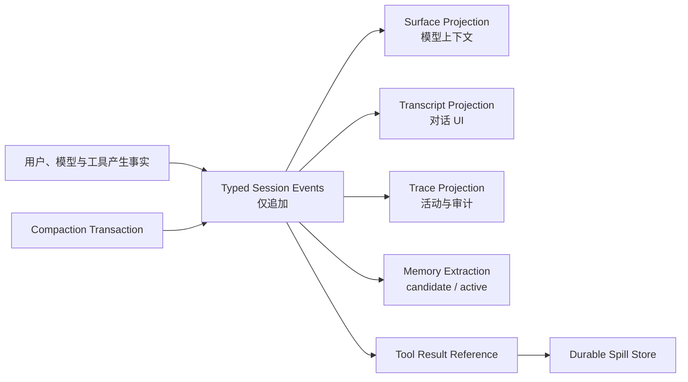

结论：值得做，而且应该作为一次 Harness 地基层升级推进。DeepSeek Harness 最值得吸收的是四个工程约束：事实只追加一次、模型上下文由事实投影、拒绝型约束不可逆、异步资源归属到明确 owner。Cordis 和 “Everything is a Plugin” 不需要进入 Kanzei。

本轮核对的是 DeepSeek Harness `master` 的 `47f943859bef60e4160492346772ded9b24f765a`。官方明确标记为 developer preview，后续会有破坏性变化，因此更适合作为设计参照，而不是直接依赖或移植其包结构。[官方仓库](https://github.com/deepseek-ai/deepseek-harness)、[固定版本](https://github.com/deepseek-ai/deepseek-harness/tree/47f943859bef60e4160492346772ded9b24f765a)

## 一、附文里的六点判断基本成立

源码确认：

- Session 是不可变事件日志，模型历史由 `surface` 投影；`surfaceOp=replace` 只遮蔽模型可见节点，原始事件仍保留。[Session 设计](https://github.com/deepseek-ai/deepseek-harness/blob/47f943859bef60e4160492346772ded9b24f765a/docs/subsystems/session.md)
- Compaction 写入 `compaction/start → summary → surface replace → end`，并检查压缩边界上的 tool call/result 配对。[Compaction 实现约束](https://github.com/deepseek-ai/deepseek-harness/blob/47f943859bef60e4160492346772ded9b24f765a/packages/compaction/compaction/README.md)
- 工具执行明确分为 `pre-execute → monotonic guards → execute wrapper → post-execute → final result`。[工具执行流水线](https://github.com/deepseek-ai/deepseek-harness/blob/47f943859bef60e4160492346772ded9b24f765a/docs/tool-execution-pipeline.md)
- Scope 同时承担可见性和生命周期归属，`dispose()` 会等待整个 fiber 真正静止。[Scope 实现](https://github.com/deepseek-ai/deepseek-harness/blob/47f943859bef60e4160492346772ded9b24f765a/packages/core/scope/src/index.ts)
- Spill 保存完整文本，模型仅获得受字节预算约束的 head/tail preview、定位符和读取指引。[Spill policy](https://github.com/deepseek-ai/deepseek-harness/blob/47f943859bef60e4160492346772ded9b24f765a/packages/spill/spill-policy/README.md)
- Invariant 是运行时 companion：加载已有 Session 时回放检查，后续事件在提交前、发布后继续检查序列、turn/step 包围关系和工具配对。[Session invariant](https://github.com/deepseek-ai/deepseek-harness/blob/47f943859bef60e4160492346772ded9b24f765a/packages/core/session/src/invariant.ts)

第六点需要补一个边界：DeepSeek 并没有给每个 package 生造运行时检查。没有可观察关系的 package 会提供解释明确的空 companion；真正的 invariant 只检查其拥有的关系。这一点很值得我们照搬。

## 二、Kanzei 当前最关键的真实差距

| 领域 | 当前实现 | 判断 |
|---|---|---|
| 会话事实 | SQLite 已有 `session_events`，但恢复依赖整包 `conversation.updated` | 有事件容器，尚未形成事件真源 |
| 对话历史 | 进程内是 `HashMap<session_id, Vec<Message>>`，轮末才保存完整快照 | 崩溃或轮末落盘失败仍可能丢失本轮历史 |
| Compaction | 直接重建、覆盖内存中的 `Vec<Message>`，随后保存压缩后的快照 | 压缩实际改写了唯一可恢复对话 |
| 权限门禁 | `Ruleset` 已有普通规则和不可覆盖的 `hard_denies` | 单调拒绝基础已经具备，应该复用 |
| 工具流水线 | 权限、进度窗口、执行、结果增强分散在 `drive.rs` 和工具内部 | 缺少可推理、可插入 Spill 的统一阶段 |
| 后台资源 | cancellation、transcript、result、notification、background process 各有注册表 | 有多个 RAII 点，但没有统一生命周期 owner |
| 大输出 | `read/bash/git/webfetch` 各自截断，缺少通用外置结果 | 截断后原文经常无法从同一会话恢复 |
| Invariant | 大量单测、脚本和局部 `debug_assert` | 缺少运行时事件关系检查与启动回放 |

最重要的证据是：

- `[append_event]` 目前接受任意字符串事件，但对话管理仍允许删除事件和清空快照：[events.rs](<C:/Users/kanzei/Documents/kanzei code/crates/kanzei-core/src/store/events.rs:12>)。
- 历史恢复直接取最新一条 `conversation.updated.messages`：[conversation.rs](<C:/Users/kanzei/Documents/kanzei code/crates/kanzei-app/src/conversation.rs:151>)。
- 完整对话只在一轮执行结束后写回：[run.rs](<C:/Users/kanzei/Documents/kanzei code/crates/kanzei-app/src/run.rs:1114>)、[run.rs](<C:/Users/kanzei/Documents/kanzei code/crates/kanzei-app/src/run.rs:1234>)。
- 当前压缩把中段替换为一条纪要并直接覆盖 `messages`：[compaction.rs](<C:/Users/kanzei/Documents/kanzei code/crates/kanzei-core/src/runner/compaction.rs:215>)。
- `run.trace` 中的工具终态只有 `preview`，而且存在 200 轮保留策略，无法作为完整原始对话的替代真源：[event.rs](<C:/Users/kanzei/Documents/kanzei code/crates/kanzei-core/src/runner/event.rs:51>)、[events.rs](<C:/Users/kanzei/Documents/kanzei code/crates/kanzei-core/src/store/events.rs:151>)。
- 当前权限的 hard deny 已经优先于可覆盖规则：[permission.rs](<C:/Users/kanzei/Documents/kanzei code/crates/kanzei-harness/src/permission.rs:130>)。这里应迁入统一 Guard 阶段，不必重写规则引擎。
- `SubagentRuntime` 同时携带多个可选注册表和回调，生命周期已明显碎片化：[subagent.rs](<C:/Users/kanzei/Documents/kanzei code/crates/kanzei-core/src/runner/subagent.rs:194>)。

所以，附文里的核心判断可以再收敛成一句：

> Kanzei 已经拥有事件、门禁、RAII 和压缩算法这些零件，下一步要把它们组成“单一事实源、分层执行管线、统一资源 owner”。

## 三、目标架构



关键规则：

1. `SessionEvent` 是事实；`Vec<Message>` 只能是临时投影。
2. `conversation.updated` 退出真源角色，最终停止新增。
3. `conversation_clear` 改成追加 `conversation.reset` 或 segment boundary，不删除历史事件。
4. Tool call 必须在执行前落事件；Tool result 在每个调用完成后立即落事件。
5. 崩溃恢复发现孤立 Tool call 时写入明确的 `interrupted` 终态，禁止自动重放可能有副作用的工具。
6. Compaction 只追加 summary 和 surface replacement，不修改、删除原事件。
7. Memory 从 Session/episode 事件提取，并带 provenance；Memory 不承担对话恢复。
8. 大工具结果的事实由“事件引用 + 完整 artifact”共同构成。

## 四、建议的串行实施顺序

### M0：冻结契约与迁移方案

先定义最小事件词表：

- `turn_started`
- `user_message`
- `assistant_message`
- `tool_called`
- `tool_result`
- `turn_stopped`
- `turn_completed`
- `turn_failed`
- `compaction_started`
- `compaction_summary`
- `surface_replaced`
- `compaction_ended`

同时确定：

- 原子 sequence 分配；
- event format version；
- legacy snapshot 一次性导入规则；
- 数据库升级前备份；
- 投影缓存可删除、可重建；
- 原事件禁止通用 DELETE。

旧历史无法恢复此前未持久化的原始细节。迁移时应把每个 Session 最新快照作为带 `legacy_snapshot` provenance 的 seed 导入，并如实保留其历史精度。

### M1：Typed Event + Shadow Projection

暂时保留现有运行路径，同时双写新的 typed events，并新增投影器：

```text
typed event replay
    ↓
derived messages
    ↓
与现有 summary.messages / conversation.updated 比较
```

这一阶段不切 UI，不改变模型输入。只有 shadow comparison 连续通过后才进入切换。

关键验收：

- 多连接并发追加不重号、不丢号；
- 停止、权限拒绝、工具错误路径全部闭合；
- 当前存量 Session 的 legacy 导入可重复执行且幂等；
- projector 重启回放结果确定；
- 未配对 Tool result、重复 result、跨 step 配对在提交时被拒。

### M2：会话真源切换

把以下读路径切到 projection：

- `conversation_get`
- `conversation_list`
- runner 的 `prior`
- 子代理 transcript 恢复
- UI 历史恢复

随后停止新增 `conversation.updated`，内存 `HashMap` 只保留 projector cache。

这一阶段必须做故障注入：

- user message 落盘后进程退出；
- assistant message 落盘后、工具执行前退出；
- 多工具只完成一部分时退出；
- stop 在工具执行中到达；
- SQLite 写入失败；
- UI 切线与进程退出同时发生。

完成标准是：重启后每个已发生事实都能恢复，未完成动作显式显示为 interrupted，不会凭空重放。

### M3：Surface Compaction

复用现有纪要模型、模板、质量闸和机械事实清单，只替换存储语义：

```text
compaction_started
→ 调现有 digest
→ compaction_summary
→ surface_replaced
→ compaction_ended
```

增加：

- 压缩边界 Tool call/result 配对检查；
- 压缩期间 surface generation 二次校验；
- 不完整 compaction transaction 检测；
- raw event hash 前后不变；
- 连续压缩 replay 一致性；
- Memory extraction 继续读 raw events 或明确的 episode projection。

这一步完成后，现有“纪要滚动合并”的算法价值才真正建立在可恢复地基上。

### M4：Tool Pipeline + Spill

在 `kanzei-harness` 建立固定阶段：

```text
parse/materialize
→ policy allow/deny/ask
→ invariant guards
→ execution wrappers
→ tool body
→ result policies
→ immutable result observers
```

已有能力的映射：

- `Ruleset` 普通规则 → Policy；
- `hard_denies`、托管文件、writer ownership → Monotonic Guard；
- timeout、progress、managed fence、cancellation → Execution Wrapper；
- recall、redundancy、truncate/redact/spill → Result Policy；
- UI、trace、metrics、memory telemetry → Result Observer。

Spill 采用：

```text
Inline(text)
Spilled {
    preview,
    artifact_id,
    bytes,
    sha256,
    retrieval_hint
}
```

Artifact 应放在与 `state.db` 同生命周期的、Git 忽略的项目运行目录中；写入使用原子文件和不可预测文件名。不能只放临时路径后不定义清理、迁移和重启恢复。

### M5：LineRuntime 统一资源归属

形成一个真正的 owner：

```text
LineRuntime
├── cancellation token
├── active run
├── child agent registry
├── transcript projection
├── background result registry
├── notification subscriptions
├── background process handles
├── writer/read leases
├── worktree binding
└── temporary artifacts
```

`dispose()` 必须：

- 幂等；
- 并发调用共享同一个完成 Future；
- 取消子代理后等待其退出；
- 收回非 persistent 后台进程；
- 等待工具 wrapper 静止；
- 释放读写租约；
- 写完生命周期终态；
- 最后返回。

Persistent 服务需要显式从 `LineRuntime` 转移给 `ProjectRuntime`，留下 adoption 事件。不能通过布尔值隐式脱离 owner。

Invariant 不是最后再补的独立阶段，而是每个里程碑的交付物：

- `SessionInvariant`
- `SurfaceInvariant`
- `ToolPipelineInvariant`
- `RuntimeOwnershipInvariant`
- `SpillReferenceInvariant`

## 五、Tool Spill 的本地量化结果

我只读统计了当前 `.kanzei/state.db`，未输出任何对话内容：

- 数据库约 47.7 MB；
- `run.trace` 30,039 条，payload 合计约 16.6 MB；
- 当前四个最新会话快照中有 304 条 Tool result；
- Tool result UTF-8 字节分布：P50 599 B、P90 4.3 KiB、P95 7.8 KiB、P99 39.9 KiB、最大约 127 KiB；
- 超过 32 KiB 的调用只占 3.62%，却占全部 Tool result 字节的 58.70%；
- 超过 64 KiB 的调用只占 0.66%，占 21.42%；
- 主要来源依次是 `read`、`test_record`、`git`、`bash`。

因此建议：

- 第一轮 shadow telemetry 使用 32 KiB 阈值；
- `read` 做工具级 bounded preview，直接指引原文件的 offset/limit，无需再复制一个 spill 文件；
- `git`、`bash`、`test_record`、web 类工具走 durable spill；
- Generic policy 作为最后一道 32 KiB 兜底；
- 实际启用前至少收集一次“would spill / subsequent retrieval / repeated read”数据，避免阈值影响正常代码阅读。

这只是当前项目最新快照的局部样本，足以支持先做 32 KiB shadow gate，尚不能当作所有项目的正式全局基准。

## 六、明确不吸收的部分

以下内容对 Kanzei 当前阶段收益很低：

- Cordis；
- Everything-is-Plugin；
- 为每个小能力拆独立 crate；
- TypeScript declaration merging；
- runtime 热插拔；
- 将所有 streaming chunk 永久写入 SQLite。

最后一点需要结合我们的负载调整：建议持久化最终 assistant message、工具调用和工具结果这些安全边界。流式 delta 继续用于 UI；只有需要“中途流恢复”时才启用 packed diagnostic chunks，避免事件库重新无界膨胀。

## 当前执行边界

本轮没有修改代码、需求文档或缺陷文档，也没有运行构建和测试。当前 `dev` 分支比远端领先 1 个提交，工作树还有大量未提交改动，涉及 `kanzei-base`、Harness、LLM、配置和 tracker 文档。上述改造又会触及数据库格式、会话恢复、工具执行和生命周期，必须先确认方案，并在现有并行工作落定后用独立分支或工作树串行实施。

我建议确认后的第一步只做 M0 + M1：正式更新需求/设计/缺陷文档，完成 typed event、shadow projector 和运行时 invariant；不会同时切 UI、Compaction 或后台生命周期。这个垂直切片稳定后再继续后续里程碑。

<oai-mem-citation>
<citation_entries>
MEMORY.md:32-50|note=[prior session runtime and stop repair context]
MEMORY.md:193-203|note=[prior parallel read serial write and tool concurrency decisions]
MEMORY.md:317-324|note=[prior architecture audit leads verified against current checkout]
MEMORY.md:397-405|note=[prior Harness runtime boundary and workspace context]
</citation_entries>
<rollout_ids>
019ff2ba-4d1e-75a0-9421-621030aab382
019fe958-d49d-7153-849a-eb0937866d04
019fe3d3-5369-7063-9c8a-4d0437bd0869
019fd4d8-2630-7f43-8cce-3b8c214fd2f0
</rollout_ids>
</oai-mem-citation>
