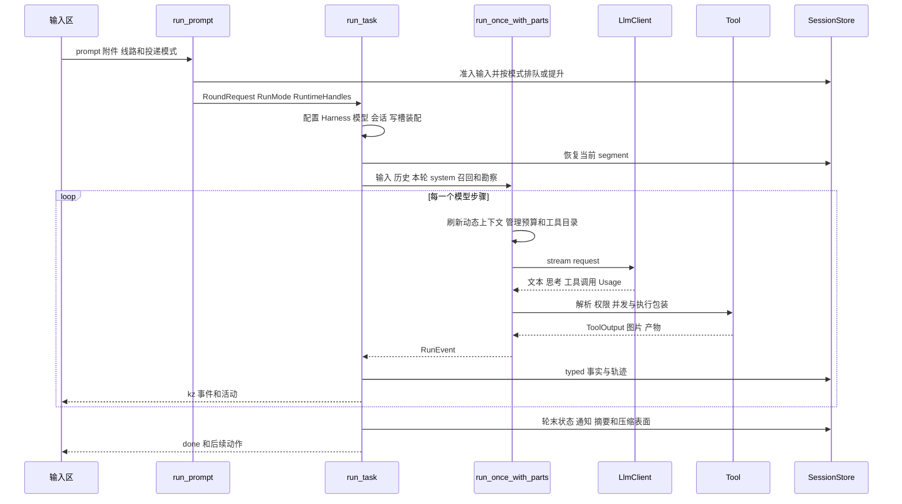

# 运行引擎的具体逻辑

## 一条消息的完整调用链

定位：`ui/08-compose-runtime.js` 的发送逻辑；`app/src/commands/run.rs` 的 `run_prompt`；`app/src/run/coordinator.rs:40` 的 `run_task`；`core/src/runner/drive.rs:101` 的 `run_once_with_parts`。完整符号链接见 [10](10-symbol-index.md)。

## 桌面运行层

`commands/run.rs` 负责调用入口、停止、答复权限和指标，不承担模型循环。`run/input.rs` 解析 delivery 和代码根、将输入准入或提升。`run/assembly.rs` 把本轮依赖、会话资源和运行状态分开装成 `RunAssembly`。

`run/coordinator.rs` 是单轮编排者。它先换运行代数并安装新的 CancellationToken，再装配，创建四种事件消费者，恢复 prior，创建 subagent runtime，进入执行循环，最后落库和决定是否续跑。

`run/execution.rs` 依次处理附件、开跑记忆召回、可选勘察、主实现、可选复核和修正。记忆提示与勘察简报只进入本轮 system，不拼入用户消息，否则下一轮会重复回灌旧事实。

`run/persistence.rs` 负责摘要、通知、episode、状态、压缩、done 事件和写槽收尾。运行成功、失败、取消均需产生可恢复终态；不能靠前端按钮是否亮起判断运行结束。

## Harness 怎样构造模型能看到的世界

输入组件包括 Base、Dev/Research/Readonly profile、配置、全局与项目 Markdown agent/skill、桌面扩展和协作上下文。每轮 resolve 把它们写入五类注册表：agents、tools、skills、context sources、permissions，随后形成不可变 `HarnessSnapshot`。

`registry.rs` 保持插入顺序，同名替换采用后者；`harness.rs` 还检查管理资源的替代工具是否存在。Markdown agent 的正文变成 system；skill 正文按需读取。坏 frontmatter 会告警并跳过，不把整个 resolve 炸掉。

稳定 system 与可刷新上下文分开。规范、协作状态、项目事实、研究 checkpoint 等声明为 refreshable 的来源会在后续 step 刷新；它们作为临时 system 段替换，不持续追加到 messages。

配置中的模型选择和 Agent 选择是不同问题。模型显示层将本线临时覆盖、agent 定义、项目 `[models]`、全局 `[models]`、内置默认合成一个 `turn_view`，界面芯片、菜单和实际运行共享这个结果，避免三处各说一套。

代码入口：`harness/src/harness.rs`、`registry.rs`、`markdown.rs`、`config/models.rs`，`app/src/model_config.rs:424` 的 `turn_view`。

## 主循环的顺序和退出条件

`drive.rs` 先物化本轮工具与 schema、构造消息和 system、初始化 usage、校准、召回、冗余检查和步数状态。随后每一步依次：

1. 检查取消；已停则返回含完整 messages 的 halted summary。
2. 刷新动态 system，发布 TurnStart，读取允许的收尾延长信号。
3. 识别工作认领边界，必要时归档旧观察。
4. 执行上下文预算维护，再发流式请求。
5. 汇总文本、思考和工具调用；无工具时通常结束，处于批次收口时先保存检查点并自动继续。
6. 调度 task，再执行普通工具，补齐配对结果与图像。
7. 提交本步消息、更新计量和诊断，再进入下一步。

主代理 `steps=0` 保持无固定步数截断。显式预算和 task 默认预算会收敛；到最后一步收走工具，要求文本收尾。收尾延长最多两步，授予值跨步保留，避免下一步掉回旧上限造成永远越过等号的漏洞。

无限主代理在专用写工具触及文件后，每 32 步或 15 分钟进入最多 8 步的收口窗口。窗口暂时停止扩大实现，要求相关验证、结构化 Git 按归属提交和已有 tracker 进展记录；不能交付时保存真实失败、下一步、范围补丁与小文件前后内容，然后继续同一任务。预先脏文件与混合修改不取得自动暂存归属；检查点始终 `completed: false`，不新增 Work Unit 或完成批数。实现为 `runner/drive/batch.rs`，详见 [修复记录](../2026-10-02-bootstrap-fixes.md)。

上下文压缩按预算选择切点后，会寻找前后邻近的完整工具调用/结果边界，保留完整头部。无合法切点时返回可恢复的延期，不调用摘要模型、不改历史、不消耗摘要无收益预算；后续消息到来仍可重试。入口为 `runner/compaction.rs` 与 `runner/drive/context_budget.rs`。

循环体将本轮消息独立累计。即使上下文压缩改变了 prior 长度，工具画像和成功关闭数仍来自本轮事件，不能用 `messages[prior.len()..]` 反推。

## 工具执行如何受控

工具输入先容错解析并校验 schema；错误输出带修复线索。权限规则是有序 last-match-wins，无匹配默认 Ask；独立 hard deny 和管理资源规则不能由普通 Allow 覆盖。

普通工具声明只读并发或特定 worktree 写并发键。runner 将可并行工具组成 wave，其余串行；权限应答、取消、超时和进度由执行路径传递。ToolOutput 将成功、拒绝、无变化、需纠错和执行失败区分，仍保留 provider 需要的 `is_error`。

`tool_pipeline.rs` 提供 parse → policy → guard → wrap → body → result policy → observer 的骨架。glob、git 等已使用，其他工具的防线和包装也分布在 runner 与具体工具中。不能声称所有工具已经完全收敛成一条 pipeline。

`tool_search` 的完整实现在 runner。搜索当前 snapshot 的 deferred tools，支持 `select:name1,name2`，把 schema 加入本轮 specs，同时更新上下文字数账单。历史里的工具调用能恢复相应加载。加载工具不放宽权限。

## 子代理和阶段流水线

`task` 是显式子代理派发；`phase_pipeline` 是用户开关启用的勘察复核编排，两条入口分别存在。开关关闭不能因此推断 task 不可用；实际派发还受本轮 subagents 配置和容量限制。

只读 explore/plan 快照以 read/glob/grep 为基础；writer 走单独可写快照和写槽。每个子代理有自己的消息、模型路由、取消身份和 transcript。背景任务结束通过事件回到主会话，重启后恢复身份/结果与自动重新执行是不同能力。

阶段状态机按 baseline、scouting、synthesis、implementation、integration、review、fixup 管理。勘察结果全部进入终态后才能越过汇总屏障；复核前交出写槽，取得稳定读环境。有发现才运行修正段；没有发现时主模型仍只跑一次。

协调器是进程内实现，按代码树管理读槽和写槽。它不是外部 agent 跨进程写锁；跨进程源码隔离依赖 worktree，文档互斥依赖 FileLock。

## 模型协议和认证

| 路径 | 当前行为 |
|---|---|
| Anthropic Messages | 构造 content blocks，按 message/block SSE 状态机转换统一事件 |
| OpenAI Chat | 兼容端点与本地 Ollama；聚合流式工具参数和 finish |
| OpenAI Responses | 处理 response item、工具结果、reasoning/hosted 回放，包含 Codex 路由 |
| DeepSeek Responses | 独立请求方言；完整历史和明文 reasoning 重发，不套用 Codex encrypted/store 字段 |
| Codex 认证 | 复用 CLI 登录文件，必要时刷新并通过并发保护写回 |
| Claude 订阅认证 | 已停用，缺 API Key 时明确报错 |
| API Key | 配置值或环境变量解析，缺必需 key 时点明实际 provider/model |

统一 `LlmEvent` 包含文本、思考、工具调用、usage 与完成。SSE 解析以字节缓冲，避免网络 chunk 切开 UTF-8。客户端区分建流前重试与已经消费事件后的失败，保留 retry notice 和错误链。DeepSeek 当前拒绝图片或文件输入。

代理策略包含显式、环境、关闭与回环豁免；工具联网读取主根配置。关键入口：`core/src/assemble.rs:7`、`llm/src/client.rs`、四个 `protocol/*.rs`、`auth/codex.rs`、`proxy.rs`。

## CLI 与桌面共有和不同的部分

CLI 的 `run.rs` 复用 core runner、route、工具 profile 和 subagent runtime，有独立权限应答与轮末 finalize。桌面负责窗口事件、多会话运行态、预览面板、移动桥和自动推进的 UI 定时执行。不能将桌面编排能力自动推定为所有 CLI 模式都具有。

CLI 命令面包括 run、六种 tracker、work、worktree、lock status、artifacts、config schema、metrics、memory、quarantine、shadow、replay-eval，以及后台验证 worker 隐藏入口。具体选项以当前 `cli/*.rs` 为准。
