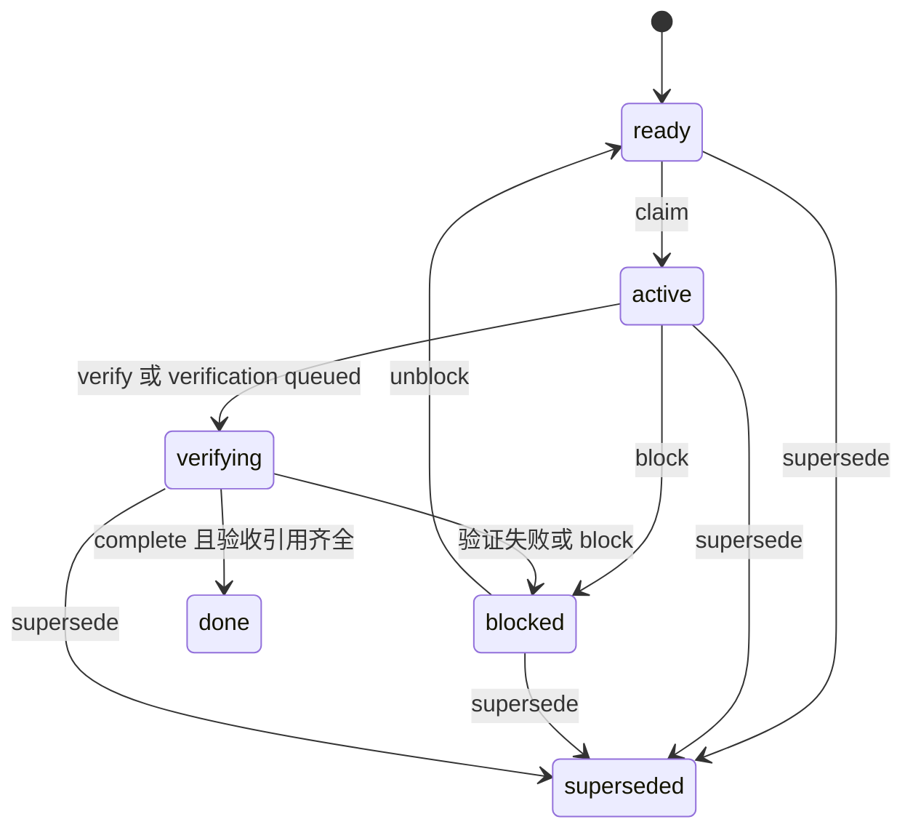

# 工作执行和决策的具体逻辑

## 三种不同对象

| 对象 | 真源 | 回答的问题 |
|---|---|---|
| Requirement 或 Defect | `.kanzei/project/*.md` | 最终要改变什么，业务上完成了吗 |
| Work Unit | `state.db` 的 work_events | 这一次执行做哪部分，下一步是什么，验收证据齐了吗 |
| Session 和 Input | session_events、session_inputs | 谁提出要求，哪个会话正在处理，什么输入还在排队 |

开发线 Process 是运行容器，Work Unit 是工作内容，Session 是交互身份。这些对象有关联，但不能互相代替。需求 done、unit done、用户验收通过、某轮 run 结束分别来自不同事实。

## Tracker 写入和状态机

DocStore 保留宽容解析和模板结构；写入口由 tracker 控制 ID、状态迁移、refs、字段和序列化。`fields` 是保序多值列表，不能改成普通 map，否则同名多条验证记录会丢失。

| 条目 | 常用状态 | 终态 |
|---|---|---|
| R 需求 | todo → doing | done、dropped |
| D 缺陷 | open → fixing | fixed、wontfix |
| I 想法 | inbox | split、dropped |
| A 架构决策 | draft → accepted | superseded、rejected |
| S 来源 | active | archived |
| F 发现 | draft | confirmed、dropped |

写入前查活动与归档账本唯一性，ID 引擎分配；状态标记不能重复混入标题。close 合法目标、依赖、引用、测试证据和条目验收都有专门校验。终态条目进入归档；reopen 只开放定义允许的退回路径。

`tracker/actions.rs` 分发 CRUD；maintenance、normalize、action_helpers 管归档修复与辅助；`tracker/validation.rs` 管需求登记和验收语义；`tracker/fields.rs` 管字段词表。未知字段保留，同时在结构化读侧标明，不静默当作已生效规则。

## 队列怎样选工作

`resolve_work_selection` 和 `resolve_work_decision` 将需求、缺陷、Work Unit、队列优先模式和认领状态合成 `ResolvedControlState`。裁决只有 Resume、Start、Blocked、WipViolation、Empty。

WIP 优先恢复，依赖未满足则跳过；停车和外部阻塞不占执行槽。依赖与“前置”分开：依赖阻塞调度，前置用于协作说明。带解除条件的停车/阻塞会根据引用终态动态判断，认领时才写回解除记录，展示读取不直接改文件。

`work claim` 用主根 `.kanzei/project/work-selection` 文件锁串行化选择和写入。在线认领信息用 branch identity 对齐；偏离默认选择、接管、阻塞、解阻塞和废弃保留理由。当前进展还附 observed HEAD 和 worktree hash，避免仅凭旧文字摘要认定代码仍处于同一版本。

取活实现：`tools/src/work.rs`、`work/context.rs`、`work/tool.rs`、`tracker/scheduling.rs`。memory crate 的 `scheduling.rs` 仍保留一份调度副本，属待收拢点。

## Work Unit 状态机

只有活动需求显式设置 `执行模型: work_units_v1` 才能创建单元，编号按需求生成 `R-xxx/Wn`。创建必须有 objective 和至少一条 acceptance；范围、依赖、verification 等列表受长度预算约束。

Checkpoint 保存摘要、下一步、决策、检索引用和版本观察。Evidence 必须使用本 unit acceptance 中的原文，并带至少一个引用；同一验收项多次证据合并去重。complete 只接受 verifying，并检查全部验收项都有证据。

后台验证 queued 会清空旧 evidence，保存 job ID 和 snapshot fingerprint。结束必须匹配当前 pending job；旧 job 不得改变已换代单元。失败转 blocked 并释放 claim。成功保持 verifying，证据登记和 complete 是后续步骤。

work_events 只追加，work_surfaces 是由它重建的缓存。业务读取与模型上下文消费 projection，审计读取原始事件。入口：`core/src/store/work.rs` 的 `project_work_events`、`append_work_fact(s)`、`rebuild_work_surface`。

## 后台验证的完整路径

1. Agent 用 `bash` 的 `verification` 参数提交命令，指定 unit、实际覆盖的 acceptance 原文、资源键和环境说明。
2. 通过既有 bash 授权与 guards，冻结源码与清单，产生指纹、日志路径和持久 job 文件。
3. 独立 worker 接管。相同资源键串行，开发线不等待共享构建资源。
4. worker 在冻结树执行，收集退出码、超时、取消和日志，核对源码与当前 job 身份。
5. 结束事实写回 Work Unit；只有匹配结果才登记通过的 criteria 证据。
6. 桌面 monitor 将 unit.claimed_by 映射回 Process，准入稳定系统输入并唤醒空闲原会话。

job 文件在项目 `.kanzei/verification`，快照和执行资源在本机 `%LOCALAPPDATA%/kanzei/verification`。恢复发现失去 worker 的旧 queued/running job，会记录 interrupted 并保留日志，不静默重跑。

这条路径已有源码与 main 接线，相关文件多为未跟踪；本次没有运行 worker，因此不将它写成当前安装版已验收。

## 并行线的真实隔离

`processes/registry` 分配 p 编号、查重、持久化和恢复；lifecycle 负责建线、更新、关闭；workspace 负责建树、收活、合并和放弃；gate 负责集成后检查。

建线先创建 branch/worktree，返回 receipt，再注册 Process。后续失败按 receipt 回滚；回滚失败保留 residue 说明，避免返回一个看起来全干净的错误。线内 cwd 指向 worktree；`.kanzei` 项目资产继续从主根读取。

冲突分两层：运行中提前展示不同线修改文件的交集，合并前 `merge-tree` 检查文本冲突。无冲突用 no-ff 合并；冲突保留双方现场。当前没有跨文件行为的语义冲突检测。

进程内协调器按 worktree key 排写者；`kz lock status` 是外部协作者的只读可见性报告。它不提供跨进程 acquire/release 锁。

## 自主推进怎样停和继续

纯状态机在 `harness/src/auto_run.rs`。桌面收集每轮工具、子代理工具、关闭数、handoff、失败类别、进展签名，后端生成动作；JS 只负责定时发送下一轮与回显状态。

结伴 Paired 默认关闭 engine nudge、冗余提醒、周期验收轮、backlog 空停；Autonomous 打开这些任务判断。权限与托管写入围栏不受该强度影响。

资源判断保留：用户停止/暂停/本轮后停、致命失败、限流、连续瞬态失败、零产出和目标空转。连续两轮无实质工具动作在重控制下停止。工具画像来自事件，也包含子代理实际工具；仅派一个 task 不算交付进展。

进展签名由代码版本、工作树变化和 tracker 事实组成，抑制“每轮调用工具但状态不变”。旧 max_rounds 字段仍为兼容存在，但不参与现行连续轮数停止判定。

有用户目标时，backlog 空不是结束依据，GoalPending 复述原目标继续。完成声明经 `work handoff` 显式区分事项/批次/请求/目标，并核对目标身份。局部事项或批次交付不能结束整次委托。模型声明达成只是控制契约，不等于客观验收已经通过。

## 两种决策记录

| 记录 | 目的 | 保存 |
|---|---|---|
| A 架构决策 | 长期产品和架构约束 | decisions.md，由 tracker 管理 |
| dec 自主决定 | 某轮模型在一个问题上作出的选择 | session_events 的 decision.updated |

A accepted 不代表运行中的所有选择都由它解释；dec 也不会自动升级为长期 A 决策。两类应分别维护。

## 自动决定与用户复核

交互模式 `question` 走 AskRequest；自动模式不等待普通选择题，要求 `decision: {answer, rationale, impact, preference_refs}` 或 `missing_fact`。状态是 Deciding、Decided、NeedsInput。只保存简短理由，不保存隐藏思维过程。

dec ID 根据 run、session、question 生成，同一问题重试复用记录，另一轮保留另一项。普通选择记录并继续；真正缺少拿不到的外部事实才走 NeedsInput。决定记录不替代工具权限授权。

用户 review 携带 request_id 和 expected_revision。相同请求重试幂等，复用 ID 却改内容拒绝；旧 revision 拒绝。尚未决定不可复核，NeedsInput 不可直接 Accept。

Accept 仅记录接受。Correct 将反馈写入原会话的队列，与复核事件在同一 SQLite 事务提交。原模型决定保留；纠正已完成 unit 时，队列提示创建新的返工 unit 并引用原单元，不抹掉旧完成事实。这里是返工指令入队，不是系统已自动完成代码修改。

## 长期偏好如何形成

Correct 默认 scope=Once。用户明确选 Project 或 Global 才同步 preference。文件同步与数据库不是一个事务，代码返回 `preference_error` 并保留可重试状态，避免数据库复核已成功就声称偏好也保存成功。

同问题通过 subject 关联已有偏好；request marker 去重；旧复核不能覆盖较新偏好。成功后数据库链接 preference ID，图谱增加 derived_from/refs。全局 scope 的存储路径已经存在，但当前 Dev 常驻 preference 注入只扫描项目 store，因此不能承诺全局偏好在所有运行入口自动生效。

具体入口：`core/src/runner/drive/question.rs`、`core/src/store/decisions.rs:343`、`app/src/decisions.rs:181` 与 `sync_preference:211`、`ui/12-decision-console.js`。
