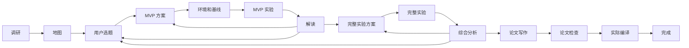

# 工具与研究流程的具体逻辑

## 工具不是一个全局无限列表

Base 注册基础工具，Dev 加工作治理和记忆，Research 换成 topic 受控通道，Readonly 用 hard deny 禁止副作用。桌面另加 UI 探针、协作、交付和可见预览；memory manager 有独立写工具。相同工具名可以在当前 snapshot 被后注册实现替换。

Dev 的 deferred 集合含 process、files、incident、conventions、architecture、prior_art、browser、latex、plot、idea、decision、memory_stats。它们有实现与注册，初始请求不发送完整 schema；由 tool_search 加载。

Readonly 的 read/glob/grep/files/git status|diff|log/webfetch 可以执行，write/edit/insert/bash/process/browser/latex/plot 被硬拒绝。question 的控制面记录可用，不因此允许改源码。

Research 禁止任意 bash，并限制 Git 写命令；源码/工件写入受 topic 目录和托管文件规则约束。实验和环境准备由研究专用通道执行。不能仅凭 Base 注册了工具就判断当前 profile 可调用。

## 全部工具族

write/edit/insert 的写后校验只跑相关单文件语法与格式检查：Rust edition 来自 Cargo，`skip_children` 避免把子模块一起扫描。Cargo 和整套 UI/浏览器回归作为批次待办明确回报，VM 命令带实验模块参数；环境缺失和超时分别报告，不称为精确代码错误。实现与回归见 [D-772 修复](../2026-10-02-bootstrap-fixes.md)。

| 工具或入口 | 具体行为 | 实现 |
|---|---|---|
| read | 有界流式读取 offset/limit/tail；图片编码；PDF 转文本；原始观察可归档 | read.rs |
| glob、grep | ignore-aware 文件匹配和 ripgrep 内核；head-limit 早停，避免无界扫描 | glob.rs、grep.rs |
| files | 一份扫描器供 agent 地图与文件页共用，树和文件度量；用途标注是额外 AI 调用 | files.rs |
| symbols | Rust 文件或 crate 的符号和结构级视图，填补 files 与 read 粒度 | symbols.rs |
| write | 受控文件写入、原子替换与写后局部验证，管理资产不能走裸写 | write.rs、local_validation.rs |
| edit、insert | 精确唯一命中替换或插入；缺锚点/多锚点/同文 no-op 分类，并提供修复线索 | edit.rs |
| frontend_locate、frontend_check | 前端编辑定位、结构和锚点诊断 | frontend.rs |
| bash | shell 检测、命令长度、授权、围栏、前台或后台执行、测试证据/后台验证接入 | bash.rs、shell.rs |
| process | 列表、输出、停止后台进程；owner、project、persistent 生命周期 | process.rs、background/* |
| git | status/diff/log/init/stage/commit 和 finalize 等结构化交付操作 | git.rs、git/* |
| work | 取活、认领、reconcile、Work Unit 全生命周期、验证 job、handoff | work.rs、work/* |
| req、defect、idea、decision | 共用 tracker CRUD、ID、字段校验、状态机和归档 | tracker.rs、tracker/* |
| source、finding | topic 来源与结论，finding 必须关联有效来源 | tracker、ResearchProfile |
| test_record | 实际执行、记录、覆盖、版本证据和终态归档 | test_record.rs、test_record/* |
| incident | 执行事故追加日志、查询聚合，正式产品缺陷另登记 | incident.rs |
| conventions | get、create、propose、patch；用户整篇保存与 agent 定点变更分开 | conventions.rs、conventions/drafts.rs |
| architecture | 架构索引 CAS 写入、链接/名称/边界校验、图扫描 | architecture.rs、arch_diagram*.rs |
| prior_art | 启动先行方案工件、read/validate、联网次数预算和核心开工约束 | prior_art.rs |
| question | 交互 Ask 或自动模式持久化决定/缺失事实 | question.rs、runner/drive/question.rs |
| tool_search | 从 snapshot 发现并加载延迟工具 | harness/tool_search.rs、runner/drive/tool_catalog.rs |
| task | 子代理独立模型快照、并行或后台执行、结果和 transcript | tools/subagent.rs、core/runner/subagent.rs |
| websearch | 单 query 或 1–4 查询批量，时间/域名过滤，Codex 搜索后端和 DDG 回退，结果 ref | websearch.rs、web_refs.rs |
| webfetch | URL 或本 session 搜索 ref 抓取，大小/文本截断、正文抽取 | webfetch.rs |
| browser | open/dom/console/click/type/press/scroll/wait/eval/screenshot；pane/headless 共用契约 | browser_tool.rs、browser_tool/headless.rs、app/preview/agent.rs |
| latex | 系统 TeX 检测、Tectonic 回退、编译 PDF 和诊断 | latex_tool.rs |
| plot | Vega-Lite、PGFPlots、matplotlib 渲染；图像与产物输出 | plot_tool.rs、palette.rs |
| memory_search、memory_note、memory_stats | 召回、草稿/机械纠错、概览 | memory/tools.rs |
| memory_read、memory_update | 专用记忆对话工具面 | app/memory_chat.rs |
| memory_add/update/merge/stale/promote | manager 的生命周期写工具 | memory/manager.rs |
| memory_inbox_clear/discard | 明确消费或丢弃草稿，避免隐含清空 | memory/manager.rs |
| collaboration_status | 主根共享运行线和工作占用的主动查询 | app/collaboration.rs |
| ui_dom、ui_console、ui_style、ui_screenshot | 当前桌面 UI 的结构、控制台、样式和真实像素 | app/harness_ext.rs、state.rs、screenshot.rs |
| deliver | 校验并输出用户可预览的项目产物 | app/harness_ext.rs |
| research_plan/loop/index/runner/write/verify/workflow | 研究状态、执行、证据、写作全流程 | 下节 |

工具清单按生产注册面整理；源码里的 `deny-guard`、`stamp` 等测试实现不算用户工具。完整函数和 schema 可以从 [10](10-symbol-index.md) 跳到实现。

## 写入围栏和 Git 事务

裸 write/edit/insert 不能修改 tracker、memory、tests、conventions、architecture 等托管资产。它们各有专用工具；拒绝消息点名合法替代通道。专用写者记写日志，包含路径、写后指纹和 run/process 身份。

bash 的结果侧守卫对托管目录和其他 worktree 建快照、检测变化，并对没有合法专用写凭据的变更回滚/留取证。persistent 后台服务仍按 owner 和项目登记，不因长驻就豁免守卫。跨树围栏保护另一条线的未提交内容；它不是一个能证明所有恶意 shell 均安全的沙箱。

结构化 git stage 仅接受明确文件，commit 校验 staged 状态和源码证据。finalize 将格式/lint、定向测试、test_record、stage、CAS commit 串成事务式路径。coverage plan 先展示本次改动与证据缺口；计划本身不等于测试通过。Git 执行保留 stdout/stderr 和超时，避免只显示 exit code。

## 研究的对象和来源

Research Library 管全局 topic 身份；topic 绑定 storage_root 和会话，历史目录原地登记，不自动迁移。开发调研和正式研究共享主根基础设施，业务对象不强塞进开发 tracker。

topic 下的探索是 E-xxx Markdown，包含状态、目标、前提等；每个探索下挂实验结果。核心 `research.rs` 重建图并返回诊断。图本身不写回业务结构。S 来源、F 发现、source_text 全文、报告、LaTeX 和结果工件各有不同角色。

## 计划与检索阅读反思

`research_plan` 的动作是 get/create/clarify/request_approval。旧课题保留计划树和审批；已有 workflow.json 时它是只读适配入口，预算投影自 AUTO，计划变更和独立审批均被拒绝。research_control.rs 统一选择控制面。

`research_loop` 的动作是 start/begin_search/add_evidence/reflect/add_finding/resume。只有批准计划能 start；begin_search 领取并发有界的任务，Research websearch/webfetch 校验任务身份。网络结果不是直接塞进主上下文的全文，回传 summary、relevance、source refs、证据级别和正文深度。

add_evidence 绑定 source；reflect 更新任务方向和收敛状态；add_finding 关联发现。loop.json 保持检索任务的可恢复进度。AUTO 暂停或离开 Survey 后，旧 loop 写动作和外部网络任务均被拒绝；resume 返回主控制面、阶段和暂停状态。调研预算取自 AUTO，旧 budget.json 不能覆盖它；旧课题保留计划预算及覆盖文件。网络次数、并发与引用核验仍各自计量。

## 引用核验和写作

`research_index` 用 topic Tantivy 全文索引，支持构建/检索与恢复，索引属于派生物。

`research_verify` 动作是 capture_source、verify_claims、budget_get/set。来源先抓取并保存全文，再据全文验证 claim；摘要不能替代正文。代码证据使用文件、行号和 hash，对照实际源码版本。预算耗尽和不能核验保持明确状态，不能省掉标志后宣称全过。

`research_write` 保留 write_outline、write_section、assemble_paper、compile_paper、repair_paper。旧课题要求检索收敛；AUTO 由 WritePaper 阶段控制写作，分节工件放在主论文目录。compile_paper 委托主流程的论文检查和编译；repair_paper 只接受实际失败的有限修复次数，修复后回到 ReviewPaper 并清除旧核验指纹，不能自动跳过数值证据检查。

## 实验运行器

`research_runner` 只有 run/get/cancel 三类动作，执行目标是本机或已登记 SSH。环境登记文档先声明连接/目录/策略，再采集本轮真实环境快照；声明不是实测结果。环境 policy 分 relaxed、managed、approval、strict，lease 和确认按 policy 执行。

运行前核对 topic、exploration、目录和执行合同，登记 run。stdout 中终端 callback 前缀与普通日志分开解析，进度/heartbeat/metric/artifact/terminal 进入 research_run_events，普通输出保留日志。持续时间和 heartbeat 超时分别监控。

结束保存 completed/failed/cancelled/stuck 等运行状态、参数原文、代码版本、环境、指标和产物，再绑定到探索结果。CLI/SSH 连接失败只说明执行通道失败，不能自动证明假设被否定；callback 完成也须对照实际产物和结果。

这是现有实验通道，不等于自动同步所有远端数据或调度 GPU 集群。环境准备属于另外的 compute 模块，用户登记和首次准备边界仍需保留。

## AUTO 研究状态机

workflow.json 的 version/revision、stage、paused、waiting_reason、direction、MVP、budget、compute、full_plan/results/rounds、analysis 和 paper 是持久 checkpoint。每次模型写动作必须提交当前 revision；选方向和预算属于用户操作，模型不能修改。

`get` 返回恢复信息，包括 active_runs、剩余实验预算和 pending_full_results。恢复时先登记已有结果、读取活动 run；不能因为上下文丢了就重复启动。

MVP 绑定可证伪问题、基线、指标、成功和失败判据、探索 ID、协议。结果 interpretation 明确 supported/rejected/inconclusive；运行错误不能转成研究否定结论。

完整实验方案 schema 要求至少 6 项，角色覆盖 baseline/main/ablation/robustness；baseline/main 至少共同两随机种子。AUTO 要求 params_text 能识别 experiment_id/role/seed，并核对定义、环境和预算。基础 runner 仍可记录自由参数原文；这就是 A-019 应补充的 AUTO 适用边界。

返工定义新矩阵会保存旧 round；显式复用只接受定义/环境未变且成功的结果，并至少安排一项新实验。模型不能抹掉 null 或失败结果来制造一份完成的矩阵。

论文 claim 绑定 result_id、metric 和 value，检查引用、正文、数值与证据，再真实编译 PDF。编译失败回修正/提交/检查，不把生成 .tex 或一个空 PDF 当作完成。

桌面 `research_auto.rs` 用当前 workflow 判断可运行性，等待选题、暂停、缺事实和 completed 会停止推进。复用 auto-run 的资源/失败控制，但使用 Paired 强度、goal-active 和 workflow guidance，不从开发 backlog 取活。

## 绘图和 LaTeX

plot 默认 Vega-Lite。PGFPlots 与 matplotlib 抽到 plot_tool/adapters.rs，必须显式指定 engine 才执行对应依赖；未知引擎、仅提供 tikz/python 却未选适配器的输入明确拒绝。palette 和产物输出继续共用。

latex 先检测系统 TeX，再回退 Tectonic。research_write、AUTO 和桌面 research_latex 共用 latex_tool/paper.rs：对同一论文编译加锁，移除旧 PDF/日志，检查实际输出的 PDF 头、大小和未解析引用。research_latex 继续负责模板、路径边界和编译历史。

这些是 Kanzei 自身的工具实现，与本次 Codex 所使用的内置 LaTeX 编辑器是两套环境；本次梳理没有用后者替换前者。
