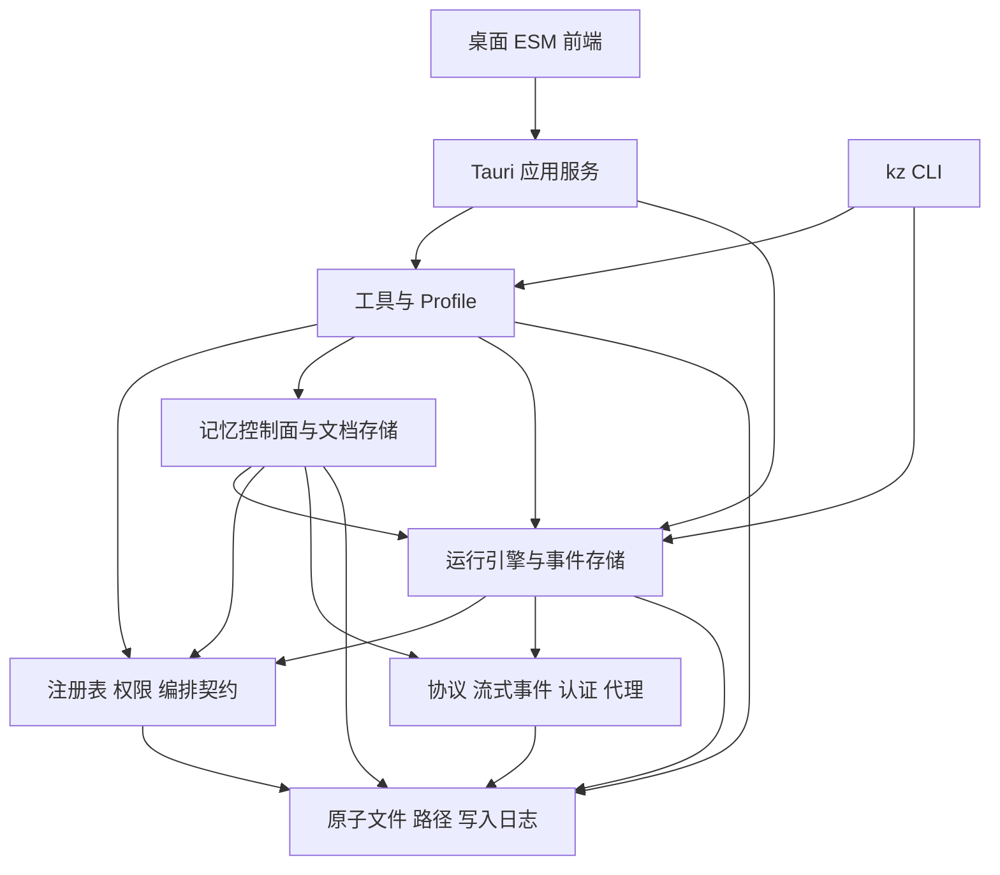

# Kanzei 当前代码功能地图与整理决策

这份地图回答三件事：当前代码有什么功能、这些功能怎么执行、整理代码库时哪些边界和旧决策需要处理。以 2026 年 10 月 2 日的本地工作区为准，包含已修改和未跟踪源码。

当前 Kanzei 已经是一套包含开发 Agent、长期任务、外部记忆、研究工作流和桌面操作台的系统。整理重点是收拢功能归属、状态真源和过期决策。单纯移动大文件不能解决这些问题。

## 阅读顺序

需要筛选和标注时，用 [网页审查入口](web/index.html)。九项整理已完成；默认待整理为零，“已整理”展示改动和验证，已处理问题保留归档；A 决策、文件/符号和实现说明仍可查阅。完整源码预览的启动方法见 [网页使用说明](web/README.md)。

2026-10-02 用户确认网页中的问题已全部登记，后续实施沿用已有 tracker 条目；登记状态不表示实现或验收已经完成。

| 文件 | 用途 |
|---|---|
| [01 功能地图](01-features.md) | 从用户能力找到界面、后端和实现模块 |
| [02 运行引擎](02-runtime.md) | 一条消息如何装配、调用模型、执行工具、停止与续跑 |
| [03 工作与决策](03-work-decisions.md) | tracker、Work Unit、并行线、自主决定与用户纠正 |
| [04 记忆与存储](04-memory-storage.md) | 记忆检索、写入、压缩、事件投影和所有数据真源 |
| [05 工具与研究](05-tools-research.md) | 全部工具族、研究各阶段、实验、论文与引用 |
| [06 桌面与交付](06-desktop-delivery.md) | 前端、文件编辑、预览、移动端、语音、更新、验证与发布 |
| [07 整理决策](07-cleanup-decisions.md) | 已确认冲突、历史 A 决策逐项对照、建议整理顺序 |
| [08 全量文件索引](08-file-index.md) | 所有纳入扫描的文件、行数、Git 状态和模块说明 |
| [09 接口索引](09-interface-index.md) | 全部 Tauri 命令及 SQL 表声明的源码入口 |
| [10 全量符号索引](10-symbol-index.md) | 函数、类型、模块、常量逐项跳转 |
| [11 文档与资源](11-documents-assets.md) | 现有设计文档、原型和资源目录，保留文档原有状态 |
| [inventory.json](inventory.json) | 可供后续工具使用的 SHA256、符号、测试声明、接口、依赖清单 |
| [validation.json](validation.json) | 本次报告的指纹、链接、接口和决策覆盖核对结果 |

## 本次基线

| 项目 | 结果 |
|---|---|
| 当前分支 | `kanzei/release-2026-09-25` |
| HEAD | `21c36e9d3a332ebb10a1e0d841887713d9911571` |
| Workspace | 8 个 crate |
| 纳入扫描 | 657 个源码、配置、提示词和脚本文件，共 294977 行；包含 docs 的原型辅助代码与 extras 的可选素材制作脚本 |
| 符号声明 | 10029 条，包含内部实现、测试、模块与常量 |
| Tauri | 163 个 command 声明，全部匹配 main 注册 |
| SQL | 27 个不同表名，分布于运行状态库与记忆索引库 |
| 扫描文件中未提交部分 | 269 个，详情见文件索引 |
| 文档与资源目录 | 102 份现有 Markdown 文档，79 个资源/锁文件路径 |

行数包括注释、测试、JSON 和夹具，不等于生产代码复杂度。测试声明数量只用于定位测试，不代表测试已通过。

人工梳理覆盖全部功能域及主要调用链；08 和 10 提供全量文件与声明入口。这里没有声称逐行审查了全部 29 万行实现。第三方 vendor 的内部逻辑、二进制素材、运行数据库内容、用户凭据和历史聊天不属于手写功能实现清单。

代码地图的验证覆盖源码结构、入口接线、接口名称和文档证据；地图本身不提供运行验收。网页九项整理的实现、15 项全量验证与 `build-59f17d67` 交付见 [整理验收](../2026-10-02-web-cleanup.md)。随后 D-772、D-773、D-774 修复的完整检查与发布结果见 [自举修复记录](../2026-10-02-bootstrap-fixes.md)，按其中的版本和范围判断。

## 系统地图

这是功能和主要依赖关系图；完整直接 crate 依赖在 inventory.json 的 `crate_dependencies`。`memory` 仍依赖 `core`，`docstore` 也在 memory crate 中；不能把目前的 crate 边界理解成完全独立的业务域。

## 清理后的文档入口

原优先问题已经按用户反馈归档，网页只列 9 项整理候选。当前源码与文档口径见 [current-state.md](../../current-state.md)，工作树、分支和旧材料的清理与恢复见 [清理记录](../../cleanup-2026-10-02.md)。

README、A 决策和设计文档已统一 ESM、dense/RRF、FileLock、手动 CI、后台 worker 和 AUTO 边界。主树未提交的决策台、按需工具与条目上下文实现仍保留；HEAD 与安装版不能替代当前工作树核对。

## 如何更新地图

在仓库根运行 `python docs/reports/2026-10-02-code-map/scan.py`，重建 08、09、10、11 和 inventory.json。01 至 07 是人工说明，功能逻辑改变后需同步维护。扫描器采用静态正则，不能替代 Rust 编译器、JS 模块解析器或端到端验收。

运行 `python docs/reports/2026-10-02-code-map/validate.py` 核对报告与当前源码。扫描后代码或文档发生变化会报指纹不一致；更新人工说明及 README 数字后再重建和核对。链接、指纹、数量和 19 条决策覆盖以最新 validation.json 为准。

首次审计只新增报告；清理阶段另清理本地工作树、分支和旧材料，并校正文档。随后按用户指示继续 D-772、D-773、D-774，实现写后校验、长运行收口和压缩恢复的修复，详见 [修复记录](../2026-10-02-bootstrap-fixes.md)。A 决策接受状态保持原状。
