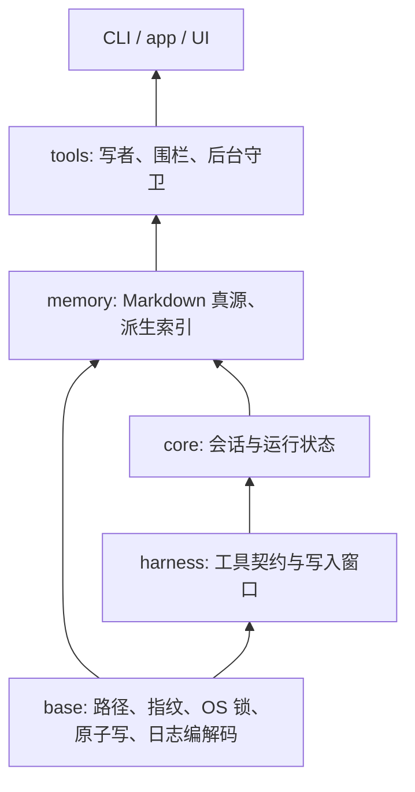

# 工作树整合与运行状态修复

日期：2026-10-03。此次只做本地整合和 Debug，不推送、不打包、不发布。

## 整合范围与恢复点

- 主目录：`dev`，起点 `abb596f0`。保留桌面升级握手、侧栏和 WebView2 数据目录隔离。
- 另一条树：`kanzei/hash-unification`，起点 `fd36faa3`，另有 30 个修改/新增文件。内容指纹提交和未提交的底层重构一并整合。
- 主目录已有六个生产文件改动；采用另一条树更完整的锁与显式日志状态实现，移植本目录独有的 CAS 竞争、发布期间持锁、隔离失败保留原件回归测试。重复实现不保留两份。
- 整合前完整快照位于 `output/integration-20261003/`：两边逐文件 SHA256、二进制补丁、Git bundle、原始文件副本。原有 `问题.MD` 不加入提交、不修改。
- 三方比较基点为 `f55c8e56`。主线新版 UI 与另一树的指纹 UI 修改无冲突；`docs/current-state.md` 保留主线说明并增加底层状态与内容指纹说明。
- `hash-unification` 与 `desktop-runtime-profile` 残留的命名文件已备份，确认目录只含该文件后清理空壳；Git 当前只登记主目录。
- 原独立工作树在检查期间被外部操作移除；本次从已校验的快照恢复其改动。不能把原工作树移除归为本次清理动作。

## 依赖与状态归属

完整导航见 [依赖地图](../reviews/file-audit-2026-10-03/dependency-map.md) 和 [文件/API 索引](../reviews/file-audit-2026-10-03/inventory.json)。生产 crate 无环，底层仍无第三方依赖。

日志属于对应物理工作树；文档仍是业务真源。`LoggedContent` 区分正文、仅指纹和删除。文档锁覆盖写入与凭据发布；日志锁只串行化凭据。后台基线由窗口关闭观察者推进，守卫回滚不能提交尚未结束的窗口。历史依据：D-258、D-364、D-398、D-399、R-268，见代码注释；这些是既有编号，本次没有伪造 tracker 状态变更。

底层整合的具体设计与原树验证见 [原树报告](2026-10-03-base-refactor.md)。该报告的测试数字只属于原树，不代替本次验证。

## crates/kanzei-base/src/write_log/codec.rs

### 职责
把持久化日志解码为可归因、可恢复的状态。

### 判断
P1

### 确切问题
- 正文被改坏后，只要仍是合法 hex 就会被接受；恢复方直接使用正文，可能写回与日志指纹不同的内容。

### 修改
- 对 Stored 正文重新计算统一指纹，不匹配返回 InvalidData，保留原日志。

### 影响范围
- record 的历史读取、entries_after、managed 与跨树归因；日志格式不变。

### 验证
- 将合法日志正文从 old 改为 bad，原实现测试失败；修复后查询和追加均明确失败，不自动恢复错误正文。
- 现有 500 条运行日志只读核对：无正文指纹不一致，无 v2 临时格式，无空正文歧义；未改动这些运行数据。

## crates/kanzei-base/src/write_log/tests.rs

### 职责
验证日志持久化、排序、保留与失败语义。

### 判断
P1

### 确切问题
- 为上述可解码但正文损坏的恢复问题补充可复现证据。

### 修改
- 扩展损坏日志回归，覆盖合法 hex 与错误指纹的组合。

### 影响范围
- 仅测试；不新增生产 API。

### 验证
- 保留修复前失败日志 `output/integration-20261003/codec-repro.log`。

## crates/kanzei-tools/src/background/lifecycle.rs

### 职责
后台进程对账、越界隔离、终止及基线协作。

### 判断
P1

### 确切问题
- 同一轮同时存在窗口内写入与窗口外越界时，守卫把仍在进行的合法写入提前吸收入基线。
- 终止进程的 await 之后回写旧基线副本，可能覆盖期间窗口关闭观察者提交的新基线。
- 隔离/恢复失败直接返回，绕过已确认越界后的进程终止，使越界进程继续运行。

### 修改
- 删除守卫的基线推进；窗口关闭观察者继续拥有该职责。
- 隔离/恢复失败仍按 kill_on_breach 终止进程，输出保留错误；不宣称恢复成功。

### 影响范围
- 后台守卫、stop/kill 收口；不改序列化字段和持久化格式。

### 验证
- 混合窗口测试在原实现失败，修复后证明窗口关闭前基线不变、关闭后精确吸收。
- 隔离目录不可创建时，真实后台进程停止，未留证内容保持原样。
- 单独的时序 lost update 未做调度注入；旧副本回写路径已删除。

## crates/kanzei-tools/src/background.rs

### 职责
后台进程状态对象及其运行回归测试。

### 判断
P1

### 确切问题
- 对 lifecycle 的混合窗口和隔离失败路径补充实际进程测试。

### 修改
- 增加两项回归；更新基线写入职责注释。

### 影响范围
- 测试与注释；无公共字段变化。

### 验证
- 测试经真实后台启动入口，退出前停止测试进程；不以 mock 终止代替真实进程状态。

## crates/kanzei-tools/src/managed.rs

### 职责
托管快照、窗口归因、隔离留证与恢复。

### 判断
P1

### 确切问题
- 整合必须保留已修的“写后凭据发布之前释放锁”和“留证失败覆盖原件”保护。
- 损坏正文应当在恢复前停止，不能退回旧快照。

### 修改
- 采用原树完整恢复计划与 Result 错误语义，移植发布锁边界、隔离失败回归，并扩展正文损坏场景。

### 影响范围
- conventions、architecture、test_record 写者；shell 围栏；后台恢复 caller。

### 验证
- 锁住 journal，三个真实写者完成文档写入后仍持有文档锁，凭据发布后才释放。
- 隔离失败原内容不变；损坏正文不自动回滚。

## crates/kanzei-base/src/atomic_file/tests.rs

### 职责
验证原子替换与 CAS 事务边界。

### 判断
P1

### 确切问题
- 整合不能丢失本目录已有的检查期间竞争写者回归。

### 修改
- 移植确定性暂停首次 CAS 校验的测试，补充原树的一胜一负并发测试。

### 影响范围
- 仅测试；生产实现采用原树内部持锁 CAS。

### 验证
- 首个 CAS 检查期间第二个不能提交；首个完成后，第二个返回 stale expected_hash，最终内容为首个版本。

# Module Summary

## 已修复
- P0：本轮没有新增 P0 定级。
- P1：日志损坏正文仍可恢复；后台混合窗口提前推进/旧副本回写；恢复失败绕过终止。另完整整合原树底层修复。
- P2：无纯风格改造。

## PASS 文件
- 本轮不把三方合并、编译或调用方适配冒充全文件 PASS；首批已审文件和范围见历史报告。

## 仍需人工判断
- 无。此次修复不需要产品选择。

## 依赖影响
- 原树引入 entries_after 的 Result 与 LoggedContent 三态，调用方一并适配；base 继续零第三方依赖。
- 新增修复不改变持久化格式。500 是保留目标；唯一恢复记录不能为达到数量被删除。

## 剩余风险与范围
- 文件锁不能约束绕过锁的外部编辑器；文档与日志是两个文件，不是跨文件事务。
- 全仓 510 个源码文件的索引已更新，但全仓逐文件人工审查尚未完成；当前完成的是工作树整合与上述运行路径修复。
- 本次未安装/启动新桌面发行版，不能把测试通过写成已上线。

## 合并方式

先在备份区按共同祖先逐文件三方比较，再移植本目录回归和新增修复。内容确认后用 `git merge --no-commit --no-ff -s ours` 建立双父提交关系，随后显式暂存实际整合内容；没有将 ours 策略的初始树直接当成合并结果。另一树未提交内容完整包含于最终整合提交和备份中。

## 本次验证

最终结果由整合目录下日志与本报告末尾验证表共同记录。

| 检查 | 本次结果 |
| --- | --- |
| 最终 `cargo test --workspace --no-fail-fast --quiet` | 2217 通过、0 失败、5 项原有忽略；包括文档测试 |
| `cargo clippy --workspace --all-targets -- -D warnings` | 通过，亦覆盖全工作区类型检查 |
| `cargo fmt --all -- --check`、`git diff --cached --check` | 通过 |
| `node --experimental-vm-modules scripts/ui-runtime-smoke.mjs` | 通过；90 个 UI 模块、4001 次 invoke、0 运行时错误，及其串联浏览器检查 |
| IPC / 文件编辑器 | 184 个前端命令已注册，36 个事件契约一致；文件编辑器 18 项通过 |
| 设计时效 / README crate 表 | 通过；8 个 crate 一致 |
| 原始快照和用户文件 | 两份快照共 47 文件 SHA256 全部一致；Git bundle 校验通过；问题.MD 未改变 |

最终 Rust 分项：CLI 49、集成 39、app 531、base 35、core 375、harness 201、llm 57、memory 178、tools 752。与原树数字的差异包含主线已有 app 回归及本轮移植/新增回归，不全部算作本轮新发现。

验证过程中的失败也保留：两项修复前回归确实失败；一次前端运行命令缺少 VM Modules 标志，纠正命令后通过；首轮文档测试读取依赖产物失败，停止重叠 Cargo 构建后串行全量及最终全量均通过。一次关闭 autocrlf 的临时 diff 检查把 CRLF 当成空白错误，仓库正常配置下的实际 diff 检查通过，未据此改写全仓换行。

本次未复跑 Linux：当前 WSL 环境没有可用 Rust 工具链，未额外安装。原树报告的 Linux 34 项结果仅作为历史证据；本次跨进程锁与恢复回归已在 Windows 执行。
