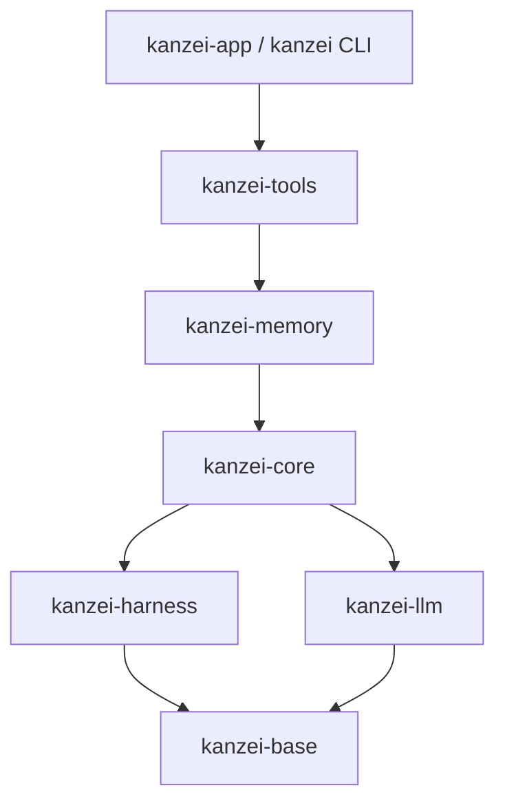

# 文件级审查依赖地图

初始基线：19489ca2；2026-10-03 整合 abb596f0 与 fd36faa3 后更新底层 API。日期：2026-10-03。文件、模块声明、公开 API、import 候选见 inventory.json；生成器为 scripts/file-audit-inventory.py。词法索引不能替代宏、动态派发和调用方的人工核实。

## crate 依赖

箭头指向被依赖方；表中列出全部生产内部依赖，图展示主干。

| crate | 生产内部依赖 |
|---|---|
| base | 无 |
| harness | base |
| llm | base；harness 仅为测试依赖 |
| core | base、harness、llm |
| memory | base、harness、llm、core |
| tools | base、harness、llm、core、memory |
| CLI / app | harness、llm、core、tools |

生产 crate 图无环。审查顺序：base → harness/llm → core → memory → tools → CLI/app → UI。模块内部回调和运行期循环不等同于 crate 依赖环。

## 状态、入口与边界

| 层 | 模块与公开入口 | 状态拥有者 / 边界 | 调用方 |
|---|---|---|---|
| primitive | base/atomic_file: write_atomic*, FileLock；path_form；content_hash | atomic_file/lock.rs 拥有进程内槽，标准库 OS 文件锁句柄拥有跨进程互斥；临时文件→rename 是单文件提交 | harness、llm/auth、core、memory、tools |
| 写入凭据 | base/write_log: record, entries_after, latest_by_path；LoggedContent | .kanzei/.write-log 是归因凭据，文档仍是业务真源 | memory/store、inbox、tools 写者、app/files_edit；managed/cross_tree 读取 |
| 工具契约 | harness/tool、tool_pipeline、permission、registry | ToolCtx、ToolOutput、不可变 HarnessSnapshot；权限与结果策略边界 | tools、memory、core runner、入口 |
| 调度 | harness/orchestration、managed_fence、async_mailbox | 租约、读槽位、队列；不能替代操作级文件锁 | core、tools、app |
| 模型协议 | llm/client、protocol、sse、auth/store | HTTP/SSE、凭据文件、统一 LlmEvent | core、memory/embed、入口 |
| 会话持久化 | core/store、history、replay | state.db 会话事实、事件及其 projection；SQLite 事务边界 | runner、tools、CLI、app |
| 执行 | core/runner/drive、phase | 每轮消息、取消、并发工具；持久化委托 store/history | tools/run、CLI/run、app/run |
| 记忆与文档 | memory/memory/store、docstore | markdown 真源，SQLite 搜索索引是派生数据；树锁与文档锁 | tools 再导出、tracker、app |
| 工具编排 | tools/managed、cross_tree、tracker、work、worktree、background | 围栏快照和日志归因；Git worktree 真源；后台进程句柄 | tool pipeline、CLI、app |
| 入口 | kanzei/cli；app/state、run、commands | AppState / SessionRuntime；Tauri command/event 跨 Rust/JS | UI invoke/event |
| 界面 | app/ui 自有 JS | 展示投影与草稿；数据库事实不能被展示状态覆盖 | 用户操作 |

## 底层修改的调用链

- `atomic_file`：经 memory/tools 再导出，覆盖 docstore、记忆、配置、凭据、会话工件、文件编辑。锁语义修改须保持共享/独占、同线程重入、限时等待和非 Send 契约。
- `write_log::record`：memory/store、memory/inbox、tools/lib 的 record_write_log、tools/write、app/files_edit。读者为 managed/cross_tree；`last_content` 的生产调用集中在 managed 的回滚。
- CAS：tools/architecture、conventions、conventions/drafts、team/tools；app/files_edit、memory_chat。须逐一核实外层文件锁与 hash 口径。
- path_form：路径展示/打开与比较键分开；不能为了统一比较键而改变可打开路径。

## 历史依据

- docs/design/parallel_read_serial_write_orchestration.md：操作级 FileLock 与运行级调度的边界。
- base/lib.rs：R-208 / D-261 将文件原语下沉，保持零依赖。
- memory/lib.rs：R-203 拆分与再导出；scheduling 复制有历史依赖原因，不能仅凭重复删除。
- docs/architecture/01_runtime_loop.md、02_harness_registries.md：执行链和注册表。
- docs/design/architecture_diagrams.md：Cargo 清单是 crate 图真源。
- 原有未跟踪 `问题.MD` 仅作线索，逐项核实，不沿用未经验证的严重等级。

## 覆盖口径

逐文件结论见 report.md。仅进入索引、搜索命中或编译通过的文件不算完成审查，不自动标 PASS。
