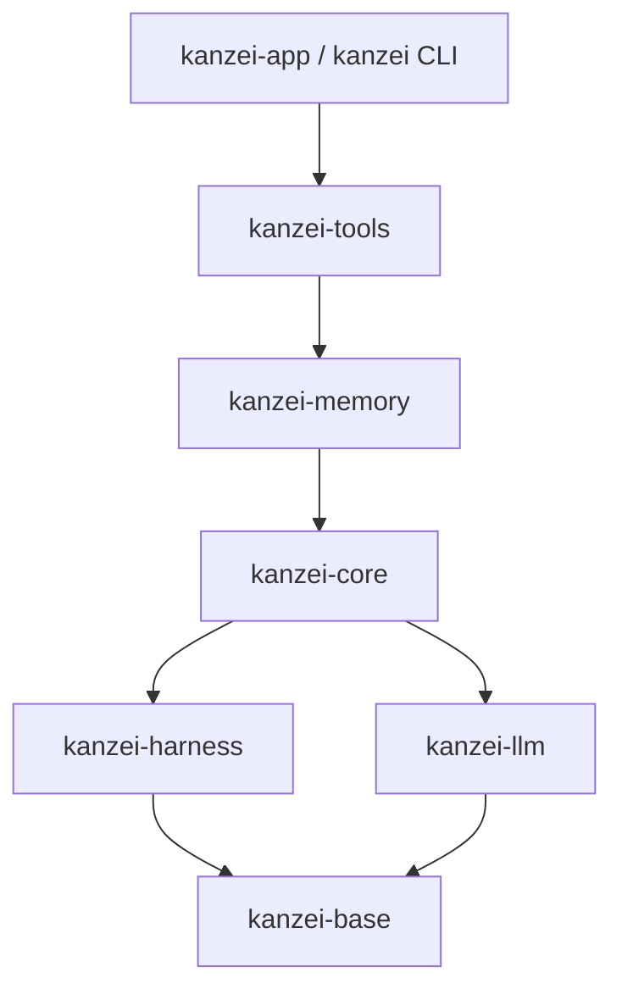

# 文件级审查依赖地图

初始基线：19489ca2；2026-10-03 整合 abb596f0 与 fd36faa3 后更新底层 API。日期：2026-10-03。文件、模块声明、公开 API、import 候选见 inventory.json；生成器为 scripts/file-audit-inventory.py。词法索引不能替代宏、动态派发和调用方的人工核实。

## crate 依赖

箭头指向被依赖方；表中列出全部生产内部依赖，图展示主干。

| crate | 生产内部依赖 |
|---|---|
| base | 无 |
| harness | base |
| llm | base；harness 仅为测试依赖 |
| core | base、harness、llm |
| memory | base、harness、llm、core |
| tools | base、harness、llm、core、memory |
| CLI / app | harness、llm、core、tools |

生产 crate 图无环。审查顺序：base → harness/llm → core → memory → tools → CLI/app → UI。模块内部回调和运行期循环不等同于 crate 依赖环。

## 状态、入口与边界

| 层 | 模块与公开入口 | 状态拥有者 / 边界 | 调用方 |
|---|---|---|---|
| primitive | base/atomic_file: write_atomic*, FileLock；path_form；content_hash | atomic_file/lock.rs 拥有进程内槽，标准库 OS 文件锁句柄拥有跨进程互斥；临时文件→rename 是单文件提交 | harness、llm/auth、core、memory、tools |
| 写入凭据 | base/write_log: record, entries_after, latest_by_path；LoggedContent | .kanzei/.write-log 是归因凭据，文档仍是业务真源 | memory/store、inbox、tools 写者、app/files_edit；managed/cross_tree 读取 |
| 工具契约 | harness/tool、tool_pipeline、permission、registry | ToolCtx、ToolOutput、不可变 HarnessSnapshot；权限与结果策略边界 | tools、memory、core runner、入口 |
| 调度 | harness/orchestration、managed_fence、async_mailbox | 租约、读槽位、队列；不能替代操作级文件锁 | core、tools、app |
| 模型协议 | llm/client、protocol、sse、auth/store | HTTP/SSE、凭据文件、统一 LlmEvent | core、memory/embed、入口 |
| 会话持久化 | core/store、history、replay | state.db 会话事实、事件及其 projection；SQLite 事务边界 | runner、tools、CLI、app |
| 执行 | core/runner/drive、phase | 每轮消息、取消、并发工具；持久化委托 store/history | tools/run、CLI/run、app/run |
| 记忆与文档 | memory/memory/store、docstore | markdown 真源，SQLite 搜索索引是派生数据；树锁与文档锁 | tools 再导出、tracker、app |
| 工具编排 | tools/managed、cross_tree、tracker、work、worktree、background | 围栏快照和日志归因；Git worktree 真源；后台进程句柄 | tool pipeline、CLI、app |
| 入口 | kanzei/cli；app/state、run、commands | AppState / SessionRuntime；Tauri command/event 跨 Rust/JS | UI invoke/event |
| 界面 | app/ui 自有 JS | 展示投影与草稿；数据库事实不能被展示状态覆盖 | 用户操作 |

## 底层修改的调用链

- `atomic_file`：经 memory/tools 再导出，覆盖 docstore、记忆、配置、凭据、会话工件、文件编辑。锁语义修改须保持共享/独占、同线程重入、限时等待和非 Send 契约。
- `write_log::record`：memory/store、memory/inbox、tools/lib 的 record_write_log、tools/write、app/files_edit。读者为 managed/cross_tree；恢复改用同一次窗口查询与 `latest_by_path`，已删除 `last_content`。
- CAS：tools/architecture、conventions、conventions/drafts、team/tools；app/files_edit、memory_chat。须逐一核实外层文件锁与 hash 口径。
- path_form：路径展示/打开与比较键分开；不能为了统一比较键而改变可打开路径。

## 历史依据

- docs/design/parallel_read_serial_write_orchestration.md：操作级 FileLock 与运行级调度的边界。
- base/lib.rs：R-208 / D-261 将文件原语下沉，保持零依赖。
- memory/lib.rs：R-203 拆分与再导出；scheduling 复制有历史依赖原因，不能仅凭重复删除。
- docs/architecture/01_runtime_loop.md、02_harness_registries.md：执行链和注册表。
- docs/design/architecture_diagrams.md：Cargo 清单是 crate 图真源。
- 原有未跟踪 `问题.MD` 仅作线索，逐项核实，不沿用未经验证的严重等级。

## 覆盖口径

逐文件结论见 report.md。仅进入索引、搜索命中或编译通过的文件不算完成审查，不自动标 PASS。

## 按地图推进的文件级记录（2026-10-03 更新）

| 层 | 已完成内容 | 本轮 / 后续范围 |
| --- | --- | --- |
| base | 首批四文件审查；锁/CAS/路径/日志三态重构已整合验证 | 见整合报告；拆分文件不能仅因编译通过自动记为全文 PASS |
| harness | registry.rs、progress.rs 已完成首批全文审查 | 其他文件尚未全面审查 |
| llm 基础 | event.rs PASS；error.rs PASS；sse.rs P1 已修；protocol/mod.rs PASS；lib.rs PASS | 第二批五文件全文；[逐文件记录](llm-framing.md) |
| llm 请求与 Chat 状态机 | request.rs PASS；protocol/openai.rs P1 已修 | 第三批全文；[逐文件记录](protocol-completion.md) |
| llm caller | client.rs 的分帧和终态验证已检查；修复无终态 EOF 被误报成功 | 仅调用链切片，完整生命周期待审 |
| memory / tools | 原树底层 caller 已适配；managed、三类专用写者及后台守卫关键路径已修 | 不等同于整个模块全文审完 |
| core / API / UI | runner/drive.rs 已跟踪整步消费→工具分发边界，其余为合并与既有测试验证 | 全面逐文件审查待继续 |

第三批结束时的下一步为协议、proxy/auth/client；这些主链已在第四批推进。当前进度以下方最新批次为准。每轮以 coverage.json 和对应报告明确全文审查、调用链切片和未审范围，不用索引或测试数量代替审查覆盖。

## 第四批推进

- llm：剩余协议、proxy/auth/client 全文已审；修复结果见 [protocol-auth.md](protocol-auth.md)。
- core：history.rs 全文 PASS；drive.rs 仍按事件消费切片记录。
- 下一条链：core 存储/输入状态 → app 运行服务；同时从已稳定 CAS → 文件编辑服务 → 前端编辑器逐层检查。未审支线仍保留在 coverage.json。

## 第五批推进与当前进度

- 两条链：SessionStore 输入事务 → 桌面/CLI 准入与提升；CAS → files_edit/files_draft → 文件编辑器。
- 新增 6 个全文审查文件，累计 30 个；索引共 511 个文件，481 个尚未完成全文审查（包含已检查切片的文件）。
- 修复输入与事件非原子提交、保存/异步打开丢失新输入、重载失败提前删除草稿。详见 [state-ui.md](state-ui.md)。
- 全工作区 2231 passed / 0 failed / 5 ignored；Clippy、格式和完整 UI 运行时/浏览器回归通过。
- 七层均尚未全量结项；当前完成的是跨层主链，不能将主链完成等同于整层完成。
- 下一条链：输入存储 → 调度与停止 → 异步回调 → API/UI 状态投影。A 家专属范围按用户要求暂不处理。

## Sol 并行第一轮

- A0/B0/C0 和主代理 M0 已整合到 dev `fbb85333`；新增 20 个全文审查文件，累计 50/511，剩余 461 个尚未完成全文审查。
- base 的 9 个 Rust 文件均有全文记录，其他六层仍有未审支线。词法索引不覆盖全部配置、脚本和界面资产。
- 已收口：日志换行编码、托管窗口项目归因与基线并发、迁移事务与历史正文清理、后台事件桥及通知消费。回退段删除与交付工作树路由是调用链切片修复。
- 当前 A1 沿工件归档 → 压缩 → 会话提交 → GC 检查未提交正文；C1 沿进程退役和通知游标检查晚写；B1 沿旧问题回复 → 邮箱/子任务 → 停止检查复活窗口。
- 逐文件记录、分包验证和尚未完成的边界见 [第一轮整合记录](parallel-round-1.md)。全工作区整合检查与 main 同步在第二轮收包后执行。
