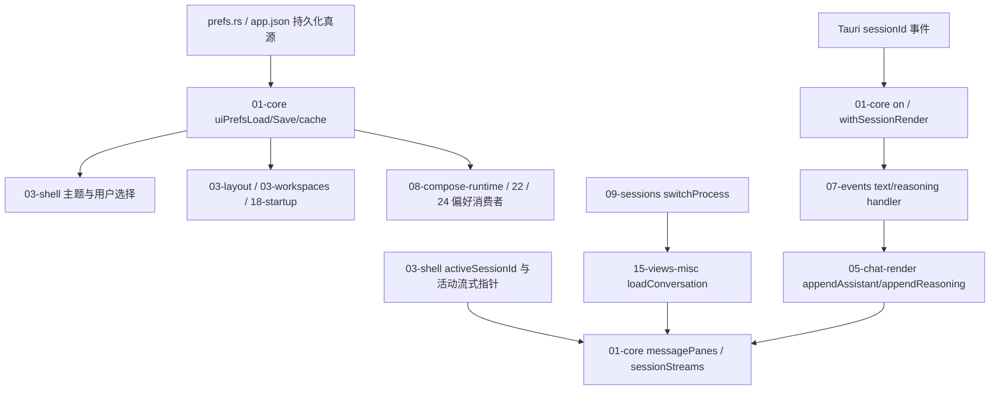

# A4 UI 状态依赖地图

基线 `0e5355c67e716afcb3e9ad892b7e74245bb25d24`；分支 `kanzei/audit-a4-state`。只新增全文审查 `03-shell.js`、`01-core.js`，其他文件为 caller 核对，不计全文覆盖。公共 coverage 由主代理整合。

## owner 与合同

| 状态 | owner / 边界 | 直接 caller 与约束 |
|---|---|---|
| 保存的偏好 | Rust prefs.rs `write_guard` → app.json | `ui_prefs_get` 返回已提交对象，`ui_prefs_set` 返回 `Result<(), String>`；顶层 Option null 不变更，layout 分区/键 null 删除，几何整体替换，layout 超 64KiB 忽略 |
| 同窗口偏好缓存 | 01-core `uiPrefsCache` 与私有 Promise 队列 | load/save 保留 Promise API；保存成功才合并，失败保持已提交缓存，强制 refresh 仍读 native；未发现外部直接读 `uiPrefsCache` |
| 启动主题 / 新选择 | 03-shell 渲染与私有 edit generation | 初始化和主题按钮是实际 caller；晚到 hydrate 不覆盖新选择，只有有效本地旧值需要迁移 |
| 会话身份 | 03-shell activeSessionId；09 切换入口 | 09 先改 process/session，再 await 15；不能用已改的 activeSessionId 给 outgoing DOM 指针归属 |
| pane 和流式装配 | 01-core messagePanes / sessionStreams；活动指针作为当前渲染上下文 | showPane 按 outgoing `pane.dataset.sessionId` 保存，incoming 从既有 sessionStreams 恢复；同 pane 不重复恢复旧指针 |
| 临时后台上下文 | 01-core withSessionRender 的 try/finally | 实际唯一入口为 on；07 同步 render callback；嵌套后台 scope 和异常均恢复上一级，不改变 active pane 属性 |
| 历史恢复 / 清理 | 15-views-misc | cached shortcut 直接 showPane；恢复、clearChat 清空三指针；detached holder 的 setActivePane 用 try/finally 恢复，未调用 showPane |
| pane 释放 | 01-core discard/evict；15、12-session-menus caller | 非活动删除同时丢 stream；evict 保留活动/运行 pane，释放 idle pane 的 stream |

## prefs caller 核对

- 03-layout：先更新自己的 layout 缓存，flush 异步保存；sound/sidebar/language 等消费 layoutPref，不依赖 native invoke 的同步前缀。
- 03-workspaces：先更新 workspace_preferences，本来就通过 workspace_save Promise 队列保存；恢复使用 await uiPrefsLoad。
- 08-auto / 08-compose-runtime：continue_prompt、auto 状态和 work_priority 的 UI/local cache 是当前窗口操作状态；偏好读取通过 uiPrefsLoad，写入保留异步合同。未发现 void save 后立即依赖 native 同步提交来启动 run 的路径。
- 22-constellation-prefs / 22-neural-flow / 24-memory-graph：先更新自己的展示状态，保存是异步持久化；boot 有用户代际/触碰保护。
- 18-startup / 28-async-workspace / 24-schedules：通过 Promise 读取，顺序服从同窗口队列；refresh=true 保留强制 native read。

没有新增 IPC 字段、persistent 字段、状态 map 或运行框架。原有 ESM `01 ↔ 03 ↔ 05 ↔ 15` 循环是运行期状态/渲染协作，沿既有 owner 修复，不移动 public API。

## 审查顺序与历史依据

先读 Rust 偏好提交/合并边界，再全文审查 03-shell 状态与初始化，然后全文审查 01-core 队列、路由、pane 和释放；问题落在 owner 后只适配必要测试。

- D-404：WebView2 本地缓存缺失时，app.json 是保存偏好真源。
- R-189：主题切换与 Monaco/theme event 的既有展示合同。
- R-267：每会话 pane 与流式状态；09 的提前改身份和 15 的缓存捷径使漏掉指针转移现在可达。
- `docs/design/ui_surface_stack.md`：prefs/layout 两级合并、null 删除、几何整体替换。
- `docs/design/ui_chat_backdrop.md`：启动 hydrate 不写回默认值，已有用户操作优先。

## 后续来源核实（不计 A4 问题）

24-schedules 读取 `uiPrefsLoad().projects`，但 native getter 没有 projects 字段；已将源码位置交主代理核实项目选择入口。该文件不在本包全文范围，不改源，不把待核实 caller 记为新 P1/P2。
