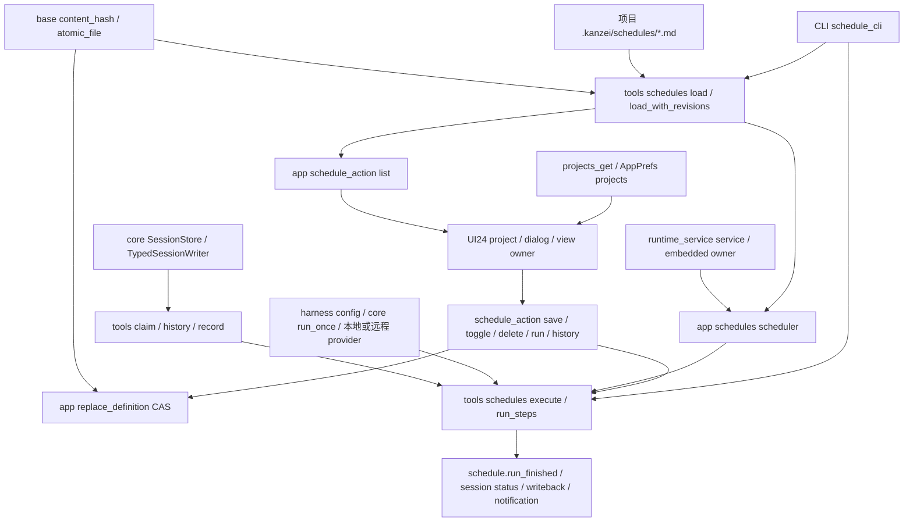

# A5 定时任务依赖地图

基线 `aff48f96b3c310fd83196e143541515c9a18643f`，分支 `kanzei/audit-a5-schedules`。全文审查新增 `crates/kanzei-app/src/schedules.rs`；`ui/24-schedules.js` 依 M0 全文记录重开，不重复计数。共享 loader 与 executor 仅列必要切片，不计全文。公共 coverage 由主代理整合。

下图箭头表示真源/能力流向消费方；实际调用依赖、public API 与 caller 见后面的合同表和清单。

## Owner 与边界

| 状态 | 真源 / owner | 实际合同 |
|---|---|---|
| 已登记项目 | `AppPrefs.projects`，`projects_get` | `ui_prefs_get` 只返回 UI 偏好，无 projects；18-startup 已消费 projects_get |
| 任务正文与版本 | 项目 `.kanzei/schedules/<name>.md` | 同次 read 的正文用于 parse 和既有 content_hash；读取后外部改动必须使旧 revision 保存失败 |
| 编辑提交 | `app::check_definition_revision` / `replace_definition` | expectedHash 与 Option<当前hash> 完整比较；旧 hash 不能接受已删除定义，None+None 才是新建。短文件锁内比较正文并替换；host await 不持 FileLock；host 失败恢复仍比较已写版本 |
| 槽位与运行历史 | `SessionStore` 中 schedules 专用会话 | claim 短文件锁 + durable 槽位事实防双执行；claim 不决定哪个进程有运行生命周期归属 |
| 应用 timer 生命周期 | 隐藏 runtime service 或显式 embedded runtime | 普通桌面窗口是 client，不应 claim/执行自主任务；main 仍可统一 spawn 入口，scheduler 自行沿既有 owner gate 返回 |
| 当前任务界面 | UI24 捕获的 opening / project / view | 延迟响应只更新原 view；已点击 run 使用原项目；保存回执不可替换后续编辑草稿 |
| Prompt 终态 | TypedSessionWriter 的已提交 terminal | Completed 写失败时 is_terminal=false，记录既有 Failed(error) 后返回失败；Stopped 的 reason 是 stopped_by_user，不代表保存故障 |
| 最终任务结果 | execute 的 Outcome → run_finished / session status | 失败结果保留已有非 notify 回写目标；app / CLI 沿 outcome.ok 呈现失败 |

## 修改前 caller 清单

- `load`：app scheduler、原 app list、CLI schedule_cli(list)。新增 `load_with_revisions` 仅 app list；原 load 签名、排序和 diagnostic 形状保持。
- content_hash 消费：app list revision → UI expectedHash → app 保存/切换/删除比较；shared record(armed) 与 due 的版本观察使用同一 hash；不改变 hash 算法或持久化格式。
- scheduler：唯一生产 caller `main.rs:222`；main 每个 desktop/service 启动都会 spawn。实际 owner 来自 `runtime_service::is_service` / `embedded`；schedule_action 继续经既有 runtime_service route 转发。
- `showSchedules`：唯一生产 caller `03-shell.js` workbench-schedules 点击。UI 控件均在本模块；`00-surface` 负责 dialog close，`01-core` invoke 提供 IPC，`03-shell` 提供当前项目和 toast。
- `schedule_action`：Tauri command 注册、UI24、真实 General 原生 smoke；runtime_service 按 command 将 client 请求发给 owner。新增内容只使用已有 projects_get，无新 IPC 字段。
- expectedHash caller：UI24 既有任务编辑/切换/删除携带 list revision，新建 null；General native smoke 新建未传字段；run/history 不走版本检查。已删定义 + 旧 hash 的拒绝不改变合法新建或无需 revision 的 run/history 合同。
- public `execute`：app schedules::spawn、CLI schedule_cli(run)。私有 run_steps 仅 execute 调用；Outcome.ok 是 app/result、CLI 退出码、run_finished、session status 与回写的共同失败边界。
- `TypedSessionWriter::finish` / `is_terminal`：本包只在 schedule run_steps 完成处消费已有方法，不改变 writer API；C4 已验证 terminal 标志仅在 append 成功后变更。

## 审查顺序与历史依据

先核 shared parser/loader/hash 与 claim，再审 app 的状态写入、host 恢复、runtime owner，最后重开 UI24 的项目和异步 view 生命周期。C4 将 terminal 拒绝假成功的真实 executor caller 移交本包，因此只补 executor 完成切片。

- `parallel/M0.md:86`、`M0-verification.json`、coverage.full_files 已含 UI24 全文；本包为重开。
- 原 schedule claim 注释和历史测试：跨 app/CLI 的 durable 槽位互斥与中断后不自动重跑。
- `runtime_service.rs` 的 service / embedded / route：沿现有运行服务归属，不引入新调度框架。
- `parallel/C4.md`（整合前以 C4 子树 verified fixture 为准）：finish 拒绝必须阻止成功结果；本包回归直接运行 public executor，经真实 provider/SQLite 完成路径。

## 证据边界

原 UI 下拉不存在第二项目选项。原行为负例直接证明无项目入口、同项目晚到 history/save；跨项目 list/run 和倒序 opening 另以“仅修 projects_get 来源、保留旧 owner 逻辑”的阶段对照证明，不能把 DOM 人工赋不存在选项当原生可达路径。关闭后的旧 list 回执原实现已写入 detached content，记 PASS。

所有数据库、home、provider 和回写目标来自临时 fixture。Cargo 已获主代理独占槽并串行完成；实际 CLI 通过正常与只拒 Completed 的 SQLite 故障控制，旧假成功及第一版 Stopped 事实均有数据失败对照。未运行 native Tauri 多窗口关窗或真实 host 登记，不冒报。
