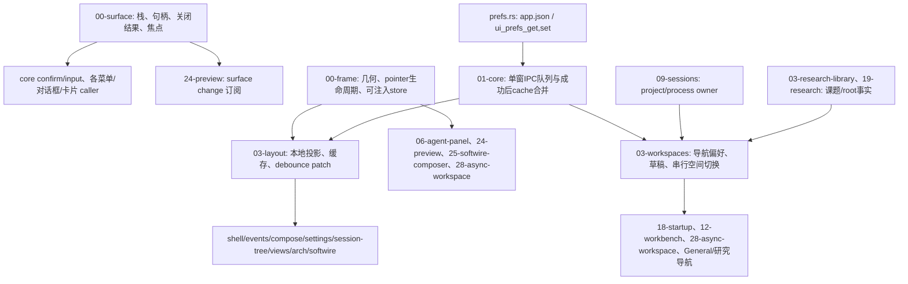

# A6 前端状态拥有者依赖地图

基线 `7fbe6a9f692b3d5cb6940987a707a02532a16c1b`，B 工作树分支 `kanzei/audit-a6-ui-surfaces`。初始全文范围为 `00-surface.js`、`00-frame.js`、`03-layout.js`、`03-workspaces.js`。完成其地图后，root 授权扩展底层 `prefs.rs` 全文及已审 `01-core.js` 的 workspace 合同切片。新增全文共5文件；01-core不重复计数，测试夹具不计工程全文。公共 coverage 由 root 更新，未经证实的候选不计问题。

## 状态拥有者与合同

| 文件/状态 | 唯一 owner / 持久化边界 | 可达并发或失败边界 |
|---|---|---|
| surface | 私有 stack 与每个 handle；native dialog/popover 是实际显示状态 | native close/toggle 异步、同元素 queue/reuse、关闭 callback、返回焦点、Esc捕获 |
| frame | 每个元素 `_kzFrame`/`_kzSplit` 与几何 store；CSS变量为投影 | pointer capture、失焦/取消、非持久 frame关闭、hydrate/viewport重放 |
| layout | layout投影与 localStorage首屏cache；app.json ui_layout是真源 | pending去抖→core写队列→晚到初始化adopt；null删除；实际写失败沿core既定静默合同 |
| workspaces | space/root事实委托session/library；偏好投影/草稿属于本模块 | restore await与本地save；跨窗全量workspace_state；切空间串行transition与取消恢复 |

## 公共 API 与 caller（修改前已查）

- surface：`openDialog/closeSurface` 被 core confirm/input、05-conversation-actions、08-project-models、09-sessions、15-views-misc/conventions、21-palette、24-schedules 使用。`openPopover/openMenu/isSurfaceOpen` 被 compose/model picker、docs/workbench/session tree、preview/softwire/General/async workspace 使用；`showCard/hideCard/isModalOpen` 被07-events/compose/editor使用；`onSurfaceChange/surfaceElements` 被24-preview/shell使用；translator与菜单/tooltip初始化由core/startup注入。gallery独立加载。句柄result与queue/reuse现合同必须保留，不能凭可优化重写。
- frame：`setFrameStore/bindFrames/refreshFrames/installSplit` 由layout；`installSplit` 还由agent-panel/preview；`installDragHandle` 由softwire-composer；`installFrame` 由async-workspace；gallery用bind/reset，其他几何exports供现有纯函数/浏览器回归。
- layout：pref读写由shell/sessions/views/settings/session-tree/preview/arch/softwire；autoAllow由events/compose；sidePanel由agent-panel；frame store由frame；`flushLayout` 由settings、General及pagehide；`adoptLayout` 唯一生产caller为模块初始化 `uiPrefsLoad().then(...)`。onLayoutChange是同窗投影通知，后端两个层次的null都是删除。
- workspace：shell记view，sessions调用adopt/scope/process选择并使用pending阻止切换期间加载；research/library导航调用保存；workbench/General/softwire调用切换或创建；startup/async-workspace调用restore。03→09→03存在运行期循环，root/process真源仍是session/library，不能复制一套。
- lower prefs：core uiPrefsLoad/Save在A4已经串行并冻结写patch，cache仅写成功后合并；Save失败按已有公开合同静默。原workspace_state整体替换是真实跨窗丢失根因，已获root授权修改Rust与全部当前写端，不能只给后端extend而保留上层旧快照。

## 本包跨模块合同（实施前已获 root 协调）

- `ui_prefs_set` 参数、Tauri字段、结果与 `app.json` 形状不变。workspace_state请求为本次触及字段delta；Rust仍在同一既有write_guard下读取当前文件、合并、原子保存。各project桶的 `dev`/`research` 按字段合并，`topic_states`按topic→字段合并，其它字段覆盖；null是存储值，例如process_id清空。与ui_layout的null删除不同。
- 新export `01-core.mergeWorkspaceState(state,patch)` 的唯一生产外部caller是 `03-workspaces.save_workspace/restore_workspace_preferences`；`mergeUiPrefsPatch`内部也调用它。local投影与成功后cache共用边界；没有新增窗口注册表或状态真源。
- `save_workspace` 唯一生产写端在本模块；其全部caller已查：`save_research_workspace`、`remember_workspace_view`、`adopt_process_workspace`、`switch_workspace`正常与取消恢复。research的既有课题切换、topic状态恢复、旧项目research迁移流程保持原样，delta滤掉原分区快照里的未变化字段，并在排队前冻结。
- `prefs.load_prefs/save_prefs/write_guard` 全caller：projects、commands/os_open、processes/lifecycle的实际写端均先取得write_guard；settings、durable_questions、research_library、runtime_continuation、schedules、verification_monitor、workspace只读。path/清理/默认回落合同没有改变；purge_process/project也仍为原原语。
- necessary native fixture：preview/fixtures、workspace-smoke、workbench-smoke同一明确domain merge；新fixture模块由preview/server allowlist托管。浏览器fixture与真Rust文件setter分别验证，不把mock冒充实际Tauri。

## 已证实问题与验证路线

1. layout初始化get阻塞→用户set/flush清pending→旧get回执adopt：保存的360被UI250盖掉，null复位也被350复活。只保留首次hydrate期间编辑直到adopt。
2. workspace restore await期间记新view→旧回执整体替换：durable已lines但本窗chat。restore token只合并本次等待期间的delta；未触及remote字段照常采用。
3. 两真实独立ESM窗口读同一旧快照→分别改项目/课题/字段→全map后写覆盖先写。底层domain merge与上层冻结delta共同修复；只改底层也会回灌上层显式发送的旧字段。

旧对照读取完整基线5个JS owner，并使用与原Rust整体替换等价的native合同；修改后的完整模块使用明确的新native合同。真Rust通过临时KANZEI_HOME调用ui_prefs_set→get→app.json重读另行证明。scope外几何/翻译fixture错误不计产品问题。

## 审查顺序与依据

先surface/frame全文与native生命周期，再layout/workspaces全文与真实caller。依据 `docs/design/ui_surface_stack.md` §4.4/4.6、A4状态队列与pane owner报告、M4项目切换合同、A5实际surface复用回归。4文件均尚未全文审查；slice或搜索不会计入全文完成。

所有回归用临时VM/本地浏览器IPC及临时KANZEI_HOME，禁止生产配置与数据库。root完成M5后正式交A6独占Cargo槽；只运行prefs相关和app all-targets检查，最后全仓由root统一执行。旧控制回放完整基线JS及原Rust setter整体赋值，产生真实数据断言失败；语法/fixture故障单独记录。

## 本包未改变的后续边界

- load_prefs读取/解析错误仍返回默认值；所有实际writer和是否有明确reset授权由后续独立包用损坏UTF8/JSON实证收口。A6仅修workspace delta写入，不宣称所有偏好失败语义已稳定。
- 08-compose-runtime优先级/自动续做的跨项目与跨窗数据probe已交root；未授权生产源码扩展，未计入A6问题或修复。
- 图及caller合同已完整读；新全文为5文件，公共coverage和后续模块排序由root统一更新。
