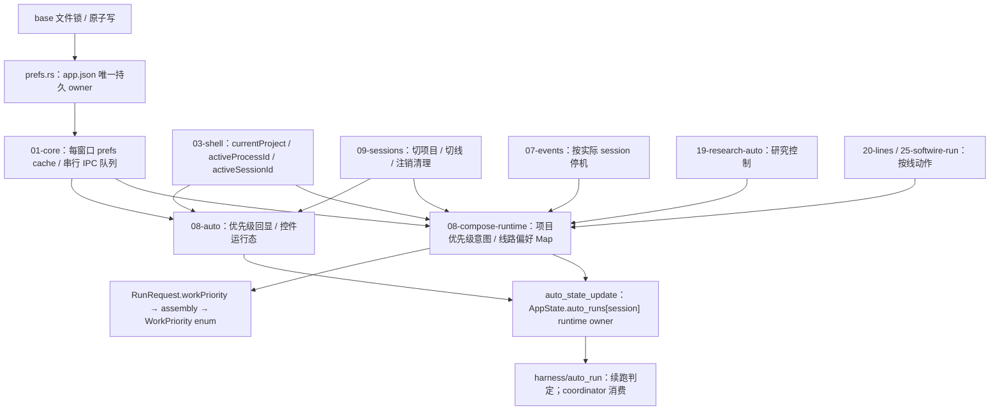

# A7 运行控制偏好：只读准备地图

当前基线 `89d7ec981ebe7467fcdbe5507700f22d5c3d7654`，复用 B 树。A8 四生产文件已冻结，等待独占 Cargo 槽。本记录只建立下一包地图和保存现有数据探针，不改生产源码、不计文件全文覆盖、不声明 A7 已完成。

仓库没有 `08-run-controls.js`。实际持有控件与偏好发布的文件是 `08-compose-runtime.js`；`08-auto.js` 提供运行态、优先级回显与控制同步；`08-compose.js` 是 ESM 测试 facade，不能算另一份业务 owner。

## 状态与字段边界

| 字段 / 状态 | 实际 source of truth | 当前读取 / 发布合同 |
|---|---|---|
| app.json | prefs.rs；write_guard 内完整读改写 | A8 checked write-load 先拒绝坏源；NotFound 可初始化；只读默认合同保留 |
| work_priority | 按规范项目路径键的持久 Map | Rust apply_ui_prefs 与 core 成功缓存更新均整体替换；08 change 会先复制已加载整图再发布 |
| process_auto_state | 按规范 process ID 的持久 Map；每值含 enabled/paused/stopAfterRound/maxRounds/mode | Rust/core 整图替换；08 持有本窗口 Map，persistProcessAutoState 发整图 |
| uiPrefsCache | 每窗口缓存 | core 队列仅串行同窗口请求；成功写后更新，不串行其他窗口 |
| processAutoState / processProfileUi | 本窗口控件及线档位投影 | hydrate 以 durable 值为准，保留既有本地 mode 迁移；不应把未触及线路陈值当新意图 |
| currentProject / active identity | 03-shell 活动视图 | 项目可以在异步 prefs load 等待中改变，动作需固定原身份 |
| auto_runs | AppState 按 session 的 Mutex Map | auto_state_update 应用于明确 session；只接线，判定由 harness 执行 |
| auto_max / continue_prompt | 标量偏好与用户自定义持续意图 | 本包不改变 legacy max 兼容、一次性 stop/goal、研究/结伴/自主模式策略 |

## 实际 public exports 与直接 caller

| API / owner | 生产直接 caller | 必须一起核对的合同 |
|---|---|---|
| core.uiPrefsLoad / uiPrefsSave / mergeUiPrefsPatch | 03-shell、03-layout、03-workspaces、08-auto、08-compose-runtime、18-startup、其他偏好消费者 | map 的 cache 合并要与 Rust 接受的实际 patch 相同；保留成功后发布与失败队列继续 |
| runtime.persistProcessAutoState | 内部 hydrate/remember/stop/echo/setLine；09-sessions.renderProcesses | 09 删除已确认退役线路后调用无参数 publisher，增量方案必须保留删除语义 |
| runtime.mergeBackendAutoState / restoreLineModes | 启动 uiPrefsLoad；测试桥 | 后端新规范键优先；仅实际迁移过的条目有资格发布，保持已有 mode 迁移行为 |
| runtime.rememberAutoUiState | 内部 profile/暂停/停止/开关；09 切线；19-research-auto | 保存的是明确 process 的意图，不能复制别的线路旧值到 durable |
| runtime.applyAutoUiState | 09 首次加载/兜底/切线；hydrate | DOM 是目标线路投影；保留线路计数、停机原因、AwaitingUser 回填 |
| runtime.applyAutoStopToSession | 07-events、19-research-auto、内部后台 done | 从实际 session 找 process；不能改成当前活动线 |
| runtime.setLineAutoState / lineAutoConfig | 20-lines、25-softwire-run；测试 bridge | 已捕获 item.session_id，runtime ACK 后才 publish；保留当前失败与续跑合同 |
| auto.syncWorkPriorityControl | 09-sessions.switchProject | 异步回显使用当前项目，仍需后续真实数据回归；本次未单独计 bug |
| auto.workPriorityKeyFor / workPriorityStorageKey / selectedWorkPriority | runtime 手动/自动请求与优先级 change | 项目 canonical 来源与规范键算法维持原合同 |
| Rust auto_state_update | main 注册；08-auto.syncAutoRunState、runtime、独立 native fixture | 返回 `{ok:true,goal}`，更新 session controller；不是 app.json writer |
| prefs.purge_process_prefs / purge_project_prefs | lifecycle/process purge、projects_remove | 现有锁内 owner 删除；增量不能复活已退役身份 |

源码搜索还核对了：`run/assembly.rs` 把 RunRequest 的 `work_priority` 转成 WorkPriority；`run/coordinator.rs` 消费 auto_runs；`state.rs` 持有 Map；`main.rs` 注册 IPC。脚本 facade/global test bridge 只是测试支持。

## 三条真实旧数据探针

2026-10-03 重新执行现有完整生产 owner ESM 探针：

`node --experimental-vm-modules --test output/audit-a6-ui-surfaces/next-priority-owner-probe.mjs`

结果 `exit 1`，3 tests / 0 pass / 3 fail，均为 `ERR_ASSERTION` 数据不变量失败，日志 `output/audit-a7-run-controls/owner-probes-current.log`。

1. A 项目选择 requirement-first，首次 prefs get 被屏障延迟，切到 B 再释放。实际落库 A 仍 defect-first、B 被改成 requirement-first。根因是 change handler 在 await 后读取 live currentProject，原意图身份没有捕获。
2. 两个独立窗口先后改 A/B，各自持同一旧 Map。B 发布整图把 A 的新 requirement-first 改回 defect-first。根因是 stale 整图被作为当前字段真源提交。
3. 两个独立窗口分别启用 p|A / p|B。第二个窗口发布全 processAutoState 把 p|A.enabled 改回 false，p|B 为 true。与第 2 条同属跨窗口整图覆盖根因。

这些探针加载完整实际 00-surface/00-frame/core/layout/workspaces/runtime ESM。03-shell live binding 模拟真实项目切换；08-auto 的纯 selector 与 flags 为受控依赖，native Map 替换按当前真实 Rust 合同实现。它们证明生产 publisher 的可达数据错误；不是完整 08-auto、真实 browser 或新 native/Rust 验证。

首版 `next-priority-owner-probe.log` 的两条 TDZ ReferenceError 来自夹具模块循环，没有数据断言证据，不计产品问题。修正依赖夹具后两优先级数据断言失败，以及追加 auto-state 第三条后的原日志均保留。此次重新运行没有修改生产源。

## 下一包最小边界（待 root 正式分配）

1. 先依 A8 checked write-load 稳定失败合同；保持同 IPC/persistent shape，不新增 schema/version/framework。
2. 在原 write_guard 内读取当前 durable 后，仅合并本次触及的项目 work_priority / 线路 process_auto_state 条目；core cache 同一字段 delta 合同。
3. publisher 只发真实动作涉及的键，动作触发时冻结 project/process/session 身份及值；不能只后端 extend 而上层仍发 stale 全图。
4. hydrate 与回显不能无条件重新提交未触及的全 Map；保留历史新键优先与 mode 迁移，只适配实际 delta。
5. 正式变更前协调 `09-sessions` 注销的删除表示。process_auto_state 当前 Value 形状可表达删除，但需明确 owner 合同，不能静默改无参 API 后留下复活/清理缺口。

尚未改源码、运行 Cargo、提交 A7 或计覆盖。当前需要收口的是身份捕获和字段写入范围，不需要产品偏好策略决策。

## 字段 delta 的明确最小合同

这是下一包实施边界，尚未修改当前 whole-map API 行为。两个 whole-map 探针合计一个根因，不分别累计问题等级。

| 请求表示 | 下一包合同 | 与实际 caller 的关系 |
|---|---|---|
| 整个字段缺失 / None | 字段不变 | 保留当前 IPC：theme 等无关保存不能清理 map |
| work_priority 空 Map | 没有触及键，无改动 | 当前唯一生产 publisher 是 priority change，不把空图当全局清空授权 |
| work_priority 某项目 = string | 只更新该项目完整枚举值 | 不带 p.work_priority 副本；project/key/value 在 change 发生时捕获 |
| process_auto_state 空 Map | 没有触及线路，无改动 | hydrate/回显的 localStorage 缓存保存不授权全库重置 |
| process_auto_state 某 id = object | 只更新该 id 本次实际触及的字段，保留其它 id 和该 id 未触及字段 | 下述追加真实探针证明按 id 完整值替换仍会 lost update |
| process_auto_state 某 id = null | 明确删除该 id，不把 null 保存进持久 map | 给 09-sessions 已确认退役清理一个明确 tombstone；缺失 id 只能表示未触及，不能猜为删除 |
| 项目删除 | 原 purge_project_prefs 锁内删除对应键 | work_priority 的 String Map 不新增 null 字段；项目 owner 保留现有清理入口 |

core 成功缓存更新必须采用相同项目 key merge、process key+字段 merge、null-remove；uiPrefsSave 继续在排队前冻结 patch、成功后发布，失败不更新 durable/cache。Rust 在同一 write_guard 内 checked load 当前原文再 apply/save；不是从 frontend full Map 判断全局状态。按 id 完整值替换是初版边界提案，下述追加数据已将其收窄到实际字段 delta。

退役线路的真实来源是 `09-sessions.renderProcesses`：仅 previousItems 中 origin_project 等于当前项目，且新 process_list 不含其 id 时删除本地 auto/profile/timer/session 状态。它现在随后无参 persist，下一包必须把这批明确 removed id 交给 publisher。不能从“某窗口 map 没有它”推导退休。`12-session-menus → process_purge → forget_process_prefs` 已在后端锁内清理对应 id；此路径与 A8 checked-load 兼容。这里只修已证明 whole-map 误发布，不声称现有偏好 API 已提供所有跨窗口退休身份准入校验。

## 全部真实 publisher 清单

全 UI 搜索 `processAutoState.set/delete/clear`、`work_priority` 和各 publish export 后，实际发布收口如下（行号是当前基线加 A8 下层切片的 UI 源，A8 没改这些 UI）：

| 生产写入口 / 触发 | 当前触及内容 | 下一包需要传递的 delta / 身份 |
|---|---|---|
| priority change 1354–1363 | localStorage 项目键；await 后 full work_priority | 触发时原 project/key/value 单项 |
| rememberAutoUiState 1170–1182 | processAutoState[processId] | 该 processId 本动作触及字段；调用方不能把未改的 DOM 字段当新意图；applyingProfileEcho 仍不写 |
| stopAutoForManualInput 695 | 空闲手动接管关闭；supplement/AwaitingUser 保持既有行为 | 通过 remember 保存原实际活动 process，不改变接管判据 |
| auto-pause 960 / auto-stop-round 980 / auto-continue 1013 | 顶栏明确用户控件 | 通过 remember 保存该线；runtime 同步继续用 session |
| syncAutoContinueWithProfile 1311 / profile change 1351 | 原 mode/profile 控件与本线 auto 偏好 | 通过 remember 保存该线；保留回显不落库及 mode 迁移 |
| stop pending branch 1378 | 原停止等待分支的控件状态 | 通过 remember；不扩大 stop_run 行为 |
| restoreLineModes 1107 | 仅缺 mode 且真实迁移的若干线路 | 只记这批迁移键；规范键已有值优先 |
| mergeBackendAutoState 1122–1130 | authoritative hydrate 全图到 local Map；可能迁移/回显 | 原文 hydrate 本身不作为用户新全图；只发布实际迁移键 |
| applyAutoUiState 1213/1229 | 目标线归一和 DOM 回显 | 本地回显保持；不得顺带发布其它未触及线路 |
| applyAutoStopToSession 1192/1193 | 按 session 查 item.id，写停机 patch | 仅对应 item.id；07 当前 done 与 runtime 后台 done、19 研究暂停共用 |
| setLineAutoState 1254/1255/1265 | 20-lines checkbox/pause/once-stop；25-softwire-run start/pause/close | 已捕获 item.session_id，ACK 后只发布 processId；保持直接 caller 与 active echo |
| 09 switchProcess 713/721 | outgoing remember / incoming echo | 不把两条线以外的 Map 作为新源 |
| 09 renderProcesses 553/556/594 | 已确认退役 id 删除；必要 fallback 目标回显 | 明确 removed ids=null；普通轮询无修改不发布全图 |
| 19 continue_research 83 / pause 108 | 已核 project/topic 的目标 research process；暂停对应 sessions | 通过同一 remember/stop publisher，不改研究策略 |

没有其它生产直接 `uiPrefsSave({work_priority...})` 或 `uiPrefsSave({process_auto_state...})`；current Map 的其它消费者是读取、测试 facade 或显示。`08-auto.syncWorkPriorityControl` 的异步回显仍需正式包补真实回归，当前没有把它额外列为已证明问题。

## 同一 process 字段 probe：key delta 仍不足

依 root 追加只读验证，在同一个实际 ESM/runtime/core 夹具创建两个窗口；native 合同控制改为 map 按 id 合并、每个 id 完整值替换，以隔离“仅修 key delta”后的状态错误。真实调用 `setLineAutoState`：A 对同一 p|A 提交 `{paused:true}`，B 提交 `{enabled:false}`。实际 B 请求和 durable 完整值带回旧 `paused:false`，最终 enabled=false、paused=false，违反 A 的暂停意图。日志 `output/audit-a7-run-controls/same-process-field-owner-probe.log`：1 test、1 ERR_ASSERTION、exit 1。原始完整生产模块没有修改。

第一次夹具未给 shell.sessionState 返回运行态，得到 TypeError；原 script/log 保存为 `.fixture-first`，不计产品负例。修正这个受控依赖后才取得数据断言失败。该探针也记录实际 `auto_state_update` 载荷：B disable 同时发送旧 paused=false，说明持久字段 delta 与 runtime 可选字段同步应采用同一动作意图范围；Rust auto_state_update 现有 Option 参数支持该合同，未提出新 API/schema。

需要共同提交的字段以现有明确动作决定，不由偏好策略重新设计：

| 实际动作 | 同一意图字段 | 不应重写的其它字段 |
|---|---|---|
| 20-lines 开关 | enabled | paused/stopAfterRound/maxRounds/mode |
| 20-lines 暂停/恢复 | paused | enabled/stopAfterRound/maxRounds/mode |
| 20-lines 本轮后停 | stopAfterRound | enabled/paused/maxRounds/mode |
| 25-softwire-run 启动 | enabled=true、paused=false、stopAfterRound=false（真实 caller 已明确给三项） | maxRounds/mode |
| 25-softwire-run 暂停 | paused=true | 其它字段 |
| 25-softwire-run 关闭 | enabled=false、paused=false、stopAfterRound=false（真实 caller 已明确给三项） | maxRounds/mode |
| 引擎停机 | 原 stop patch 指定的 enabled 或 stopAfterRound | 其它字段 |
| 用户选择模式 / 旧档位迁移 | mode | 未触及的控制字段 |
| 19 research continue | enabled=true、paused=false、stopAfterRound=false（现有控件动作） | maxRounds/mode |

顶栏单一控件及手动接管应保留其原明确动作，只传实际改动字段；读取快照或 normalization 默认值不是用户再次选择。历史 maxRounds 当前没有可编辑 UI，不拿它构造虚假的用户路径。同一 process 字段问题与原 whole-state stale overwrite 是同根，不另计一个 P1。

## 历史依据

- `docs/design/ui_chat_backdrop.md` D-404：app.json 是持久真源，localStorage 是缓存。
- `docs/design/project_workspace.md` §5/6：canonical 项目与 process ID，新规范键优先；线路 mode 随 auto state 持久化；旧 mode 迁移与 AwaitingUser 行为保持。
- `docs/design/continue_prompt_dissection.md` R-169/R-322：续跑机械判定属于 harness，前端保留用户意图；D-111 一次性停止/goal 不改成新的偏好策略。

## 正式 A7 源码阶段（2026-10-03）

上面的只读准备记录保留原时间与基线。正式分配后从 `84a3892bc80483a61cc6335e7a8ca654ca2b3c18` 创建 `kanzei/audit-a7-run-control-deltas`，仍复用 B 树。底层 A8 checked load 已合入，当前源范围严格为 prefs/core/08-auto/08-runtime/09 retirement，没有新增工作树或共享 coverage 修改。

审查顺序：prefs 持久字段合并 → core 成功 cache 合并 → auto 选择身份与 hydrate → runtime 实际意图 publisher/ACK/请求 → 09 已确认退休 publisher。08-auto 与 08-compose-runtime 全文读完，新增全文 2；prefs/core 是已审 owner 重开，09 仅 `renderProcesses` 退休切片。两模块的环由同一实际状态边界处理：runtime 持有线路 Map，auto 持有当前控件镜像；app.json 是持久 owner；AppState.auto_runs 是运行时 owner。

### 最终 owner 合同

| 层 / 调用 | A7 合同 | 直接 caller / 影响 |
|---|---|---|
| prefs::ui_prefs_set | 保持签名及 schema；write_guard + checked load 当前源，priority 合并项目键，process 合并实际字段，id=null 明确退休，缺失/空 Map 不清库 | main IPC；08 真实 publishers；09 退休；既有 ui_prefs_set 测试 |
| core::uiPrefsSave / mergeUiPrefsPatch | 同一 delta 语义；排队前冻结；native 成功后才合并 cache，失败沿原静默 fallback 合同 | 全 UI prefs caller；A4/A6 owner 不回退 |
| auto::rememberWorkPrioritySelection(value)（新增 export） | 选择发生时认领 project/value；单项目 delta；使旧 hydrate 失效 | 唯一生产 caller：runtime 的 priority change；独立 ESM 回归 |
| auto::syncWorkPriorityControl | 捕获 project+generation；晚回执不画入其它项目或覆盖新选择 | 09 switchProject；本包实际延迟 get 回归 |
| auto::syncAutoRunState(patch?) | 新可选 patch 只提交动作触及字段；无参数仍保留已有明确恢复/研究启动意图 | 09 新 session/切线、19 research continue、runtime 初始化保留无参；pause/enabled/once-stop/manual takeover/clearGoal 用明确 patch |
| runtime::persistProcessAutoState(delta={}) | localStorage 全 Map 仅投影；durable 只发 delta；首次 get 在途暂存明确动作 delta，hydrate 后合并发布；空参数 echo 不授权全图 | remember/stop/setLine/真实 mode migration；09 退休新增传 null |
| runtime::rememberAutoUiState(processId, fields?) | 按原 process ID 只提取控件本动作字段；第一启用保存原可见 mode；不从其它未触及 DOM 字段制造意图 | 各独立控件传具体字段；09 outgoing 与19研究恢复保留既有默认字段意图 |
| runtime::setLineAutoState | 原 Promise 调用合同；私有每 process 队列；捕获 item.session_id 与首次 mode；失败队列继续；ACK 后字段合并当前 Map；retired/rebound 身份不再 publish | 20-lines checkbox/pause/once-stop、25-softwire start/pause/off；三字段 softwire 耦合不拆 |
| runtime::sendAutoToSession | 原 projectDir 规范身份；core uiPrefsCache 中该项目 durable priority 优先，缺值才 legacy localStorage fallback | armAutoContinue 定时器；实际 run_prompt 载荷回归；没有新 cache/helper/export |
| runtime::continue_prompt hydrate | 实际 input/change 使旧 get 回执失效；change 仍沿原时机保存 | continuePrompt 的真实续跑意图消费；未把输入每键改为持久写 |
| runtime 文件补全 / SOP | 原 project + 现有请求/token/句柄代际；关闭/重开/切项目/后到 error 不改新 popup；选择再核身份 | 文件：input timer/choose/send/Esc；SOP：同文件按钮/关闭/条目选择；公共函数签名不变 |
| 09::renderProcesses 退休切片 | 仅本项目 previousItems 中确定已注销 ids=null；未触及其它项目不删除 | 原 process_list 刷新；backend purge 合同仍由原 owner 管 |

全 public caller 已搜索，额外新增仅 selection export；core.uiPrefsCache 为既有 public export，新增 import 仅 runtime。persistent 字段、文件布局、业务策略、依赖与锁原语未换。新旧 UI/后端需按同一包整合，当前不发版。

### 已证明的根因与证据边界

1. P1 async 身份与旧 hydrate：priority 原项目丢失、旧 prompt/priority get 覆盖新控件、旧文件/SOP 回执或按钮串项目；SOP 实际 `run_prompt(project-B,prompt=A-only command)` 已在旧源码控制中出现。各路径合计一根因，不逐路径计数。
2. P1 stale whole-state：两个窗口项目/线路/同 process 不同字段覆盖；同窗旧 ACK 回放 DOM/local/durable；plain echo 把 snapshot 当写授权；明确退休的迟到回执复活。项目键、线路键与线路字段都必须限制真实动作范围；同一根因。
3. P1 priority 三表示不一致：fresh localStorage 空，后端与 UI requirement-first，实际后台 run_prompt 却 defect-first。由实际请求断言证明，兼容 fallback 正常控制通过。

新独立回归 `scripts/ui-run-control-deltas-smoke.mjs` 运行完整真实 core/runtime/auto/09 ESM 源。仅环依赖装配分两阶段：先真实 core/runtime 与 auto function placeholder，再将完整真实 auto 对真实 owners 求值并接入 exports；不是摘抄业务函数。独立窗口各有 VM/cache/Map，native receipt/DOM/shell 是可控边界。native fixture delta 等于准备中的 Rust setter 语义，不能单凭 Node 认证 Rust。

Node 冻结阶段记录：29/29 正例；精确完整旧 `84a3892b` 同夹具 5 PASS/24 ERR_ASSERTION、exit 1，正常控制保留。旧源码通过 git show 读取，未替换生产文件；前后生产 raw SHA 另外记录。当时 3 条实际 Rust ui_prefs_set/reload/并发 guard 回归已准备，尚未 Cargo。A4 15/A6 12/M4 22/A5 8 直接 caller 回归通过。whole runtime 的 Node 部分执行后在 browser 子模块导入缺 playwright-core 退出，保留原 log，属于 B 树依赖环境，不计产品负例/全套通过。

### 正式串行验证完成

root 在 B5 明确释放后授权唯一 Cargo/shared target 槽。真实 setter/并发 3/3；exact-old apply_ui_prefs 保留全部实际测试，23 合法控制 PASS /3 新数据 assertion FAIL、Cargo101；finally 原字节恢复 SHA256 `7dc2f3c7f566647503cf209a8cbad340756c3404f9df1e110a6597bf9aa6508d`，刷新 422 Rust 源 mtime 后实际重编，prefs26/app600全部通过。all-targets check/Clippy-D/fmt/diff 全 exit0。

完整 runtime/browser 使用 `KANZEI_PLAYWRIGHT_ROOT=C:/Users/kanzei/Documents/kanzei code`、`PLAYWRIGHT_BROWSERS_PATH=C:/Users/kanzei/AppData/Local/ms-playwright` 和既有 ignored dependency loader；90 UI 模块、3608 次初始化 invoke、0 runtime errors，真实 Edge 子门全部通过，exit0。没有构建共享 kzapp/native 或跑全 workspace。首次 --lib 命令、test helper 的 backdrop 位置、Node --test argv 故障保留为验证修正，均不计产品 negative。产品负对照只计实际数据断言失败。最终 source/fixture/log raw SHA256 见 A7-verification 与 raw evidence-index；35 份 Node 冻结 index 原字节另存。正式 leaf 限定 9 文件，shared coverage/main 不改。
