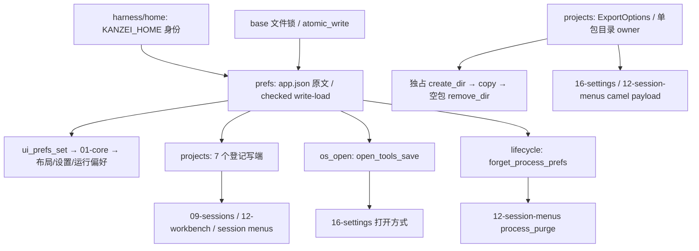

# A8 偏好失败合同与导出目录依赖地图

基线 `89d7ec981ebe7467fcdbe5507700f22d5c3d7654`；复用 B 工作树，分支 `kanzei/audit-a8-prefs-failure`。生产写入范围只有 `prefs.rs`、`projects.rs`、`commands/os_open.rs`、`processes/lifecycle.rs`。projects 首次全文审查；prefs 为 A6 后重开全文；另外两文件只审必要写端及其 caller 切片。公共 coverage 由 root 统一更新，切片不计全文。

## source of truth 与失败边界

| 状态 | owner / 边界 | 必须保持的合同 |
|---|---|---|
| app.json | prefs 原文；app 所有实际 writer 共用 write_guard 与 save_prefs | 原始读取或解析失败不能授权提交默认值；NotFound 可以初始化 |
| readonly prefs | load_prefs 投影 | 保持既有 best-effort 默认值，读错误本身不写盘 |
| projects/names/open_tools/运行偏好 | 同一 AppPrefs 文件的不同字段 | 一个字段保存不能因原文失败加载清掉其他字段 |
| process 删除 | runtime/DB/lifecycle 与 prefs 各有 owner | 既有多阶段操作不是一个总事务，必须准确返回偏好阶段失败 |
| 导出包 | 每次成功 create_dir 的调用方 | 不得复用其他调用的包；空结果只清理自己占有的空目录 |
| IPC ExportOptions | nested serde 字段，不受外层 Tauri camel 参数转换代替 | 两个真实 UI 使用 camelCase；历史 snake 请求仍可读 |

## 修改前已搜索的 API 与全部 writer

新内部 `load_prefs_for_write() -> Result<AppPrefs,String>` 没有新 IPC。成功后沿用原 simplify；NotFound 返回默认；其它 I/O、UTF8、JSON、typed-field 失败带原路径返回 Err。原 `load_prefs()` 委托它后默认回落。不是在 save 前补重读：每个 writer 的第一次状态读取就是 checked source。

| writer | 直接生产 caller | 锁与副作用顺序 |
|---|---|---|
| ui_prefs_set | 01-core.uiPrefsSave；各模块偏好保存经 core 队列 | write_guard → checked load → 修改字段 → save |
| register_project | projects_create | 目录/可选 git 初始化已完成 → guard → checked load → 登记 |
| projects_init | native command 注册；项目初始化入口 | 创建目录/.kanzei 骨架 → guard → checked load → 登记 |
| projects_rename | 09-sessions | 名称输入校验 → guard → checked load → 登记项校验 → save |
| projects_add | projects_pick；native command | 验证/初始化目录 → guard → checked load → 登记 |
| projects_remove | 09-sessions | 运行中对话检查 → guard → checked load → pure purge → save |
| projects_reorder | 12-session-menus | guard → checked load → 原排序算法；无变化不 save |
| projects_select | 12-workbench | guard → checked load → 必要目录隔离 → current → save |
| open_tools_save | 16-settings | validate_tools → guard → checked load → open_tools → save；不启动程序 |
| forget_process_prefs | process_purge/purge_process | 部分分支已 close/purge DB → guard → checked load → pure purge → 有变化才 save |

全源搜索实际生产 save 共 10 处，均在既有 guard 内。没有添加写原语、锁顺序、持久版本字段或依赖。

只读 load：ui_prefs_get、projects_get/isolation_report、os_open list/open_with、durable_questions、research_library、runtime_continuation、schedules、settings、verification_monitor、workspace。general_chat 与 workspace_snapshot 使用 projects_get。保持默认回落；model_config 接收投影，不是另一个 app.json writer。pure purge_process/project 与 same_project_path/simplify 的 caller、键合同不变。

projects 全文同时核对创建/命名/git、初始化/登记、根身份/隔离/detach、文件枚举、导出、运行中对话检查、排序与 workspace_snapshot。其未证实有实际错误的实现原样保留。

## 导出合同的完整 caller

- `ExportOptions`：真实 `ui/16-settings.js` 导出表单、`ui/12-session-menus.js` 导出菜单；两者 nested options 均使用 projectDir/outputDir/includeMemory/includeRequirements/includeDefects/includeConfig。main re-export 与 command 注册；state_tests 唯一 Rust struct literal；preview fixture 只是 mock。Rust字段名和返回 path/files不变。
- serde 加 camelCase 与六个旧 snake alias，修 UI 请求拒绝同时保留手写旧请求兼容。
- 私有 `reserve_export_dir(output,stamp)` 唯一生产 caller 是 export_project_data。std::fs::create_dir 原子取得目录；仅 AlreadyExists 换 suffix，其它错误即时返回。相同 stamp 的调用不共享目录，无新 base primitive 或第三方依赖。
- copy_file/tree 只有实际文件复制时创建目标父目录；空选择产生的本包目录使用 remove_dir 清理。复制失败仍可能留下自己的部分包，沿用既有失败合同；不递归删除外来内容。

## 历史依据

- `docs/design/ui_chat_backdrop.md` D-404：app.json 是本机持久偏好真源，localStorage 仅缓存。
- `docs/design/project_workspace.md`：已有键迁移与新键优先，不授权读失败重置配置。
- `crates/kanzei-harness/src/home.rs` D-187：KANZEI_HOME 是正式隔离通道。本包只读自建 home/project/DB，不接触生产资料。
- A6 workspace delta 已完成，本包保留该 merge 与只读回落；本次修复是 checked write-load 和独立导出 owner/参数根因。A7运行控制 owner探针留在下一包，不改08源码。

## 证据与执行边界

- 精确旧 D2 debug binary SHA256 `31bf051ba8ca722b323014eefe3db288f3b2c4ba23eb6b3a9dd1835897ebcf2e`。不是 A8 新编译；原 D2/A8修改前基线的 prefs path/load/simplify/guard/save/apply/get/AppPrefs 片段逐字比较已记录；此次 workspace_state=None 的 UI setter 路径相同。
- 首 prefs native：正常与NotFound控制2PASS，三种损坏后实际 UI setter 清空 projects/names/open_tools，3FAIL/exit1。导出 native：camel 拒绝、同秒覆盖、empty递归误删3FAIL/exit1。
- 支持命令扩展：真实 ui_prefs_set/projects_remove 三种损坏、camel/export owner；3正常控制PASS/8真实断言FAIL/exit1。无执行故障，PID64236与所有子进程退出。
- 首扩展脚本错误地把 desktop-only open_tools_save 放进无界面 service，4断言遇到设计拒绝。原脚本/log/result保留；这4项不计产品证据。工具保存与 process prefs 清理的验证使用已准备的真实 Rust writer 回归，尚未执行，不修改 IPC routing。
- 独立native夹具同时隔离CODEX_HOME，模型所有角色显式fixture:unused，排除启动fast模型回落保活。此前受支持11项与当前完整隔离脚本得到相同3PASS/8FAIL，均为精确旧binary控制；不拿旧binary给新源认证。
- 正式独占Cargo验证：15真实回归通过，三组旧原行为编译成功后分别8PASS/7FAIL、3PASS/1FAIL、1PASS/3FAIL，实际Cargo均101；finally原字节SHA恢复+mtime刷新，再次实际重新编译15项全通过。
- prefs23、projects15、完整app597通过；app all-targets check/Clippy-D/workspacefmt/diff/Node syntax均exit0。四源码没有验证期间修正；生成schema换行变化无内容diff，已精确恢复不stage。
- 没有构建共享kzapp；新binary/native11由root最终三包统一整合验证，不能拿旧D2 binary给新源认证。可复制原字节证据清单为output内evidence-index.json，明确排除exe/profile/DB。A7只读准备地图不放本包提交、不计新增覆盖。
