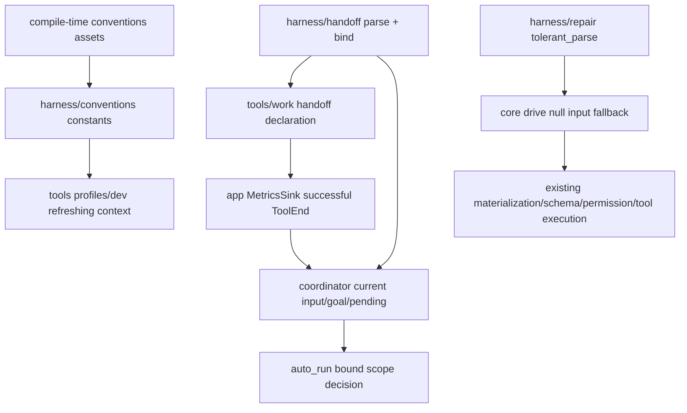

# D4 基础合同依赖地图

基线为根树 `cb6cdc5267ac931b6a4b3b1f82111b995576cb01`。先全文阅读 conventions.rs、handoff.rs、repair.rs，再核对全部 public API 与实际调用链；无源码修改。

## 状态与边界

- 三文件都没有持久状态或运行锁。conventions 是编译期文本真源，项目文件只由上层每轮读取；读取失败显示错误，不生成空配置覆盖。
- handoff 只保存声明和值级校验。实际本轮成功采集属于 MetricsSink；完成权属于带 admitted input/goal/pending 输入的轮末控制器。WorkItem/Batch 局部声明保留，不能因此结束 Request/Goal。
- repair 只产生参数 Value，先试原合法 JSON；未修复返回 None。原 raw_input 与工具失败回喂由 core 保留；它不执行工具，不绕过权限或 schema。任意未支持语言语法不是 contract。

## 修改前 caller 与历史依据

- DEFAULT_CONVENTIONS/CARGO_CONVENTIONS：lib 再导出、tools/profiles/dev 常驻刷新；git/profiles 既有守护测试。两个 assets 为必要文本切片，不计工程 Rust/JS 全文覆盖。
- HandoffDeclaration.from_input：app/run/events 的意图登记；bound_scope：coordinator 轮末；context_prompt_for：assembly；context_prompt：该 primitive 与既有 tests。HandoffScope 消费位于 auto_run，work 工具使用既有 serde 字段；全名及非限定名已搜索。
- tolerant_parse：lib 再导出、core/runner/drive.rs 的 input=null 分支；七项 primitive 既有 tests。后续参数失败继续走既有纠错，不能把修复失败猜作运行成功。
- 依据：R-191/D-279 规范单源；R-322/UX-008 完成范围与内部记录；docs/design/model_autonomy_and_harness_intensity.md 的声明事件流与精确身份；docs/design/harness_m1.md 的参数修复边界。

## 验证与范围

全部三文件与 D3 已验证基线在 CRLF 规范化后逐字相等。只增加地图与审查记录，无生产或测试改动；同轮 root 统一全仓检查后再更新 coverage。其余 Harness 文件及相关 caller 未因本包搜索而标全文 PASS。
