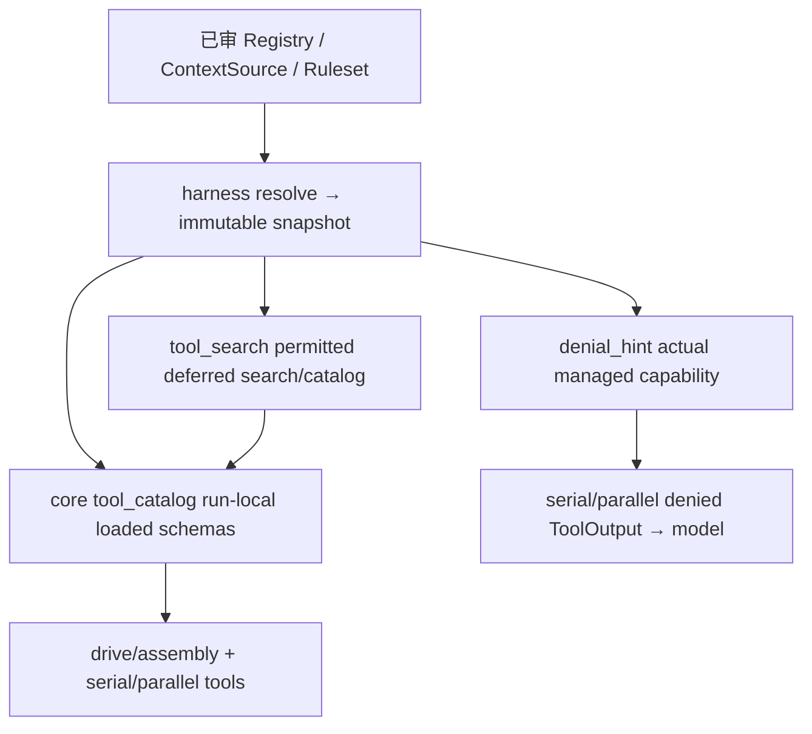

# D5：Harness 工具快照与发现地图

基线 `4aeed9c764d07412ccbcfb1d24e52018ce2ebb02`。先全文阅读 harness.rs、tool_search.rs、core/runner/drive/tool_catalog.rs（含各自内部测试），再查其生产消费者与拒绝路径。Cargo 当前归 C5 补包，root 后续统一验证，不把阅读或候选计为修复完成。

- 每次 resolve 的 draft 独立；组件按注册顺序贡献，Registry 同名 last-wins。required_tool/deferred名单装配检查保留。ResolveCtx/config Arc 为本次快照，动态 ContextSource 自己声明每步刷新；不把刷新文本加入历史累积。
- 工具注册与执行集合真源是 snapshot.materialize_tools，D3 已修共同完全拒绝判据。Deferred 只影响首轮 schemas，tool_search 不可见时退回全部已物化工具；执行权限仍按真实 resource 核对。
- core tool_catalog 持每次 run 的 specs/context_report，按工具名幂等加载；历史只加载当前快照仍允许的工具，schemas 与账单同时增加。Unknown/loaded 混合查询真实保留已加载结果，反馈里明确区分，不误记重复 schema。

## 修改前全部 caller

- snapshot resolve/select/materialize：tools profiles/base/subagent/schedules executor、CLI run、app assembly/model_config、core runner assembly/subagent；core 每步读取 refreshable baseline。公有类型与方法、限定名及 re-export 均搜索，无签名变化计划。
- tool_search.search/render_result：唯一生产消费者 core tool_catalog.run_tool_search；render_catalog：snapshot.deferred_catalog；one_line：catalog；ToolSearchTool：profiles/dev 注册，runner 特殊处理。
- core tool_catalog：drive/assembly 从历史加载；drive 串行/并行分发自动加载及处理搜索；append_deferred_process_hint 只对实际后台 bash handle 提示 process schema。相关函数均 pub(super)，无持久格式或 UI API。
- denial_hint：core serial_tools/parallel_tools 的实际 Gate::Deny 回执；app permission_tests、tools profiles 既有控制。既有 D-173 要求拒绝指引指向真实可用能力，不能指向不存在的专用工具。

## 已定位的待实测问题

合法配置整体 Deny 某个已注册的专用工具时，materialize_tools 将其摘除；该工具对应 managed resource 的 denial_hint 仍说它是唯一合法写渠道并要求直接调用。实际 runner 把该指引放进拒绝回执，模型只能再次请求不可调用的工具。拟只在共同完全拒绝判据证明渠道已移除时明确说明当前权限禁用该渠道；资源 Allow/Ask 例外、可见 deferred loader、正常专用工具指引不变。

这是窄条件下的错误补救 routing，保护门禁仍生效；若真实配置/快照回归成立按 P2 记录。不会修改权限、自动放宽规则或加入新工具。其余两个全文文件不因风格或缺测试修改。
