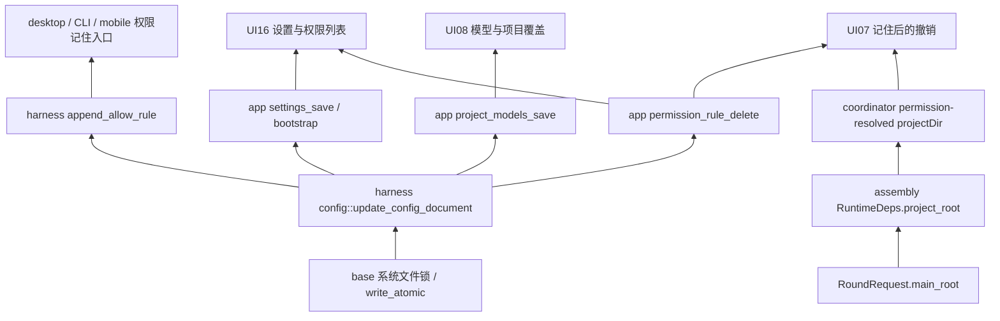

# M3 配置写入与权限身份依赖地图

全文范围：app `settings.rs`（原1692行，含全部既有测试）、`model_config.rs`（原1571行，含13项既有测试）。`state_tests.rs` 与 `run/coordinator.rs` 仅审查必要 caller 切片，不重计全文。model_config 另由 D0 独立全文复核。

## Owner 与边界

- `kanzei.toml` 原文是持久真源。`DocumentMut` 只是同一锁持有期间的编辑快照；所有五类专用 writer 通过 lower 事务读取、校验、编辑、原子替换。没有更换 schema、格式或新增依赖。
- 通用文件编辑器走同一 base 锁及 CAS/读凭据 guard；export 写外目录副本。专用 writer 全仓检索未发现另一处裸写活动配置。外部编辑器不遵循此协议的边界保持原有说明。
- 全局设置只写全局文件；项目模型、记住/撤销只写规范化主项目 `.kanzei/kanzei.toml`。provider 非空清单即权威，空清单保留原有 providers，这是既有业务合同。
- 权限列表 index 只是该快照的数组位置。删除必须携带 `expectedRule` 的 action/resource/effect，并在同一写锁快照核对；不猜新 index，不新增稳定 ID 或迁移。
- UI 的活动项目不拥有后台会话的权限规则。coordinator 使用 assembly 已持有的主根发出 `projectDir`；后台 pane 路由保留它，UI07 在既有 bounded map 中保存来源。缺来源旧 payload 不猜项目。

## 改动前 caller 搜索与闭环

| Contract / helper | 真实 caller 与处理 |
|---|---|
| `settings_read_document/read_text/write_document` | 仅 settings 保存/bootstrap、model_config 保存；迁到 lower 同锁事务后删除重复读写原语 |
| `settings_parse_document` | model patch 保留；合法/非法原文合同不变 |
| `settings_table/set_value/set_or_*` | 仅 settings 各节及 model patch；切换到已有 `toml_edit::TableLike`，支持普通/内联表，原键/值装饰保留 |
| `save_project_models_file_with/between_reads` | 唯一生产 wrapper、唯一模拟重读测试；取消两读/四次重试与生产测试 hook，换真实跨线程持锁回归 |
| `validate_model_roles` | settings 保存与 settings/state_tests caller；实际提交前在锁内按最终配置校验。原 state_tests 改测真实保存的成功/失败与零提交 |
| `permission_rule_delete` | main invoke 注册；UI16 删除、UI07 撤销、state_tests 隔离回归；三参数同步闭环，expectedRule 必填 |
| project model commands | main 注册；UI08-models 查询/提升、UI08-project-models 读取/保存/打开；API 载荷不变 |
| `kz:permission-resolved` | run/events 唯一 native producer 经 coordinator emit；JSON object 加主根，with_session_id 保留，01-core 路由→UI07；A3 两个 fixture 补该新字段 |

## 确切问题与证据

- **P1 / D1-C1 同根因**：settings 裸读改写、model 最后复读后的窗口、bootstrap 缺失检查后的覆盖、delete 裸写，都可绕过权限追加锁。实际另一线程持有同一路径事务时，旧上层 writer 提前完成；持久快照可被覆盖。统一 owner 后上层等待并保留双方结果。
- **P1 / D1-C4 与 A3 同根因**：删除 A 后 index0 已是 B，旧 index0 删除再成功；页面确认等待/重试/旧响应及后台 pane 的 currentProject 猜测可跨项目。完整身份核对与 A3 来源绑定共同修复。
- **P1 / M3-C2**：合法 `models = { ... }` 等内联表能被 loader/查询接受，保存却只接受普通 Table。使用现有 TableLike 支持同一实体两种表示，不改变业务值；新增模型 save/unset 与 global 各节实际保存回归。
- **P1 / M3-C3**：删除 provider 后，旧模型校验仍把原文件中的 provider 当可用；保存成功后该 provider 已被移除，模型无法解析。改为同一事务内校验实际将提交的配置，三个模型角色失败都不提交，换成保留 provider 可成功。
- **P2 / D1-C5**：规则读取/解析失败伪装成空列表，UI 错误恢复入口不可达；现在仅 NotFound 返回空，其他失败携路径返回。
- `xhigh` 原 HEAD 已支持，未修改、未计问题。默认 verify_every_n 争议未在本包更改；D1 只修显式 overlay。

## 历史依据

- D-082：设置页只编辑管理键并保留表单外数据，现有 DocumentMut 方案保留。provider 完整清单的剪枝是既有合同。
- D-083：允许并记住必须精确资源、持久化成功后才批准；不扩大权限或吞写失败。对应归档位置与原文核对在 [D1-map.md](D1-map.md)。
- 本包沿用上述决策；没有 Anthropic 专属支持改造、发布、用户配置操作。

验证证据与逐文件结论见 [M3.md](M3.md) 和 [M3-verification.json](M3-verification.json)。
