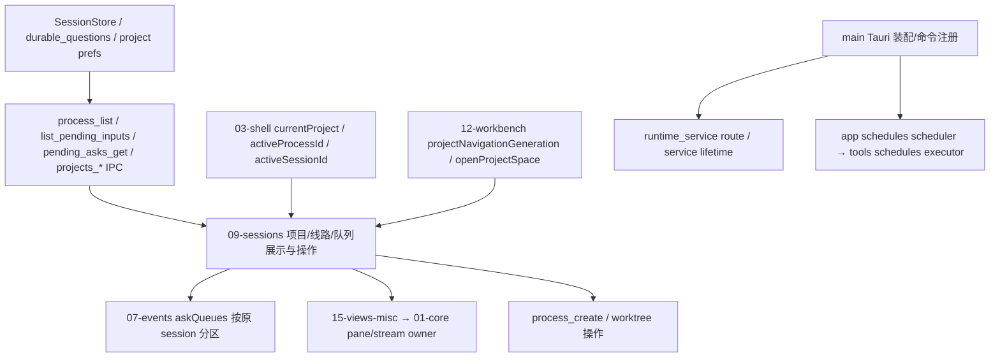

# M4 会话界面与入口依赖地图

审查基线 `aff48f96`：A4 的 UI 偏好和 pane owner 已合入；随后 C4 合入 `33664fd0`。先全文阅读 `ui/09-sessions.js`（原 1638 行）与 `src/main.rs`（458 行），修改前搜索所有导出函数、IPC 与状态消费者。`12-workbench.js` 只复核导航合同并改一个条件，不算全文审查。验证与未完成边界见 [M4.md](M4.md)。

| 状态 | 单一事实源 | 当前文件职责 |
|---|---|---|
| 会话与输入持久状态 | 项目 SQLite，后端 process/session 身份 | 09 只展示对应项目/线路的快照，不把 await 后的全局身份当请求身份 |
| 当前项目/线路 | 03-shell 的三项身份；12-workbench 的导航代次 | 09 的 switchProject 复用既有导航事务；调用开始时捕获原身份，迟到结果和旧按钮不得操作另一条线 |
| 待答请求 | 后端 asks/durable questions；前端 07 askQueues 的 session 分区 | pending_asks_get 的恢复结果必须进入请求会话，pumpAsk 只消费活动分区 |
| 排队输入 | list_pending_inputs/cancel_input 的 session 参数与 input_id | 最近一次有效刷新展示；撤销携渲染时的真实项目/进程 |
| Git/worktree 身份 | 后端注册表和 git worktree list | 09 的确认、facts 和 refresh 跨 await 保持发起项目与单次准入 |
| 原生服务 | runtime_service 已有 service/embedded 分工 | main 仅装配，不在入口重复实现执行 owner；scheduler 归属由 A5 下层收口 |

## 修改前 caller 核对

- `refreshPendingAsks`：09 renderProcesses、switchProcess；07 pumpAsk/answerAsk 按 askQueues 与 payload.sessionId 消费。native `commands/run.rs::pending_asks_get` 按原 root/process 读取，`state::pending_ask_payload` 明确携 sessionId。
- `refreshPendingInputs`：09 switchProcess、enterProject、撤销；07 stopped/done/input-received；08-compose-runtime 发送；29-general-chat 切换。`renderPendingInputs` 只有 09 内部 caller，导出保持原形状。native lifecycle 的 list/cancel 都按 project+process 得 session，再按 input_id 操作。
- `createWorktreeLine`：09 worktree-add、20-lines lines-add、12-session-tree 经 enterChat 后创建；原生 process_create 原子建树并注册。确认和 facts 都是实际异步入口。
- `checkProjectIsolation`：09 activate_execution_root、detach 后重查；project_root_info/project_detach 以项目参数解析，旧响应不能成为新项目按钮的来源。
- `closeParallelProcess`：09 研究会话列表、20-lines、12-session-menus 当前项目关闭；后端 process_close 使用完整 process ID，不需要新 IPC 字段。
- `switchProject`：12-docs-pages 文档页项目选择、21-palette 命令面板；既有 `openProjectSpace` 还被 03-shell、11-docs-list、12-session-tree/menus、18-startup、24-preview、25-softwire、26-project-conversations、28-async-workspace、29-general-chat 调用。新 `options.reload` 仅 switchProject 设置；原 caller 的同项目聊天缓存捷径保持。两个导航入口必须共用既有 projectNavigationGeneration，不能分别认定自己最新。
- `main.rs`：实际所有命令注册、runtime route、service lock、window/data-directory、UI/手机 emit、scheduler/monitor/preview/recovery 装配均已读。IPC/event 机器检查覆盖注册集合；scheduler 活跃 owner 的根因在 A5 下层，不在 main 加重复 gate。

## 已确认并已通过回归的路径

1. A 的 pending_asks_get await 后改用活动 B 的 askQueueFor，A 权限卡被放进 B 分区；初次失败又留下 askSyncedSession，轮询不能重试。
2. A 队列迟到覆盖 B，或同线路旧列表覆盖新列表；旧行撤销动态读取全局项目/进程。
3. createWorktreeLine 在 facts/confirm 后才捕获项目，且 facts await 前未置 in-flight；可在 B 建 A 的任务或重复准入。
4. 隔离检查旧响应显示在新项目，旧按钮动态 project_detach 新项目。
5. close 的 wasActive 是确认前快照，完成时可清除后来选中的另一个 process。
6. 切换执行根时旧 Git/worktree facts 仍可操作，误用旧项目的阻断与修复动作。
7. switchProject 绕过 openProjectSpace 的导航代次，迟到项目选择可覆盖更新的导航。

公共函数形状、IPC 与持久 schema 不变。定向测试执行真实 09 与 12 模块，IPC 用可控 Promise 检查原身份/实际调用；精确旧源码有 15 项断言失败、7 项正常路径通过，修复后 22/22 通过。首次完整回归发现同项目 switchProject 被缓存捷径跳过，已用上述 reload 条件保留原合同；修复后的完整 UI/浏览器回归退出 0。

## 历史依据

- D-251：worktree 操作必须在 await 前认领项目。
- D-355 / R-086：切换等待目标 process/history，权限队列可在 webview 重载后恢复。
- D-170：项目隔离告警与显式 detach，不改变持久根或静默迁移。
- R-267 / A4：pane 与流式指针由 01-core 按实际会话拥有，09 不新增第二份 stream 状态。
- 设计依据：[session_state_and_line_runtime.md](../../../design/session_state_and_line_runtime.md)、[project_workspace.md](../../../design/project_workspace.md)；历史修复约束：[tier1_implementation_plan.md](../../../design/tier1_implementation_plan.md) 的 D-251/D-257 回归合同。
