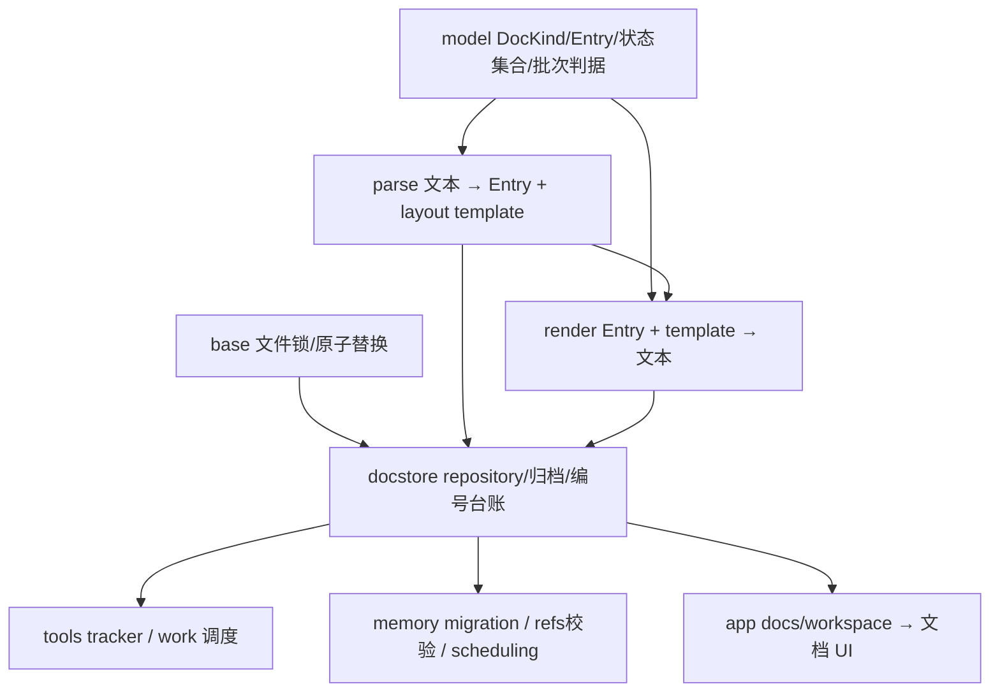

# M5：结构化文档 primitive 依赖地图

基线 `2df4f75d`，先全文阅读 model.rs（335）、parse.rs（227）、render.rs（137）；repository.rs（173）也已读，但持久化错误分支需要下一步完整检查 archive/validation，不在本包提前标 PASS。

- 真源：markdown 条目头中最外层 status；布局模板保存原游离文本。Entry 是解析投影，SQLite 不拥有 tracker 文档。
- 文件写入由 repository 和 base 负责；parse/model/render 不做 I/O，不拥有锁，不另建缓存或副作用。
- R-203：memory/docstore 从 tools 拆出；tools 再导出，不能因外观重复制造反向依赖。R-257 B3 是当前拆域历史。
- D-002/D-070：合法标题括号和 vec[index] 必须保留；D-331：标题不能携跨 DocKind 状态标记；D-332：外层非法状态必须保留并由调度 fail closed；D-239：字段换行统一进入单行写原语；D-329/D-130：布局中的原文保留及空白收敛已有合同。

## 修改前 caller 核对

- ALL_STATUS_TOKENS 仅 parse 的 title_status_marker/strip_status_markers 使用；传递 caller 包括 tracker::check_title（add/update/repair）、actions/normalize、DocStore.integrity、archive.restore_title。
- parse/parse_document：repository.load、archive.load/restore、memory/migration；经 tools::docstore 再导出供 app 和 CLI 使用。所有同名与限定名 caller 已搜索；顶层 docstore.rs 中相关既有测试是必要切片。
- render/render_with_template：repository.save、archive 的所有归档/恢复写入、validation.delete_raw_line；push_field 是全部字段渲染的现有唯一原语。
- model 的批次 public 函数：app docs/workspace、tracker 与 tracker/actions；读取历史批次不钳上限、写入只限制新声明的合同保持。
- 状态消费：tools tracker/scheduling 与 memory/scheduling 对未知状态判 INVALID；work 的 WIP 过滤同样以解析 Entry.status 为准。

## 已确认的可达问题

1. requirement add 允许标题“实现 [RFC]”；render 写成“实现 [RFC] [todo]”，parse 两次剥离 status，把 RFC 当状态。后续调度将合法条目标 INVALID。反向例“标题 [todo] [fixed]”又把非法最外层 fixed 隐藏成 todo，破坏 D-332 fail-closed。
2. ALL_STATUS_TOKENS 缺 MEMORY 当前真实 stale 状态；check_title/integrity/normalize 漏掉 [stale]，跨 DocKind 标题状态合同不完整。
3. 同 parser 根因：合法缺状态存量缺陷 update 标题为“新标题 (high)”且保留 severity=low，写成“新标题 (high) (low)”；循环两次剥离 severity，下一次 load 丢掉括号标题并把 severity 变为 high。A5 独立只读复核已核实真实 update caller，不补默认状态或在 caller 抹掉合法括号。

只修共同 primitive，不在调度和 UI 复制补丁；公共签名、markdown 格式、合法未知状态诊断和历史 token 均保持。memory 包 184 项及三个真实 Tracker caller 回归通过；三个精确旧生产分支编译成功后实际断言失败，原字节恢复已核对。全仓整合仍待同轮包合入，不用全文阅读当通过证明。
