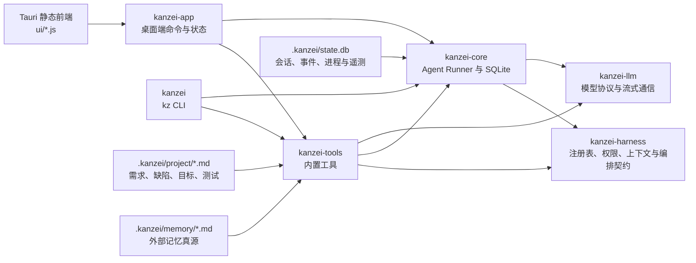

我已经按当前工作区做完只读梳理。先给结论：这不是一个普通的“聊天 UI + API 调用”项目，而是一套以外部记忆、Markdown 工单、SQLite 事件溯源、权限硬门禁和 Git worktree 并行为核心的个人 coding agent。

本次没有修改文件、没有运行测试或构建。最终核对时，工作区在 `dev` 分支，领先 `origin/dev` 2 个提交；另有 15 个已跟踪文件被修改、2 个未跟踪源码文件。说明当前还有别的开发工作正在进行，我下面会明确区分稳定结构与开发中内容。

## 一、先建立整个项目的心智模型

可以把它类比成一个 Python monorepo：

- `Cargo.toml` 类似根目录的 `pyproject.toml`。
- 每个 Rust crate 类似一个独立 Python package。
- `kanzei-core` 类似领域服务和任务执行引擎。
- `kanzei-tools` 类似工具插件包。
- `kanzei-llm` 类似模型 SDK 适配层。
- `kanzei-harness` 类似依赖注入容器、权限中间件和插件注册系统。
- `kanzei-app` 类似桌面 API 层加前端。
- `kanzei` 是命令行入口。
- `.kanzei/project/*.md` 类似直接由人和 Agent 共同维护的工单数据库。
- `.kanzei/state.db` 是运行事件库，不是工单真源。

六个 crate 的依赖仍然是无环 DAG，但有一个值得注意的架构现状：`kanzei-tools` 反向依赖 `kanzei-core`，并直接依赖 `kanzei-llm`。这主要来自回放评估、记忆召回等工具需要接入 Runner 和模型，并不是 Cargo 循环依赖，但会让工具层比理想状态更重。

---

# 二、根目录文件

项目总入口是 [README.md](<C:/Users/kanzei/Documents/kanzei code/README.md>)，工作区定义是 [Cargo.toml](<C:/Users/kanzei/Documents/kanzei code/Cargo.toml>)。

| 文件                  | 用途                                                                                                                   |
| --------------------- | ---------------------------------------------------------------------------------------------------------------------- |
| `README.md`         | 面向用户的产品说明。解释记忆优先、真实 worktree 并行、受控合并、Markdown 工单、模型通道、安装方式和六个 crate 的职责。 |
| `Cargo.toml`        | Rust workspace 根配置。登记六个成员 crate、共享依赖、Rust 2021 edition 和 release 优化策略。                           |
| `Cargo.lock`        | Cargo 锁定的完整依赖版本。用于可复现构建，一般由 Cargo 维护，不手工编辑。                                              |
| `package.json`      | 前端检查工具的 npm 壳。项目没有 React/Vite/Webpack 构建；这里只提供 ESLint 和 Playwright Core。                        |
| `package-lock.json` | npm 依赖锁文件，对应`package.json`。                                                                                 |
| `eslint.config.js`  | ESLint 9 flat config。主要只开启`no-undef`，避免经典脚本拆分后出现未定义全局变量；不强制格式化风格。                 |
| `.gitignore`        | 定义生成物和本地状态边界。忽略`target`、`dist`、`node_modules`、SQLite、索引库、隔离证据、临时锁、诊断输出等。   |
| `LICENSE.md`        | PolyForm Noncommercial 1.0.0，允许非商业使用、修改和分发，禁止商业用途。                                               |

一个关键点：前端没有 npm 构建步骤。`package.json` 只是静态检查与浏览器冒烟测试的依赖容器，真正交付给 Tauri 的就是 `crates/kanzei-app/ui/` 里的静态文件。

---

# 三、根目录下的各个目录

## 1. `.git/`

Git 自己维护的内部数据库，包括：

- `objects/`：commit、tree、blob 等对象。
- `refs/`：分支和标签引用。
- `logs/`：reflog。
- `index`：暂存区索引。
- `worktrees/`：其他 Git worktree 的管理记录。
- `hooks/`：Git hook 模板或脚本。

这些不是业务源码，不能手工整理或删除。项目的“任务级并行”非常依赖 Git worktree，因此 `.git/worktrees/` 也是运行语义的一部分。

## 2. `.github/`

只有一个主要文件：

- `.github/workflows/ci.yml`：Windows GitHub Actions CI。

CI 顺序是：

1. checkout；
2. 安装 Rust stable、rustfmt、clippy；
3. 恢复 Cargo 缓存；
4. 安装 Node 22；
5. `cargo fmt --check`；
6. `cargo clippy --workspace --all-targets -- -D warnings`；
7. `cargo test --workspace`；
8. 前端语法、运行时、并行线路、可访问性、i18n、Markdown 冒烟。

它与 `scripts/verify.ps1` 的检查清单应该同步维护。

## 3. `.claude/`

- `.claude/settings.local.json`：本机 Claude/Coding Agent 的局部权限或运行偏好，不属于 kanzei 产品配置，也没有进入 Git 跟踪清单。

不要把它和 `.kanzei/kanzei.toml` 混淆。

## 4. `.playwright-cli/`

本地浏览器自动化留下的诊断目录，目前包括：

- `console-*.log`：浏览器控制台日志。
- `page-*.yml`：页面结构或快照。

这是被忽略的测试证据，可重新生成，不参与应用打包。

## 5. `node_modules/`

npm 安装的第三方开发依赖，目前约 1300 个文件、约 25 MB。主要服务于：

- ESLint；
- JavaScript 全局变量检查；
- 浏览器测试脚本。

可由 `npm ci` 根据 `package-lock.json` 完整重建，不是源码。

## 6. `target/`

Cargo 编译缓存和构建产物目录。当前约 3.8 万个文件、约 24 GiB。

通常包含：

- `debug/`：开发构建、依赖、增量缓存和测试二进制。
- `release/`：release 构建。
- `incremental/`：Rust 增量编译缓存。
- `deps/`：依赖库、测试和 crate 编译结果。
- `build/`：各依赖 build script 的输出。

它很大不代表安装包很大。当前 `dist` 里的单个安装包约 12 MB，而 `target` 主要是可再生的开发缓存。

## 7. `dist/`

发布资产与验证证据，目前保留了多版 Windows 安装包：

- `kanzei-setup-<commit>.exe`：按提交短哈希命名的 NSIS 安装包。
- `release-notes-ccfecff.md`：某个发布批次的说明。
- `verification.json`：由验证脚本生成、绑定具体 commit 的检查证据。

该目录被 Git 忽略，但不是简单的临时缓存。它承载本机发布验证和历史安装包，不应和 `target` 一起随意清理。

## 8. `output/`

实验、缺陷复现和测试诊断输出，被 Git 忽略。

当前内容主要有：

- `d266-install-setup-test.ps1`：D-266 安装流程诊断脚本。
- `d268-*.ps1/.out/.err/.log`：D-268 并行测试及多次运行输出。
- `d293-full20.*`：D-293 相关 20 次运行记录。
- `kz-e2e-manual.*`、`kz-wv2-log.*`：真实桌面/WebView2 E2E 的输出槽。
- `e2e-exp/env-var-exp.mjs`：E2E 环境变量实验。
- `playwright/parallel-lines-{800,1024,1280}.png`：并行线路页面在不同宽度下的截图。

这些是证据或诊断材料，不是产品代码。

---

# 四、`.kanzei/`：项目自己的控制面

这是整个项目最特别的目录。它同时包含配置、项目事实、记忆真源、运行数据库和越权写入证据，但这些文件的权威级别不同。

## 1. `.kanzei/kanzei.toml`

项目级配置。它会覆盖 `~/.kanzei/kanzei.toml` 的全局配置。

主要包含：

- 主模型、快速模型；
- provider、协议、端点和鉴权来源；
- profile；
- token、超时、并发、上下文比例等限制；
- 测试、提交、推送节奏；
- 权限规则。

当前这个文件有未提交修改，新增了对后台 `process output` 的权限规则。

## 2. `.kanzei/project/`

这是项目管理事实源。

| 文件                        | 用途                                                                             |
| --------------------------- | -------------------------------------------------------------------------------- |
| `requirements.md`         | 活动需求，通常是`R-xxx` 条目。调度顺序、状态、优先级、依赖和验收条件都在这里。 |
| `requirements-archive.md` | 已关闭需求的归档。                                                               |
| `defects.md`              | 活动缺陷，通常是`D-xxx` 条目。                                                 |
| `defects-archive.md`      | 已关闭缺陷归档。                                                                 |
| `goals.md`                | 当前目标。                                                                       |
| `goals-archive.md`        | 历史目标。                                                                       |
| `tests.md`                | 当前运行中的测试记录；现在内容很少，因为终态记录会进入归档。                     |
| `tests-archive.md`        | 已完成、失败或跳过的测试证据。当前有未提交修改。                                 |
| `decisions.md`            | 技术或产品决策记录。                                                             |
| `conventions.md`          | 项目特有开发规范，会和编译进程序的通用规范共同注入 Agent。                       |
| `architecture/README.md`  | 架构索引，记录已经验证的架构文档和链接。                                         |
| `*.lock`                  | 跨进程写入锁句柄文件，是运行时产物，不是文档。                                   |

这些 Markdown 是需求、缺陷、目标和项目记忆的可编辑真源。启用 `work_units_v1` 的长程需求仍以 Markdown 保存 Outcome；SQLite v18 只保存 append-only Work Event 与可重建的当前投影，不取代需求文本。

## 3. `.kanzei/memory/`

项目级长期记忆。每条有效记忆是一份独立 Markdown 文件。

### 派生文件

- `INDEX.md`：从单条记忆生成的可读索引。
- `index.db`：FTS/BM25 等检索索引，可从 Markdown 重建。
- `inbox.md`：主 Agent 提交的记忆草稿，等待 memory-manager 整理。

### 当前有效记忆文件

文件名本身已经描述了主题：

- `M-001`：前端动态 i18n 必须保留源文案并在语言切换时重算。
- `M-003`：工具需求验证失败多次后的单向状态转移规则。
- `M-004`：tracker 列表阻塞感知与稳定排序。
- `M-005`：托管项目文档禁止裸 `edit`，必须走专用工具。
- `M-006`：需求/缺陷的阻塞原因、筛选和独立文档页顺序。
- `M-007`：设置页项目资料导出。
- `M-008`：Runner 首次请求统一过滤历史。
- `M-009`：`edit` 找不到旧字符串时必须重读。
- `M-010`：新旧字符串相同属于 no-op 拒绝，不是假装修改成功。
- `M-012`：活动区和归档区出现同一 ID 时拒绝 tracker 写操作。
- `M-013`：Git commit exit code 1 与 “changes not staged” 的处理。
- `M-014`：HTML 静态中文必须登记进 i18n 资源表。
- `M-015`：SSE 中 context overflow 后必须重建 OpenAI 请求。
- `M-019`：整文件 `Set-Content` 被拦截后应使用定点 `edit`。
- `M-021`：旧字符串多处命中时先缩小定位。
- `M-022`：Rust 验证失败时不要反复通过通用 shell 重跑测试。
- `M-023`：文件访问拒绝可能是瞬态错误。
- `M-026`：测试记录请求缺校验时必须补充验证。
- `M-027`：涉及净删除的 edit 必须显式确认。
- `M-029`：Git merge 必须走结构化 Git 工具。
- `M-030`：自主推进与 backlog 判定集中在引擎，前端只执行动作。
- `M-032`：六臂记忆回放评估台。
- `M-034`：阶段编排中验收边界和 P0/P1 缺口处理。
- `M-037`：已交付需求不要在后续分支重复实现。
- `M-038`：主根文档写权限必须显式开启。
- `M-041`：自主会话遇到 `permission_requires_user` 的处理。
- `M-058`：发布 SOP。
- `M-059`：记忆清理 SOP。
- `M-060`：并行线路合并 SOP。
- `M-061`：自举复盘与证据链检查。
- `M-062`：当前机器 WebView2 调试环境的历史限制。

### `memory/archive/`

这里保存被替代、合并或过期的旧记忆，不裸删，便于追溯。

大致分为：

- `M-002`：旧“开发重心需求优先”规则。
- `M-009/M-011`：旧编辑和重复 ID 修复经验。
- `M-016`～`M-018`：文档命名、需求优先级、发布脚本经验。
- `M-020/M-024/M-025/M-028/M-031`：关闭、归档和 no-op 编辑规则。
- `M-033/M-035/M-036`：记忆回放评估台的早期版本。
- `M-039/M-040`：验收证据与设计文档漂移。
- `M-042`～`M-057`：shell 权限、Git 工具、需求/缺陷字段更新和防脏数据 SOP 的多代演进记录。

它们默认不应被当成最新规则；最新有效版本在上一级。

## 4. `.kanzei/state.db`

项目运行状态的 SQLite 数据库，当前约 30 MB。它保存：

- session；
- session event；
- steer/queue 输入；
- episode；
- Agent 通知；
- 并行线/进程注册；
- 记忆召回遥测；
- 记忆反事实评估；
- 会话运行状态。

当前 schema 版本是 v13。

伴随文件：

- `state.db-shm`：SQLite WAL 模式共享内存文件。
- `state.db-wal`：预写日志。
- `state.db.v12.bak`：从 v12 升级前自动保留的数据库备份。

这些文件包含真实会话历史，不能因为被 `.gitignore` 忽略就认为可以随意删除。

## 5. 其他 `.kanzei` 文件

- `file-annotations.json`：文件导览页的 AI 用途标注缓存，按内容哈希失效，可重建。
- `research/memory.md`：研究模式使用的轻量研究记忆入口。
- `quarantine/`：托管目录被 shell 或后台进程越权修改时保存的现场。

`quarantine` 下诸如：

- `shell-<timestamp>/...`
- `bg-<id>-<timestamp>/...`

分别表示 shell 或后台进程造成的托管文件变化。目录里是变化发生时捕获的 `.kanzei/project` 或 `.kanzei/memory` 文件副本。它们是审计和恢复证据，不是运行时真源。

---

# 五、`crates/`：Rust 业务源码

## 1. `crates/kanzei-harness/`

这是“规则和能力如何装配”的底层。

### `Cargo.toml`

声明序列化、schema、TOML、异步 trait、路径解析等依赖。它不依赖 `kanzei-core` 或 `kanzei-tools`，因此位于较低层。

### `assets/default_conventions.md`

所有项目默认拥有的通用开发规范，编译时通过 `include_str!` 打进程序。项目特有规则再由 `.kanzei/project/conventions.md` 追加。

### `src/`

| 文件                 | 用途                                                                                                                                        |
| -------------------- | ------------------------------------------------------------------------------------------------------------------------------------------- |
| `lib.rs`           | crate 公共出口，重新导出配置、上下文、Harness、权限、工具和编排契约。                                                                       |
| `defs.rs`          | `AgentDef`、`CommandDef`、`SkillDef`、profile 和 agent mode 等基础定义。                                                              |
| `registry.rs`      | 六类注册表共用的“按名称、保持顺序、同名后注册覆盖”容器。                                                                                  |
| `harness.rs`       | 把组件装配成不可变`HarnessSnapshot`；检查工具、权限和托管资源契约是否完整。                                                               |
| `config.rs`        | 解析和合并全局/项目`kanzei.toml`，解析 provider、模型角色、限制、节奏和权限。当前有未提交修改，正在加入 DeepSeek Responses 协议迁移逻辑。 |
| `context.rs`       | Context Source 抽象，区分一次性 baseline 和每步刷新上下文。                                                                                 |
| `conventions.rs`   | 暴露编译期内嵌的默认开发规范。                                                                                                              |
| `markdown.rs`      | 扫描全局和项目的`agents/commands/skills` Markdown 扩展。                                                                                  |
| `permission.rs`    | 有序权限规则集，last-match-wins；无匹配时默认询问。                                                                                         |
| `tool.rs`          | `Tool` trait、`ToolCtx`、`ToolOutput`、并发类别等工具契约。当前有未提交修改。                                                         |
| `repair.rs`        | 宽容 JSON 修复：尾逗号、单引号、裸键、Python 字面量和 Markdown JSON 围栏。                                                                  |
| `auto_run.rs`      | 自主推进纯状态机，决定继续、提示推进、暂停还是停止。                                                                                        |
| `orchestration.rs` | “并行读、串行写”的协调器契约、阶段、屏障、读许可和写租约类型。                                                                            |
| `progress.rs`      | 长工具执行中的 task-local 进度上报通道。                                                                                                    |
| `managed_fence.rs` | 专用工具合法写托管目录时打开写入窗口，让后台围栏区分合法修改和越权修改。                                                                    |
| `home.rs`          | 唯一的`KANZEI_HOME` / `~/.kanzei` 解析入口。                                                                                            |

## 2. `crates/kanzei-llm/`

模型协议和 HTTP 流式通信层。

### `src/`

| 文件                               | 用途                                                                                                                        |
| ---------------------------------- | --------------------------------------------------------------------------------------------------------------------------- |
| `lib.rs`                         | 对外暴露 Route、客户端、请求类型、事件和代理配置。                                                                          |
| `request.rs`                     | 统一的 Message、Part、ToolSpec、LlmRequest 等协议无关请求模型。                                                             |
| `event.rs`                       | 将不同 provider 的流式事件统一成文本、思考、工具调用、usage 等`LlmEvent`。                                                |
| `error.rs`                       | HTTP、协议、认证、流解析等错误类型。                                                                                        |
| `client.rs`                      | `Route + Endpoint + ProtocolKind` 的流式客户端；当前开发中加入 `deepseek_responses_at`。                                |
| `sse.rs`                         | 增量 SSE 解析器，正确处理 chunk 边界和 UTF-8。                                                                              |
| `proxy.rs`                       | 支持`<scheme>_proxy`、`all_proxy`、`no_proxy` 和显式代理配置。                                                        |
| `atomic_file.rs`                 | 全仓共用的`tmp + rename` 原子文件替换实现。                                                                               |
| `auth/mod.rs`                    | 认证模块出口。                                                                                                              |
| `auth/codex.rs`                  | 复用 Codex CLI 的`~/.codex/auth.json` 登录态并按需刷新。                                                                  |
| `auth/claude.rs`                 | 复用 Claude Code 的`~/.claude/.credentials.json`。                                                                        |
| `auth/store.rs`                  | 安全写回共享凭证文件：原子替换、写前重读，避免覆盖其他 CLI 刷新的 token。                                                   |
| `protocol/mod.rs`                | 协议枚举、请求体构造分派、SSE 状态机和 endpoint path 分派。                                                                 |
| `protocol/openai.rs`             | OpenAI Chat Completions 兼容协议，覆盖 Ollama、Kimi、DeepSeek Chat、OpenRouter 等。                                         |
| `protocol/openai_responses.rs`   | OpenAI/Codex Responses 协议，负责`encrypted_content`、reasoning 回放和 Responses SSE。                                    |
| `protocol/anthropic.rs`          | Anthropic Messages 请求与流式状态机。                                                                                       |
| `protocol/deepseek_responses.rs` | 当前未跟踪、开发中的 DeepSeek Responses 方言：完整历史重发、明文 reasoning、不带 Codex 的 store/include/encrypted content。 |

最后一个文件还没有进入 Git，因此应理解为正在开发的实现，不能视为稳定基线。

## 3. `crates/kanzei-core/`

Agent 执行引擎和 SQLite 运行事实层。

### 顶层源码

| 文件                 | 用途                                                                              |
| -------------------- | --------------------------------------------------------------------------------- |
| `lib.rs`           | 模块出口。                                                                        |
| `assemble.rs`      | 把解析后的模型/provider 配置装配成可调用 Route。当前正在接入 DeepSeek Responses。 |
| `history.rs`       | 清洗模型历史，尤其过滤没有配对结果的孤立 tool call。                              |
| `notification.rs`  | 内存通知 broker、Agent 消息和订阅模型。                                           |
| `orchestration.rs` | 项目级“并行查、串行写”的内存协调器实现。                                        |
| `phase.rs`         | 勘察、汇总、实现、集成、复核、修正等阶段的确定性状态机。                          |
| `replay.rs`        | 从历史`run.trace` 提取回放案例，运行六臂记忆对照并评分。                        |

### `src/runner/`

| 文件              | 用途                                                           |
| ----------------- | -------------------------------------------------------------- |
| `mod.rs`        | Runner 配置、公共入口和 Agent 循环的核心装配。                 |
| `drive.rs`      | 真正驱动每轮模型请求、工具调用和继续执行。                     |
| `event.rs`      | `RunEvent`、`RunSummary`、Ask 等对外事件类型。             |
| `tool_exec.rs`  | 工具调用分波、权限门禁、并行执行和拒绝结果补齐。               |
| `subagent.rs`   | 只读子代理运行时及递归调用边界。                               |
| `context.rs`    | 上下文 token 预算、估算校准、尾部保留和摘要质量检查。          |
| `compaction.rs` | 主动压缩和 context overflow 应急压缩。                         |
| `metrics.rs`    | 工具、失败、usage、完成动作等运行指标。                        |
| `redundancy.rs` | 重复 Git 查询、重复全量测试、已知缺陷路径等冗余提醒。          |
| `recall.rs`     | 工具失败触发记忆召回、去重和召回遥测。当前有较大的未提交修改。 |

### `src/store/`

| 文件                 | 用途                                                           |
| -------------------- | -------------------------------------------------------------- |
| `mod.rs`           | `SessionStore`、Session、Event、Delivery 等共享类型。        |
| `schema.rs`        | SQLite 建表与 v1→v13 迁移。                                   |
| `session.rs`       | 打开数据库、会话生命周期、WAL 配置、备份和 housekeeping。      |
| `events.rs`        | session event 追加、读取和清理。                               |
| `inbox.rs`         | 用户输入 admit、steer、queue、promote、cancel 和中断收尾。     |
| `episodes.rs`      | 每轮 episode 摘要、失败样本和运行元数据。                      |
| `notifications.rs` | 移动端通知落库、顺序号和投递 cursor。                          |
| `processes.rs`     | 并行线路和进程注册、模型/profile/开关持久化。                  |
| `telemetry.rs`     | 记忆 available→retrieved→injected→action changed 漏斗遥测。 |
| `eval.rs`          | 记忆 leave-one-out 反事实价值聚合和置信区间。                  |
| `testutil.rs`      | Store 单测共用的内存数据库夹具。                               |

## 4. `crates/kanzei-tools/`

内置工具层，也是当前最大的业务能力集合。

| 文件                | 用途                                                                                                       |
| ------------------- | ---------------------------------------------------------------------------------------------------------- |
| `lib.rs`          | 工具模块出口，按 profile 装配工具。当前有未提交修改。                                                      |
| `base.rs`         | 注册基础工具、环境上下文和默认权限。                                                                       |
| `profiles.rs`     | `dev`、`research`、`readonly` 三种 profile 的工具和权限组合。当前有未提交修改。                      |
| `read.rs`         | 有界逐行或尾部读取，避免大文件整读。                                                                       |
| `write.rs`        | 文件写入，并对 JSON/TOML 等结构化文件做写后检查。                                                          |
| `edit.rs`         | 唯一字符串精确替换，零命中和多命中都会拒绝。                                                               |
| `glob.rs`         | 尊重`.gitignore` 的有界文件查找。                                                                        |
| `grep.rs`         | 基于 Rust grep 库的有界内容搜索。                                                                          |
| `bash.rs`         | 根据实际 shell 生成命令说明，支持同步和后台模式。                                                          |
| `shell.rs`        | Windows 优先`pwsh → powershell → cmd` 的 shell 检测。                                                  |
| `background.rs`   | 后台进程注册、输出缓存、owner 归属、进程树停止和托管目录围栏。                                             |
| `process.rs`      | 查看后台进程输出、状态和停止进程的工具。                                                                   |
| `git.rs`          | 结构化 Git status/diff/stage/commit/worktree 操作；commit 绑定暂存指纹。                                   |
| `git_batches.rs`  | 从 Git commit 标题中的`R-xxx Bn/Sn` 推导真实完成批次。                                                   |
| `docstore.rs`     | 需求、缺陷、来源、发现的 Markdown 解析、ID 和状态机底座。                                                  |
| `tracker.rs`      | `req/defect/source/finding/goal/decision` 等结构化 CRUD。                                                |
| `test_record.rs`  | 测试记录专用写入和自动归档工具。                                                                           |
| `architecture.rs` | `.kanzei/project/architecture/README.md` 的专用 CAS 写入口。                                             |
| `conventions.rs`  | 项目规范的专用定点补丁工具。                                                                               |
| `managed.rs`      | shell/后台任务修改托管文档后的快照、隔离、回滚。                                                           |
| `question.rs`     | 请求用户输入，通过 Runner 的统一 ask 通道等待。                                                            |
| `todowrite.rs`    | 维护当前运行内计划，不修改项目 backlog。                                                                   |
| `subagent.rs`     | 为`task` 子代理提供只有 read/glob/grep 的能力快照。                                                      |
| `frontend.rs`     | CSS/HTML/JS 定位和结构检查，只读。                                                                         |
| `files.rs`        | 扫描项目文件树、统计行数/大小，并复用 AI 用途标注。                                                        |
| `webfetch.rs`     | 抓取网页并转纯文本，限制响应大小和输出长度。                                                               |
| `websearch.rs`    | 通过 DuckDuckGo HTML 页返回结构化搜索结果。                                                                |
| `embed.rs`        | OpenAI 兼容`/embeddings` 调用和 `Embedder` 抽象。                                                      |
| `replay_eval.rs`  | 把真实 LLM 和记忆检索接入六臂回放评估。                                                                    |
| `work.rs`         | 需求/缺陷/Work Unit 的确定性取活与事件命令面；由代码决定 Resume/Start，并给模型生成有界 Context Capsule。 |

### `src/memory/`

| 文件           | 用途                                                                  |
| -------------- | --------------------------------------------------------------------- |
| `mod.rs`     | 记忆作用域、类别、条目、失败召回策略和整体出口。当前有未提交修改。    |
| `store.rs`   | 单个 scope 的 Markdown 记忆仓库、ID 分配、INDEX 和 FTS 索引维护。     |
| `index.rs`   | fingerprint、BM25、dense、hybrid 三通道检索抽象。                     |
| `tools.rs`   | 主 Agent 可用的`memory_search`、`memory_note`、`memory_stats`。 |
| `manager.rs` | memory-manager 的 add/update/merge/stale/promote 等独占写入工具。     |

## 5. `crates/kanzei/`

`kz` 命令行应用。

### `src/main.rs`

唯一 CLI 入口，支持：

- `kz run "<prompt>"`；
- `kz run --new`；
- `kz run --readonly`；
- `kz run --project-root <path>`；
- `kz replay-eval`；
- `kz req|defect|source|finding|goal|decision ...`。

它负责：

1. 解析项目主根；
2. 防止把用户 HOME 误当项目；
3. 加载全局和项目配置；
4. 按顺序装配 Harness；
5. 构造模型 Route；
6. 打开 SQLite；
7. 启动 Runner；
8. 把流式事件输出到终端。

### `tests/`

| 文件                                         | 测试内容                                                    |
| -------------------------------------------- | ----------------------------------------------------------- |
| `always_allow_bash.rs`                     | Always Allow 规则是否持久化，拒绝工具调用是否保持成对历史。 |
| `bash_action_literal.rs`                   | 结构化 bash 权限 action 是否保持稳定字面量。                |
| `context_overflow_recovery.rs`             | SSE context overflow 后压缩、重试和历史落库。               |
| `ctrl_c_finalize.rs`                       | Ctrl+C 后 session 是否回到 idle、输入是否正确取消。         |
| `max_tasks_parallel_dispatch.rs`           | 一轮 task 并行数量上限和溢出行为。                          |
| `memory_hints_not_persisted.rs`            | 临时记忆提示只进 system，不污染持久消息。                   |
| `parallel_scouting_under_serial_writer.rs` | 串行写策略下只读勘察仍能真实并行。                          |
| `task_cancel_parallel.rs`                  | 单独停止一个并行子代理而不影响主轮。                        |
| `worktree_main_root.rs`                    | worktree 中登记仍落主根、跨进程 ID 不冲突。                 |

## 6. `crates/kanzei-app/`

Tauri 桌面端。

### 配置和资源文件

| 文件/目录                     | 用途                                                                                        |
| ----------------------------- | ------------------------------------------------------------------------------------------- |
| `Cargo.toml`                | 声明`kzapp` 二进制、Tauri、Windows API、文件选择器和内部 crate 依赖。                     |
| `build.rs`                  | 运行`tauri_build`，并显式监听图标和 Tauri 配置变化。                                      |
| `tauri.conf.json`           | 应用名、窗口大小、静态前端目录、NSIS 打包和安装模式。                                       |
| `capabilities/default.json` | 主窗口的 Tauri capability，目前允许核心 API 和事件通道。                                    |
| `app-icon.png`              | 应用图标的源/预览资产；实际打包输入主要来自`icons/`。                                     |
| `gen/schemas/*.json`        | Tauri 自动生成的 ACL、capability、desktop、Windows schema，用于配置校验，不是手写业务逻辑。 |

### `icons/`

- `32x32.png`、`64x64.png`、`128x128.png`、`128x128@2x.png`：常规桌面尺寸。
- `Square30x30Logo.png`、`Square44x44Logo.png`、`Square71x71Logo.png`、`Square89x89Logo.png`、`Square107x107Logo.png`、`Square142x142Logo.png`、`Square150x150Logo.png`、`Square284x284Logo.png`、`Square310x310Logo.png`：Windows Tile/AppX 规格尺寸。
- `StoreLogo.png`：Microsoft Store 风格资源。
- `icon.ico`：Windows EXE/安装器图标。
- `icon.icns`：macOS 图标容器，目前不是 Windows 发布链的主要输入。
- `icon.png`：通用高分辨率图标。

### `src/`

| 文件                       | 用途                                                                                                                                                |
| -------------------------- | --------------------------------------------------------------------------------------------------------------------------------------------------- |
| `main.rs`                | Tauri 主入口、AppState 注入、窗口创建、IPC command 注册、启动更新和孤儿 WebView 清理。现在已经拆到约 220 行，历史上六千多行的巨石状态已经明显改善。 |
| `run.rs`                 | 桌面端一轮 Agent 执行主链：输入 admission、Runner 装配、事件发送、停止、自动推进、轨迹落库。                                                        |
| `state.rs`               | AppState、每个 session 的运行时容器、pending ask、live trace、UI probe 和状态辅助。                                                                 |
| `processes.rs`           | 并行线路、process、worktree 创建/检查/合并/放弃、写租约和收活。                                                                                     |
| `projects.rs`            | 项目列表、选择、隔离检查、文件查找和工作资料导出。                                                                                                  |
| `prefs.rs`               | `~/.kanzei/app.json` 的桌面项目偏好持久化。                                                                                                       |
| `conversation.rs`        | 对话历史列表、恢复、删除和快照。                                                                                                                    |
| `docs.rs`                | Git 状态、需求/缺陷快照、测试记录、文档读取和架构索引的 Tauri 薄封装。                                                                              |
| `memory.rs`              | 记忆列表、详情、召回、指标和 inbox 整理命令。                                                                                                       |
| `settings.rs`            | 设置读取/保存、provider 连通性、权限规则。当前正在加入 DeepSeek Responses 测试与迁移显示。                                                          |
| `files_view.rs`          | 独立文件页后端：文件树、预览和 AI 用途标注。                                                                                                        |
| `collaboration.rs`       | 多线路共享协作快照、活动、当前工具和变更文件。                                                                                                      |
| `phase_pipeline.rs`      | 桌面端七阶段勘察/实现/复核流水线接线。                                                                                                              |
| `orchestration_trace.rs` | 把类型化编排事件写入 session event。                                                                                                                |
| `subagents.rs`           | 快速结构化子代理和缺陷审查命令。                                                                                                                    |
| `auto_run.rs`            | 桌面端自主推进状态持有与 Harness 纯状态机的接线。                                                                                                   |
| `fast_model.rs`          | Ollama fast 模型检查和一键准备。                                                                                                                    |
| `mobile.rs`              | 本地移动端 HTTP bridge、通知和消息入口。                                                                                                            |
| `update.rs`              | 检查更新、下载安装包、安装助手、CLI 同步和版本比较。                                                                                                |
| `agent_container.rs`     | 子代理容器 manifest 的创建、升级和回滚。                                                                                                            |
| `harness_ext.rs`         | 前端自查、快速记录等桌面专用 Harness 扩展。                                                                                                         |

### App 内单元/集成测试文件

- `conversation_tests.rs`：附件、session ID、历史恢复和孤立 tool call 清洗。
- `permission_tests.rs`：权限弹窗恢复、Always Allow 和 tracker 写开关。
- `process_tests.rs`：运行停止、session 隔离、线路状态恢复。
- `state_tests.rs`：项目隔离、设置校验、文档快照和导出。
- `phase_pipeline_tests.rs`：七阶段轨迹、屏障、超时、复核和修正段历史。
- `update_tests_update.rs`：安装器完整性、版本判断、更新助手。
- `worktree_tests.rs`：真实 Git worktree 的创建、并发、合并、放弃、回滚和残留检测。

---

# 六、桌面前端 `crates/kanzei-app/ui/`

前端是传统静态 HTML/CSS/JavaScript。所有 JS 通过 `<script defer>` 依次加载并共享全局作用域，所以文件编号也是依赖顺序。

## 核心文件

| 文件           | 用途                                                                                            |
| -------------- | ----------------------------------------------------------------------------------------------- |
| `index.html` | 整个桌面端 DOM 骨架：对话、项目、文档、记忆、文件、架构、设置、并行线路、权限弹窗、活动面板等。 |
| `style.css`  | 全部视觉样式、布局、响应式规则、状态颜色、聊天、文档和线路页面样式。                            |

## 编号 JavaScript

| 文件                   | 用途                                                                                             |
| ---------------------- | ------------------------------------------------------------------------------------------------ |
| `01-core.js`         | 全局变量、DOM 工具、JSON/localStorage 辅助和 Agent 色彩。                                        |
| `02-i18n.js`         | 中英文字典、动态文案翻译、语言偏好和整页语言重算。                                               |
| `03-shell.js`        | 页面壳、侧栏、运行状态机、状态栏、计时、通知和日志。                                             |
| `04-markdown.js`     | 自研 Markdown 渲染器，支持列表、表格、链接、代码块和安全 URL。                                   |
| `05-chat-render.js`  | 用户/助手消息、思考块、工具块、流式文本、错误和复制按钮。                                        |
| `06-activity.js`     | 工具活动流、diff 树、阶段、实时进度、恢复轨迹、过滤，以及子代理面板/usage/transcript。              |
| `07-events.js`       | Tauri`kz:*` 事件监听、权限队列、todo、上下文详情和完成事件。                                   |
| `08-compose.js`      | 输入框、附件、发送、停止、自主推进、模型/profile、提示历史。                                     |
| `09-sessions.js`     | 项目、进程、会话、worktree、pending 输入和测试记录。                                             |
| `10-docs-core.js`    | 文档页筛选、标签和视图入口。                                                                     |
| `11-docs-list.js`    | 需求/缺陷列表渲染、拖拽排序、跳转、批次进度。                                                    |
| `12-docs-pages.js`   | 工作区、文档详情、依赖图和运行焦点页面。                                                         |
| `13-memory.js`       | 记忆列表、详情、指标、召回、价值标记和 DOM/UI 探针。                                             |
| `14-docs-actions.js` | 刷新文档、缺陷审查、过滤操作。                                                                   |
| `15-views-misc.js`   | 其他页面切换、Git、对话历史、文档查看器和快速登记。                                              |
| `16-settings.js`     | provider、模型、代理、限制、节奏、语言、移动端、更新和导出。当前有未提交 DeepSeek 协议选项修改。 |
| `17-files.js`        | 独立文件导览页、目录树、Monaco 加载和文件预览。                                                  |
| `18-startup.js`      | 最后加载的启动入口，绑定事件并执行初始刷新。                                                     |
| `19-arch.js`         | 架构索引页面和架构文档查看。                                                                     |
| `20-lines.js`        | 并行线路、文件交集冲突、token、收活和合并确认。                                                  |

注意 `18-startup.js` 虽然编号是 18，却故意在 `19`、`20` 之后加载，因为它必须等所有函数都已定义再启动应用。

## `vendor/monaco/`

内置 Monaco Editor，供文件页预览源码。

核心文件：

- `loader.js`：AMD loader。
- `editor/editor.main.js`：Monaco 编辑器主体。
- `editor/editor.main.css`：编辑器样式。
- `base/worker/workerMain.js`：Web Worker 入口。
- `base/browser/ui/codicons/.../codicon.ttf`：Monaco 图标字体。
- `nls.messages.zh-cn.js`：中文本地化。

`basic-languages/` 下每个目录只有对应语言的语法定义 `语言名.js`，覆盖：

`abap`、`apex`、`azcli`、`bat`、`bicep`、`clojure`、`coffee`、`cpp`、`csharp`、`css`、`dart`、`dockerfile`、`elixir`、`fsharp`、`go`、`graphql`、`hcl`、`html`、`ini`、`java`、`javascript`、`julia`、`kotlin`、`less`、`lua`、`markdown`、`mdx`、`mysql`、`objective-c`、`pascal`、`perl`、`pgsql`、`php`、`powershell`、`protobuf`、`python`、`r`、`ruby`、`rust`、`scala`、`scss`、`shell`、`solidity`、`sql`、`swift`、`systemverilog`、`typescript`、`vb`、`wgsl`、`xml`、`yaml` 等全部已列出的语言。

这些是第三方 vendored 资源。通常不逐个修改，也不应把它们算作 kanzei 自研业务模块。

---

# 七、`docs/`

## 1. `docs/assets/`

- `kanzei-product-hero-v1.png`：README 顶部的产品主视觉图。

## 2. `docs/design/`

这些是 kanzei 自己的设计与决策文档，属于项目正式设计材料。

| 文件                                              | 主题                                             |
| ------------------------------------------------- | ------------------------------------------------ |
| `readme.md`                                     | 设计文档应该记录什么、最小结构是什么。           |
| `app_icon.md`                                   | App 图标的色彩、形状、安全区和导出规范。         |
| `architecture_browser.md`                       | 架构浏览页和记忆维护的技术选型。                 |
| `audit_20260812_eight_dimensions.md`            | 2026-08-12 八维度全面审计和改进计划。            |
| `ci_release_evidence_chain.md`                  | CI、独立验证、commit 绑定和发布证据链。          |
| `continue_prompt_dissection.md`                 | “继续”提示文案拆解及自主推进引擎化。           |
| `deepseek_harness_upgrade.md`                   | DeepSeek Harness 约束驱动的 Session 事件真源、Surface、Tool Pipeline/Spill 与 LineRuntime 升级方案。 |
| `deep_parallel_dev.md`                          | 深度并行开发模式、任务线和模型隔离。             |
| `direction_taste.md`                            | 项目方向基线：优先复刻可替代区，创新投入护城河。 |
| `frontend_phase3.md`                            | 后端能力与前端呈现的差距矩阵。                   |
| `harness_m1.md`                                 | Harness M1 的配置、注册表和扩展设计。            |
| `interaction_modes.md`                          | 自主推进与结伴开发两种交互模式。                 |
| `m2_sqlite_store.md`                            | SQLite 会话存储初始设计。                        |
| `memory_control_plane.md`                       | 决策中心的记忆控制面、召回漏斗和评估。           |
| `memory_decision_sufficiency.md`                | 怎样让记忆足以改变具体决策。                     |
| `memory_system.md`                              | scope、category、文件格式、索引和写入路径。      |
| `monolith_decomposition.md`                     | App、前端、Runner、Store 巨石文件拆解计划。      |
| `parallel_lines_ui.md`                          | Agent 身份如何贯穿并行线路 UI。                  |
| `parallel_read_serial_write_orchestration.md`   | 多进程并行读、串行写和阶段编排。                 |
| `phase2_system_upgrade.md`                     | 自举二期 research、memory、金色神经流与 voice 的依赖、批次和验收总纲。 |
| `r030_process_decoupling.md`                    | Process 与项目解耦、并行线路模型。               |
| `r059_mobile_agent_communication.md`            | 移动端通知和 Agent 通信。                        |
| `r108_ai_design_decision_records.md`            | AI 辅助设计讨论和决策记录。                      |
| `reliability_usability_self_hosting_quality.md` | 可靠性、可用性和自举质量模型。                   |
| `research_mode.md`                              | research profile 的定位和边界。                  |
| `session_state_and_line_runtime.md`             | session 状态、并行线路和设置作用域的统一契约。   |
| `subagent_management.md`                        | 子代理管理体系扩展。                             |
| `tier1_handoff_20260811.md`                     | 2026-08-11 并行能力交接状态。                    |
| `tier1_implementation_plan.md`                  | 第一梯队大型实施计划和批次。                     |
| `work_unit_foundation.md`                       | Outcome、Work Unit、事件投影、上下文预算、关闭门禁与迁移契约。 |

## 3. `docs/reference/`

这部分是外部参考资料，不是 kanzei 当前实现的正式契约。

- `deepseek_harness_reference_20260814.md`：DeepSeek Harness 开源后对 Kanzei 的源码核对、差距分析与实施参考原文。

> 2026-08-15 清理:2026-08-06 从 opencode 整体拷入的上游快照(`readme.md`、`CONTEXT.md`、`specs-v2/`、`opencode-archive/`、`src/` 下 10 个 `.ts` 参考实现，共 23 个文件)已删除。kanzei 的分层、权限、会话与压缩设计已由 `docs/design/` 与 Rust 实现自行承载，不再做上游对照;需要回看原文的走 git 历史。

## 4. `docs/reports/`

- `2026-08-07-frontend-review.md`：桌面前端评估报告。
- `2026-08-08-harness-static-analysis.md`：Harness 静态分析报告。

报告记录某个时间点的审计结论，不一定等于当前代码现状。例如历史审计中的 `app/main.rs` 和 `ui/main.js` 巨石文件已经在当前工作树里被大幅拆分。

---

# 八、`scripts/`

| 文件                              | 用途                                                                                                            |
| --------------------------------- | --------------------------------------------------------------------------------------------------------------- |
| `verify.ps1`                    | 正式验证入口；要求源码干净，将 fmt、clippy、测试和前端检查结果绑定到 commit，并生成`dist/verification.json`。 |
| `release.ps1`                   | 本地完整 release 构建、CLI 和桌面程序安装。                                                                     |
| `package.ps1`                   | 从验证证据、commit 范围和 Ack 开始，构建 NSIS 安装包并可发布。                                                  |
| `install-setup.ps1`             | 安装包/安装助手的本地安装流程。                                                                                 |
| `parallel-lines-regression.mjs` | 并行线路 UI 和冲突显示回归。                                                                                    |
| `ui-runtime-smoke.mjs`          | 在最小 DOM harness 中执行全部前端脚本，捕捉 ReferenceError、初始化崩溃和关键行为回归。                          |
| `ui-a11y-smoke.mjs`             | 可访问性、ARIA、键盘和结构检查。                                                                                |
| `ui-i18n-smoke.mjs`             | 中英文字典、动态文案和 HTML 静态中文覆盖检查。                                                                  |
| `ui-markdown-smoke.mjs`         | Markdown 表格、列表、代码、链接和不安全 HTML 测试。                                                             |
| `ui-lint-smoke.mjs`             | 通过 ESLint Node API 检查未定义变量，并校验 globals 清单同步。                                                  |
| `ui-sources.mjs`                | 从`index.html` 解析脚本清单并按真实顺序载入，供多个冒烟脚本复用。                                             |
| `gen-ui-lint-globals.mjs`       | 从经典脚本顶层声明生成`ui-lint-globals.json`。                                                                |
| `ui-lint-globals.json`          | 前端跨文件共享全局符号清单，是生成物但被纳入版本控制以供 CI 校验。                                              |

---

# 九、当前正在开发、尚不能当作稳定能力的内容

这一节原本逐条列着某次盘点时的未提交文件清单。那份清单已于 2026-08-15 删除：里面的东西早已全部落地（`deepseek_responses.rs`、`work.rs` 都已跟踪，`kanzei-tools/src/memory/mod.rs` 则随记忆能力搬进 `kanzei-memory` crate 而不复存在），静态文档追不上工作区的变化速度，留着只会指向不存在的路径。

要看"现在有什么在做、什么还不稳"，去真源：

- 在办与待办：`.kanzei/project/requirements.md`、`defects.md`（状态字段即真相，`[doing]`/`[fixing]` 就是进行中）。
- 未落地的改动：`git status` 与 `git log`。注意本仓常有自举会话并发写入，工作区里同时存在别人半成品是常态。
- 门禁是否全绿：`dist/verification.json`（绑定 commit，由 `scripts/verify.ps1` 产出）。

---

# 十、推荐阅读顺序

如果你想真正读懂，而不是从几百个文件随机翻，我建议这样走：

1. 先读 [README.md](<C:/Users/kanzei/Documents/kanzei code/README.md>)，理解产品目标。
2. 读 [Cargo.toml](<C:/Users/kanzei/Documents/kanzei code/Cargo.toml>)，确认六个 crate 和依赖方向。
3. 读 `kanzei-harness/src/lib.rs`、`harness.rs`、`permission.rs`，理解能力和规则怎样装配。
4. 读 `kanzei-core/src/runner/mod.rs`、`drive.rs`、`tool_exec.rs`，理解一轮 Agent 怎么跑。
5. 读 `kanzei-core/src/store/mod.rs`、`schema.rs`、`events.rs`、`inbox.rs`，理解持久化和 steer/queue。
6. 读 `kanzei-llm/src/request.rs`、`client.rs` 和三个稳定 protocol，理解模型通信。
7. 读 `kanzei-tools/src/base.rs`、`profiles.rs`、`tracker.rs`、`git.rs`、`managed.rs`，理解工具和硬门禁。
8. 读 `kanzei/src/main.rs`，看 CLI 如何把前面这些东西装起来。
9. 读 `kanzei-app/src/main.rs`、`run.rs`、`state.rs`，看桌面端如何复用同一内核。
10. 最后沿 `ui/index.html → 01-core.js → 07-events.js → 08-compose.js → 18-startup.js` 阅读前端。

最需要牢记的事实源关系是：

- 需求、缺陷、目标、记忆：Markdown 是真源。
- 会话、事件、线路、运行状态：`state.db` 是真源。
- `INDEX.md`、`index.db`、`file-annotations.json`：派生数据。
- `quarantine`：越权修改现场。
- `target`、`node_modules`：可重建缓存。
- `dist`：发布资产与验证证据。
- `docs/design`：本项目设计。
- `docs/reference`：上游参考，不是自动生效的正式契约。
